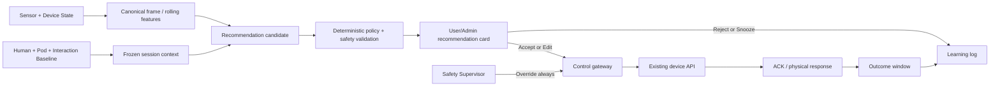

# ZEEP Adaptive Coach v1.0 — Recommendation-first Plan

สถานะ: **แผนเสนออนุมัติ · ยังไม่เปิดการสั่งอุปกรณ์อัตโนมัติ**  
วันที่ทบทวน: 15 กันยายน 2026  
ขอบเขต: Pi5, Admin Monitor, User Control และ API สำหรับ ZEEP App

## 1. ข้อสรุปสำหรับทีม

ระยะแรกให้ AI ทำหน้าที่เป็น **Adaptive Coach** เท่านั้น:

> อ่านค่าปัจจุบันเทียบกับ Baseline → แนะนำว่าควรปรับอะไร เท่าไร และเพราะอะไร
> → ผู้ใช้หรือ Admin ยืนยัน → Server ตรวจ Safety ซ้ำ → จึงส่งคำสั่งจริง

AI ไม่มีสิทธิ์เรียก GPIO, MQTT หรือ Music API โดยตรง และไม่ควรพยายามเพิ่ม
Sleep Score หรือ Recovery Score ด้วยการไล่บังคับ Sleep State

ลำดับอำนาจถาวรของระบบคือ:

1. Safety Supervisor, Emergency Stop และทางออกฉุกเฉิน
2. Operating/Safety Policy ที่อนุมัติและ versioned แล้ว
3. คำสั่งและความต้องการที่ผู้ใช้ระบุโดยตรง
4. Personal Baseline ตามขอบเขตข้อมูลที่อนุมัติของแต่ละ Mode
5. ค่าเริ่มต้นของ ZEEP และค่าเฉพาะของ Pod
6. AI Recommendation

## 2. สิ่งที่ระบบมีแล้ว

- Sensor frame ทุก 10 วินาที
- Sleep evidence ทุก 30 วินาที และการยืนยัน 60/120 วินาที
- Environment, HR, RR, Movement, Bed Status และ Device intent ใน payload เดียว
- Baseline จาก Session ที่จบแล้ว แยกตาม Mode
- Admin endpoint `GET /api/v1/admin/adaptive/live`
- Smart Response แบบ pure/read-only
- Device API ส่วนใหญ่ตรวจ Safety latch แต่ยังไม่ได้บังคับ `READY/ARMED`,
  ownership และ confirmation TTL ผ่าน Gateway กลางครบทุกเส้นทาง; endpoint
  ปรับ volume ยังเป็นข้อยกเว้นที่ต้องปิดก่อน G2
- Sleep State ถูกกำหนดเป็น wellness telemetry ไม่ใช่ actuator input

รุ่นปัจจุบันจึงถือว่าอยู่ที่ **G0 · Observe** และมีฐานเริ่ม G1 ได้แล้ว แต่ยังขาด
Decision store, user feedback, command/outcome correlation, Gateway กลาง และ
physical feedback ของอุปกรณ์หลายชนิด

## 3. Baseline ที่ Adaptive Coach ต้องใช้

Baseline ไม่ควรเป็นค่าเดียวต่อคน แต่ต้องแยก 3 ชั้น:

| ชั้น | Key | ใช้ตอบคำถาม |
|---|---|---|
| Human baseline | `user × mode × target_profile` | คนนี้พักสบายและตอบสนองอย่างไรโดยทั่วไป |
| Pod baseline | `pod × device × firmware` | อุปกรณ์ของ Pod นี้ตอบสนองต่อคำสั่งอย่างไร |
| Interaction baseline | `user × pod × mode × target_profile × phase` | คนนี้ชอบตั้งค่าอะไรเมื่อใช้ Pod นี้ในช่วงนั้น |

Phase ที่เก็บต้องต่างกันตาม Mode:

| Mode | Phase |
|---|---|
| Overnight Recovery | เตรียมพัก → เริ่มนิ่ง → พักต่อเนื่อง → เตรียมตื่น |
| Nap & Refresh | เตรียมพัก → พัก/ผ่อนคลาย → เตรียมกลับไปทำกิจกรรม |

ขอบเขต Baseline ต้องระบุให้ชัด ไม่ใช้คำว่า “Mode เดียวกัน” ครอบทุก feature:

- Overnight: physiology, behavior, comfort และ environment ใช้ Session
  Overnight ที่ผ่านคุณภาพ
- Nap: behavior, comfort และ environment ใช้ Nap เทียบ Nap; รุ่นปัจจุบันยังใช้
  `qualified_overnight_reference` สำหรับ HR/Movement จึงต้องแสดง provenance นี้
  และห้ามเรียกว่า Nap physiology baseline
- การแยก Nap เป้าหมาย 30/90 นาทีเป็น **Target design**; โค้ดปัจจุบันยังรวมเป็น
  `nap_recovery` และต้องแยก key ก่อนเริ่มเรียนรู้รายช่วงเวลา

### 3.1 ข้อมูลที่ใช้เรียนรู้

- ค่าที่ผู้ใช้เลือกเอง: อุณหภูมิ, แสง, เพลง, volume, mode เพลง, กลิ่น และท่าเตียง
- ค่าจริงจาก Sensor: median, IQR, trend, coverage และเหตุการณ์ผิดปกติ
- HR/RR settling, movement และ continuity เป็นผลสนับสนุน
- การกด `ยอมรับ`, `แก้ค่า`, `ไว้ก่อน`, `คงเดิม` และ Manual override
- Feedback หลังปรับ: `สบายขึ้น`, `เหมือนเดิม`, `ไม่สบายขึ้น`
- ผลหลัง Session: Sleep Score สำหรับ Overnight หรือ Recovery Score สำหรับ Nap
  ใช้ประกอบการทบทวนเท่านั้น ไม่ใช้เป็น reward ให้ AI ไล่คะแนน

ทุก Session ต้อง freeze Baseline/Policy/Model version ตอนเริ่ม และอัปเดต Baseline
หลัง Session จบเท่านั้น เพื่อป้องกันค่าขยับตาม Model ของตัวเองระหว่างทำงาน

### 3.2 ระดับความพร้อม

ตารางนี้คือเกณฑ์ **Target สำหรับ Adaptive Coach** ยังไม่ใช่ความสามารถที่
Candidate generator ปัจจุบันบังคับใช้ครบทุก domain:

| ระดับ | Session ที่จบใน Mode เดียวกัน | สิทธิ์ของระบบ |
|---|---:|---|
| B0 · Default | 0 | ใช้ ZEEP default และถามความชอบ |
| B1 · Learning | 1–2 | แสดงว่า “กำลังเรียนรู้”; ยังไม่อ้างว่าเป็นค่าประจำตัว |
| B2 · Provisional | 3–6 | เสนอคำแนะนำเฉพาะบุคคลแบบชั่วคราว |
| B3 · Personal | 7–13 | ใช้ Personal Baseline เต็มรูปแบบสำหรับ Recommendation |
| B4 · Stable | ≥14 และผลสม่ำเสมอ | นำไปประเมิน Bounded Auto รายอุปกรณ์ได้ |

เกณฑ์นี้สอดคล้องกับระบบปัจจุบันที่เริ่มสร้าง Personal Baseline candidate หลัง
3 Session,
เปรียบเทียบ Personal Restore หลัง 7 Session และถือว่าแนวโน้มเริ่มนิ่งที่ 14
Session โดยยังต้องผ่าน coverage และ QA ของแต่ละ Session

Session ที่ไม่จบ, Sensor coverage ต่ำ, มี Safety incident หรือ Mode ไม่ชัดเจน
เก็บไว้ตรวจสอบได้ แต่ไม่สอน physiology/device-response Baseline ส่วนค่าที่ผู้ใช้
เลือกหรือบอกเองยังเก็บเป็น `declared_preference` พร้อม provenance ได้
กฎคัด coverage/Safety incident นี้เป็น Target ของ G1; behavior extractor ปัจจุบัน
ยังไม่ได้บังคับตัวกรองดังกล่าวครบ

อายุ เพศ เชื้อชาติ กรุ๊ปเลือด และข้อมูลสุขภาพไม่ใช้สั่งอุปกรณ์โดยตรง ข้อมูลที่
ผู้ใช้สมัครใจให้ใช้ได้เพียงอธิบายบริบทหรือเลือกคำถามที่เหมาะสม ภายใต้ consent
และขอบเขต wellness

## 4. Data flow ที่ต้องการ



Model สร้างได้เพียง structured proposal ที่อยู่ใน allowlist ส่วน Policy Engine
เป็นผู้ตัดสินว่าแสดงได้หรือไม่ Server ต้องตรวจสิทธิ์, Pod ownership, TTL,
Sensor freshness และ Safety อีกครั้งตอนผู้ใช้กดยืนยัน

## 5. State machine เป้าหมายของคำแนะนำ

```text
DISABLED
  → SESSION_INIT       โหลดและ freeze baseline/policy
  → WARMUP             รอ Sensor สดและ coverage พอ
  → OBSERVE            ประเมิน canonical frame ทุก 10 วินาที
  → CANDIDATE          ความต่างผ่าน persistence gate
  → RECOMMEND          แสดงคำแนะนำหนึ่งรายการ
  → ACCEPT / EDIT / REJECT / SNOOZE
  → COMMAND            ส่งเมื่อมีคนยืนยันเท่านั้น
  → VERIFY             แยก transport ACK กับ physical confirmation
  → OUTCOME            เทียบค่าก่อน–หลังและรับ feedback
  → COOLDOWN
  → OBSERVE
```

`SAFETY_HOLD` แทรกได้จากทุก State ทันที การ Restart ต้องกลับไป `OBSERVE`
ด้วยค่าล่าสุด แต่ห้าม replay คำสั่งหรือคำแนะนำเก่าอัตโนมัติ

State machine นี้ยังไม่ได้ถูก implement ครบใน production; Smart Response
ปัจจุบันใช้ policy band คงที่และคัดลอก suggestion ไปยัง adaptive payload เท่านั้น
G1 ต้องเพิ่ม deterministic recommendation engine, persistence/TTL, arbitration
และ audit store ก่อน จึงจะถือว่าผ่านขั้นนี้

## 6. Gate เป้าหมายก่อนแสดงคำแนะนำ

ข้อกำหนดต่อไปนี้ใช้กับ **in-session recommendation** ส่วน starting preset
ก่อน Session มาจากประวัติเดิม จึงไม่ต้องรอ rolling window 5 นาที แต่ยังต้องตรวจ
อุปกรณ์ออนไลน์, สิทธิ์, consent และ Safety ก่อนส่งคำสั่ง:

- Sensor ที่เกี่ยวข้องกับ domain นั้นเป็น `live`, finite และไม่ stale; Sensor
  คนละ domain ที่ขาดห้ามปิดกั้นคำแนะนำทั้งหมด
- Rolling coverage 5 นาที ≥80%
- ความต่างจาก Baseline ต่อเนื่องตามเวลาของอุปกรณ์ ไม่ใช้ packet เดียว
- ไม่มี Manual command หรืออุปกรณ์อื่นเปลี่ยนใน outcome window
- หาก Safety ไม่ `READY/ARMED` หรือมี latched fault แสดงได้เพียงคำอธิบายแบบ
  `blocked` และห้ามกดยืนยันส่งคำสั่ง
- Recommendation ยังไม่หมดอายุและยังตรงกับ current observation
- ระหว่าง Session เปลี่ยนเพียงหนึ่งตัวแปรต่อ outcome window เพื่อแยกผลได้;
  starting preset แบบหลายอุปกรณ์ทำได้แต่ต้องบันทึกเป็น configuration bundle
  และไม่ใช้สรุปเหตุ–ผลรายอุปกรณ์
- Sleep State ใช้บอกบริบท/ระงับการรบกวนเท่านั้น ไม่เป็น trigger สั่งอุปกรณ์

การบังคับ Gate เหล่านี้ต้องอยู่ใน Control Gateway กลาง ไม่พึ่งการตรวจในหน้า UI
หรือแต่ละ route กระจัดกระจาย Gateway ต้องตรวจ Safety, session/pod ownership,
actor role, one-time token, TTL และ current observation ซ้ำในจังหวะส่งจริง
ข้อยกเว้นที่ปลอดภัยต้องกำหนดเป็น allowlist แคบ ๆ เช่น `off`, `stop`,
`door_open` เพื่อทางออกฉุกเฉิน และไฟบอกเหตุฉุกเฉิน

คะแนนความมั่นใจเริ่มต้นสำหรับ Shadow replay:

```text
confidence =
    35% data quality
  + 25% baseline maturity
  + 20% persistence
  + 20% verification capability
```

- `≥0.75` แสดงคำแนะนำให้ปรับ
- `0.55–0.74` ถามความรู้สึกหรือเฝ้าดู
- `<0.55` ไม่เสนอการเปลี่ยนค่า

น้ำหนักข้างต้นเป็น engineering hypothesis ต้องจูนด้วย Offline replay ไม่ใช่
ค่าทางการแพทย์

## 7. ทะเบียนอุปกรณ์ทั้งหมดและนโยบายระยะแรก

| อุปกรณ์/คำสั่งจริง | AI แนะนำอะไรได้ | ผู้ยืนยัน | ตรวจผลอย่างไร | สถานะ Auto |
|---|---|---|---|---|
| แอร์ `on/off` | เปิดก่อนพักหรือคงสถานะ | User/Admin | IR ACK + trend อุณหภูมิ; ยังไม่ยืนยัน power จริง | ยังไม่อนุญาต |
| อุณหภูมิ 15–25°C ฝั่ง User | เพิ่ม/ลดครั้งละ 1°C | User/Admin | SHT3x trend 10–15 นาที | Candidate หลังมี feedback เพิ่ม |
| Swing `on/off` | เปิด/ปิดตามความสบายที่เคยเลือก | User/Admin | IR ACK เท่านั้น | ยังไม่อนุญาต |
| Fan `1→5→1` | ระยะแรกเสนอเพียง “ลองปรับหนึ่งขั้น” | Admin | เป็น intent counter ไม่ใช่ระดับจริง | ไม่อนุญาต |
| ไฟหน้าจอแอร์ `light_on/off` | ปิดแสงรบกวนเมื่อทีมยืนยันความหมายคำสั่งแล้ว | Admin | IR ACK + Lux ทางอ้อม | ไม่อนุญาต |
| ไฟเพดาน `led` | เปิด/ปิดตาม phase | User/Admin | GPIO intent + Lux ทางอ้อม | Candidate หลัง validation |
| ไฟดาว | ใช้ช่วงเตรียมพักและเสนอปิดเมื่อเริ่มพัก | User/Admin | GPIO intent + Lux ทางอ้อม | Candidate หลัง validation |
| แสงแดงหัว/กลาง/ปลาย | เลือกตามความชอบและ routine เท่านั้น | User ทุกครั้ง | GPIO intent; ไม่มี irradiance/dose sensor | ไม่อนุญาต |
| เพลง play/pause/stop | เลือกเสียง, เริ่ม, พักหรือหยุด | User/Admin | Player process/IPC + dBA ทางอ้อม | ลด/หยุดอาจทดลองภายหลัง |
| Volume | เพิ่ม/ลดครั้งละไม่เกิน 5% | User/Admin | MPV IPC + SPH0645 dBA | Candidate หลัง ACK fix |
| Repeat/Queue และ track | จำ preference ตาม Mode | User/Admin | Player state | Candidate สำหรับ preset |
| Aroma 1–4 | ยังไม่สร้างคำแนะนำจนมี consent/formulation guard ครบ | User opt-in ทุกครั้ง | GPIO pulse 5 วินาที; ไม่มี dose/flow feedback | ไม่เข้า G2 |
| ไอน้ำ | ยังไม่สร้างคำแนะนำจนมี water/dose/condensation guard ครบ | User/Admin ทุกครั้ง | RH trend; ไม่มี water/flow feedback | ไม่เข้า G2 |
| เตียง head/foot/flat/center | แนะนำท่าที่ผู้ใช้เคยชอบก่อนพัก | User กดเอง | MQTT ACK + auto-stop 2 วินาที; ไม่มี position sensor | ไม่อนุญาต |
| Bed stop | แสดงเป็น Safety/manual action | User/Admin/Safety | command ACK | Safety only |
| ประตู open/close | ไม่เป็น wellness recommendation | User/Admin | GPIO pulse; ไม่มี position/obstruction feedback | ห้าม Adaptive |
| Brainwave preview | ใช้เฉพาะการทดลองที่ Admin เปิดและยืนยัน | Admin | Player process; ไม่ยืนยันผลเชิงสรีรวิทยา | ห้าม Adaptive |
| Shutdown Pi | ไม่เกี่ยวกับการพัก | Admin | OS/service status | ห้าม Adaptive |

### 7.1 ลำดับเปิดใช้งานรายอุปกรณ์

| Wave | ขอบเขต | รูปแบบอนุญาต |
|---|---|---|
| Wave 1 | อุณหภูมิ ±1°C, ไฟเพดาน/ดาว, เพลง, volume ±5%, repeat/queue | AI แนะนำ → User/Admin ยืนยัน |
| Wave 2 | Swing, fan-step, ไฟหน้าจอแอร์, แสงแดง, preset เตียงขณะตื่น | AI แนะนำได้ แต่ Manual confirm ทุกครั้ง |
| Restricted | Aroma, ไอน้ำ, Brainwave preview | ยังไม่สร้างคำแนะนำจน prerequisite ครบ; Brainwave เฉพาะ Admin ทดลอง |
| Manual/Safety | ประตู, Bed stop, Shutdown | ไม่ใช้เป็น Adaptive wellness action |
| Future hardware | Ventilation, HEPA, carbon/VOC removal | รอ command path, ACK และ physical feedback |

### 7.2 อุปกรณ์ที่ยังไม่มี command path

ปัจจุบัน Pi ยังไม่มี actuator API จริงสำหรับ:

- พัดลมเติม/ระบายอากาศ
- เครื่องดูดกลิ่นหรือ Carbon filter
- HEPA/Air purifier
- ระบบกำจัด VOC

Smart Response จึงแสดงได้เพียง `team_action_recommended` ห้ามแสดงว่า AI
“เปิดระบบระบายอากาศแล้ว” จนกว่าจะมี command, ACK และ physical feedback

## 8. กฎเฉพาะรายอุปกรณ์

### 8.1 แอร์และอุณหภูมิ

- เก็บ Baseline เป็น **desired temperature** ที่ผู้ใช้เห็น แยกจาก
  `ir_command_temperature`; ห้ามนำสองหน่วยความหมายมาปนกัน
- ค่าต่างจาก Personal Baseline ต่อเนื่องอย่างน้อย 5 นาทีจึงแนะนำ
- ปรับครั้งละ 1°C, cooldown 15 นาที และไม่เกินรวม 2°C ต่อ Session ใน Pilot
- `on` ปัจจุบันส่ง `on → IR command 18°C → swing_on`; ด้วย bias ปัจจุบัน −3
  snapshot/UI แปลงเป็น desired 21°C จึงต้อง freeze และแสดงทั้งสอง field แยกกัน
  ใน audit ส่วนหน้าผู้ใช้แสดงเฉพาะ desired temperature
- ชุดเปิดแอร์นี้ต้องบันทึกเป็น `configuration_bundle` และไม่นำ outcome ไปอ้าง
  เชิงเหตุ–ผลของ power, temperature หรือ swing รายตัว
- ACK ปัจจุบันหมายถึง ESP32 ส่ง IR แล้ว ไม่ได้หมายถึงแอร์เปลี่ยนจริง
- Fan 1–5 ต้องไม่แสดงเป็นค่าที่วัดจริง จนมี feedback หรือ idempotent command

### 8.2 แสง

- Hardware ปัจจุบันเป็น Binary จึงใช้คำว่า `เปิด/ปิด` ไม่ใช้ `หรี่`
- Overnight: แนะนำลดสิ่งเร้าก่อนพักและคงความมืดระหว่างพัก
- Nap: ใช้แสงต่ำช่วงพักและเสนอแสงกลับก่อนจบตามเวลาที่ตั้ง
- Lux ยืนยันภาพรวมได้ แต่ยังระบุไม่ได้ว่าไฟดวงใดหรือ spectrum ใดเป็นต้นเหตุ
- แสงแดงเป็น preference/routine ไม่ใช้คำกล่าวอ้างด้านการรักษา

### 8.3 เพลงและเสียง

- แยก “เสียงจากเพลง” ออกจากเสียงแอร์/ภายนอกก่อนเสนอให้ลด volume
- หากเพลงกำลังเล่นและระดับเสียงสูงต่อเนื่อง ให้เสนอทีละ 5%
- ไม่เริ่มเพลงหรือเพิ่ม volume ระหว่างผู้ใช้พักโดยอัตโนมัติ
- Manual stop ต้องยกเลิก recommendation/play queue ที่ค้าง
- ค่าตั้งต้นปัจจุบันคือหยุด, 60% และ Repeat One

### 8.4 กลิ่นและไอน้ำ

- ยังไม่ให้ Candidate generator สร้างคำแนะนำใน G1/G2 จนกว่าจะมี explicit
  opt-in, formulation/lot, allergy/fragrance sensitivity, cartridge/water status,
  dose cap, cooldown, contraindication lockout และ immutable audit ครบ
- ไม่ใช้ Sleep State เป็นเหตุผลให้พ่น
- เมื่อ VOC สูงหรือ SGP40 ไม่ live ให้ block Aroma recommendation
- ไอน้ำต้อง block เมื่อ RH สูง, มี condensation, Sensor ผิดปกติ หรือแหล่งน้ำไม่ผ่าน
  ข้อกำหนดอุปกรณ์
- Backend ปัจจุบัน pulse 5 วินาที; UI ที่ยังระบุ 1 วินาทีต้องแก้ให้ตรงก่อน G2
- ก่อนเปิด Pilot Recommendation ต้องอนุมัติ cooldown และจำนวน pulse สูงสุดต่อ
  Session อย่างเป็นทางการ

### 8.5 เตียง

- AI แนะนำท่าที่บันทึกไว้ได้เฉพาะก่อนพักหรือเมื่อยืนยันว่าผู้ใช้ตื่น
- ผู้ใช้เป็นคนกดทุกครั้ง และปุ่ม Stop ต้องอยู่พร้อมใช้งานเสมอ
- ห้ามเคลื่อนเตียงจาก Sleep State หรือขณะผู้ใช้หลับ
- ก่อน Auto ต้องมี position, current/obstruction หรือ pinch feedback และผ่าน hazard review

### 8.6 ประตู

- ประตูไม่ใช่ Adaptive target
- AI แสดงได้เฉพาะคำเตือนให้ตรวจทางเดินและผู้ใช้
- เปิด/ปิดโดยผู้ใช้หรือ Admin เท่านั้น; Safety profile ปัจจุบันทำได้เพียง
  de-energize relay/ยับยั้งการเคลื่อน ไม่ได้สั่งเปิดประตู
- Gateway อนุญาต `door_open` เป็นทางออกฉุกเฉินได้ แต่ห้าม Safety logic เดาทิศทาง
  หรือสั่ง `close` โดยไม่มี position/obstruction feedback
- ก่อนพิจารณาระบบอัตโนมัติต้องมี position sensor, obstruction detection และ
  verified emergency egress

## 9. ความต่างของสอง Mode

### Overnight Recovery

เป้าหมายคือความสบาย ความต่อเนื่อง และสภาพแวดล้อมที่นิ่งตลอดคืน

- ก่อนพัก: แสดง Personal starting preset ให้ผู้ใช้ตรวจและกดยืนยัน
- ระหว่างพัก: Recommendation แสดงเงียบ ๆ ที่ Admin Monitor ไม่แจ้งเตือนผู้ใช้
- ไม่ไล่สร้าง N2/N3/REM และไม่ใช้ State เดียวสั่งอุปกรณ์
- ผลลัพธ์หลัก: เวลาที่ environment อยู่ในช่วงเหมาะสม, disturbance,
  continuity และ feedback ตอนเช้า
- Sleep Score เป็นผลสรุปปลาย Session ไม่ใช่ control target

### Nap & Refresh

เป้าหมายคือสงบ พักได้ตามเวลา และพร้อมกลับไปทำกิจกรรม; ผู้ใช้ไม่จำเป็นต้องหลับ

- Target: แยก Baseline 30 และ 90 นาที; production ปัจจุบันยังรวมทั้งคู่เป็น
  `nap_recovery` จึงยังห้ามอ้างว่าเรียนรู้แยกแล้ว
- เน้น HR/RR settling, movement, continuity, environment และ pre/post feedback
- ไม่ไล่ N2/N3/REM และไม่หักคะแนนเพราะผู้ใช้ไม่หลับ
- ช่วงท้ายเสนอแสง/เสียงกลับตามเวลาได้ แต่ยังต้องเป็น routine ที่ผู้ใช้ยืนยันไว้
- Recovery Score เป็นผลสรุปปลาย Session ไม่ใช่ control target

## 10. Recommendation UX

แสดงทีละหนึ่งข้อและใช้ภาษาสั้น:

```text
แนะนำลดอุณหภูมิ 1°C
ตอนนี้สูงกว่าค่าที่คุณมักพักสบาย 1.6°C ต่อเนื่อง 6 นาที
ความมั่นใจ 82%

[ปรับ] [แก้ค่า] [ไว้ก่อน] [คงเดิม]
```

กฎลดความรบกวน:

- ไม่เกิน 2 คำแนะนำใน 30 นาที และไม่เกิน 4 ครั้งต่อ Session
- กด `ไว้ก่อน` แล้วพัก domain นั้น 30 นาที
- Manual action ยกเลิก recommendation ที่ค้างใน domain เดียวกัน
- Overnight หลังเริ่มพักแล้วไม่ส่งเสียงหรือ notification ให้ผู้ใช้
- แสดง `ยืนยันผลแล้ว`, `ACK เท่านั้น`, `ยังตรวจผลไม่ได้` ให้ตรงกับฮาร์ดแวร์

## 11. API contract ที่เสนอ

### 11.1 อ่านคำแนะนำ

```http
GET /api/v1/adaptive/recommendations/current
GET /api/v1/admin/pods/{pod_id}/adaptive/recommendations/current
```

```json
{
  "schema_version": "zeep.adaptive-recommendation.v1",
  "recommendation_id": "rec_01...",
  "observation_id": "session-id:frame-sequence",
  "session_id": "s-...",
  "pod_id": "pod-01",
  "mode": "sleep",
  "phase": "wind_down",
  "device": "aircon_temperature",
  "action": "decrease",
  "current_value": 23,
  "proposed_value": 22,
  "unit": "degC",
  "reason_code": "above_personal_comfort_range",
  "reason_text": "สูงกว่าค่าที่คุณมักพักสบาย 1.6°C",
  "confidence": 0.82,
  "baseline": {
    "baseline_id": "bl_...",
    "maturity": "personal",
    "sessions_used": 8,
    "mode": "sleep",
    "frozen": true
  },
  "requires_confirmation": true,
  "confirmable": true,
  "ai_executable": false,
  "expires_at": "2026-09-15T20:15:00+07:00",
  "blockers": []
}
```

AI-facing contract ไม่มี URL ของ Device API และไม่มี arbitrary command string

### 11.2 ตอบคำแนะนำ

```http
POST /api/v1/adaptive/recommendations/{recommendation_id}/decision
```

```json
{
  "decision": "accept",
  "edited_value": null,
  "observation_id": "session-id:frame-sequence",
  "confirmation_token": "one-time-token"
}
```

`decision` รับเฉพาะ `accept | edit | reject | snooze` เมื่อ accept/edit แล้ว
Control Gateway จึงสร้าง `command_id` และเรียก existing allowlisted Device API

## 12. Audit และการวัดผล

ทุก Recommendation ต้องต่อสายข้อมูลได้ครบ:

```text
observation_id
→ frozen_baseline_id + policy/model version
→ recommendation_id
→ pre-window 5 นาที
→ accept/edit/reject/snooze + actor
→ command_id
→ transport ACK
→ physical confirmation
→ outcome window 10–15 นาที
→ user feedback
```

ผลหลักคือสิ่งที่อุปกรณ์ควรเปลี่ยนจริง เช่น °C, dBA, lux หรือ RH ส่วน HR, RR,
Movement และ Sleep State เป็นผลสนับสนุน ยังไม่ใช้กล่าวว่าอุปกรณ์ “ทำให้สุขภาพดีขึ้น”
จาก Session เดียว

KPI สำหรับ Recommendation-first:

- Recommendation acceptance/edit/reject/snooze rate
- Manual override ภายใน 15 นาที
- ACK success และ physical-confirmation rate
- Expected sensor response / no effect / overshoot
- Comfort feedback ดีขึ้น/เท่าเดิม/แย่ลง
- False recommendation จาก Offline replay
- Safety block rate และจำนวนคำสั่งซ้ำหลัง Restart ต้องเป็นศูนย์
- ผลแยกตาม Mode, Pod และ baseline maturity

## 13. Roadmap และ Exit criteria

### G1 · Shadow Learning

- เพิ่ม append-only observation/recommendation store
- freeze baseline/config manifest ต่อ Session
- replay ย้อนหลังและวัด false recommendation
- เพิ่ม command actor, command ID และ outcome correlation

ผ่านเมื่อข้อเสนอทุกข้ออธิบายย้อนกลับได้และไม่สร้าง command

### G2A · Pre-session Recommendation

- แสดง starting preset ให้ User/Admin ตรวจ
- Accept/Edit/Reject/Snooze ได้
- สั่ง existing API เฉพาะเมื่อคนยืนยันและผ่าน Control Gateway กลาง
- เก็บ feedback หลังปรับ

ผ่านเมื่อไม่มี stale/replayed command และ Safety/permission test ผ่านทั้งหมด

### G2B · In-session Supervised Recommendation

- แสดงหนึ่งข้อแก่ Admin โดยไม่รบกวนผู้พัก
- ปรับหนึ่งตัวแปรต่อครั้งพร้อม outcome window
- รองรับ rollback/manual override

ผ่านเมื่ออัตรา unverified action และ override อยู่ในเกณฑ์ที่ทีมอนุมัติ

### G3 · Bounded Auto ในอนาคต

เริ่มพิจารณาเฉพาะการลด/หยุดเสียง, ปิดไฟตาม routine และอุณหภูมิ ±1°C หลังมี
physical feedback ที่เชื่อถือได้และผ่าน hazard review รายอุปกรณ์ ประตู, เตียง,
กลิ่น, ไอน้ำและแสงแดงยังคงเป็น Manual/Consent-controlled

## 14. งานที่ต้องปิดก่อน G2

### P0

1. เพิ่ม persistent decision/feedback/outcome store
2. เพิ่ม frozen baseline ID, policy/model version และ actor ทุก event
3. สร้าง Control Gateway กลางที่บังคับ `READY/ARMED`, latch, ownership, role,
   TTL, one-time token และ allowlist ตอน accept; ปิดเส้นทาง volume ที่ bypass
4. เพิ่ม deterministic recommendation engine และ state/persistence/arbitration
   ตาม §§5–6 แทนการใช้ fixed Smart Response band เป็น Adaptive decision
5. แยก Nap target 30/90 นาทีใน key/schema ก่อนสร้าง Baseline รายช่วงเวลา
6. ตัด Aroma/Steam ออกจาก G2 จน consent, sensitivity, formulation/water,
   dose cap, cooldown, lockout และ audit พร้อม
7. แก้ข้อความ Aroma/Steam ใน UI จาก 1 วินาทีให้ตรง Backend 5 วินาที
8. เปลี่ยนคำแนะนำ “หรี่ไฟ” เป็น “ปิดไฟ” จน Hardware รองรับ dimming
9. แยก blocker ตาม domain; Sensor เสียงหายต้องไม่ปิดคำแนะนำอุณหภูมิ และ
   Sensor PM2.5 หายต้องไม่ปิดคำแนะนำเพลง
10. เพิ่มตัวกรอง coverage, Safety incident, completion และ resolved Mode ใน
    behavior/device-response baseline extractor ก่อนเปิด G1 learning

### P1

1. แยก transport ACK, routine executed และ physical confirmation
2. แก้ Audio volume ให้รายงาน success เมื่อ MPV IPC สำเร็จจริง
3. เพิ่ม Feedback Sensor ของแอร์, ตำแหน่งเตียง และประตู
4. ทำ per-Pod device calibration/response baseline

### P2

1. เพิ่ม actuator และ feedback สำหรับ ventilation/HEPA/carbon filter หากอยู่ใน
   hardware scope ที่อนุมัติ
2. ทำ N-of-1 comparison โดยสลับค่าทีละตัวแปร
3. ประเมิน Bounded Auto รายอุปกรณ์ ไม่อนุมัติรวมทั้ง Pod ในครั้งเดียว

## 15. หลักฐานและข้อจำกัด

- [CDC/NIOSH: Improve Sleep](https://www.cdc.gov/niosh/blogs/2020/sleep.html) —
  สภาพแวดล้อมที่มืด เงียบ เย็นสบาย และสบายตัว
- [CIE Position Statement 2024](https://www.cie.co.at/publications/cie-position-statement-integrative-lighting-recommending-proper-light-proper-time-3rd) —
  รูปแบบแสงตามเวลาและ near-darkness ระหว่างนอน
- [WHO Guidance on Environmental Noise](https://www.who.int/tools/compendium-on-health-and-environment/environmental-noise) —
  เสียงเป็นปัจจัยรบกวนการนอนและสุขภาพ
- [WHO Global Air Quality Guidelines 2021](https://www.who.int/publications/i/item/9789240034228/) —
  กรอบสุขภาพของ PM2.5 และมลพิษอากาศ; ไม่ใช่ cutoff 10 วินาทีของ Pod
- [Bedroom ventilation randomized trial](https://pubmed.ncbi.nlm.nih.gov/26452168/) —
  สนับสนุนการศึกษาความสัมพันธ์ระหว่าง ventilation/CO₂, sleep และ next-day response
- [US EPA Moisture Guide](https://www.epa.gov/mold/brief-guide-mold-moisture-and-your-home) —
  ใช้เป็น guardrail ด้านความชื้น/condensation ไม่ใช่สูตร Sleep Score
- [FDA Bed Safety](https://www.fda.gov/medical-devices/hospital-beds/guide-modifying-bed-systems-and-using-accessories-reduce-risk-entrapment) —
  รองรับการประเมินความเสี่ยง entrapment ก่อนระบบเตียงอัตโนมัติ
- [AASM Consumer Sleep Technology Position](https://pmc.ncbi.nlm.nih.gov/articles/PMC5940440/) —
  ยืนยันขอบเขต wellness และข้อจำกัดก่อนกล่าวอ้างเชิงวินิจฉัย

หลักฐานเหล่านี้ใช้กำหนด guardrail และหัวข้อที่ควรวัด ไม่ได้พิสูจน์ว่า setpoint
เดียวเหมาะกับทุกคน ผลจริงของ ZEEP ต้องได้จาก Pilot ที่ versioned,
time-aligned และมี feedback ของผู้ใช้

## 16. Definition of Done ของ Recommendation-first

- User เห็นเฉพาะคำแนะนำของตัวเองและ Pod ที่กำลังใช้
- Admin เห็นทุก Pod พร้อม data freshness และ safety state
- ทุกคำแนะนำมี Baseline source, confidence, reason, TTL และ blocker
- ไม่มี AI output ใดเรียก Device API โดยตรง
- Accept/Edit ผ่าน server-side policy และ Safety ซ้ำทุกครั้ง
- Restart ไม่ส่งคำสั่งซ้ำ
- Manual override มีอำนาจสูงกว่าและถูกบันทึก
- Command, ACK, physical response และ outcome แยกสถานะชัดเจน
- Overnight และ Nap ใช้ Baseline/ผลลัพธ์คนละ Mode
- Door/Bed/Aroma/Steam ไม่ถูก Auto จาก Sleep State
- Audit ย้อนกลับได้ถึง Sensor frame, baseline, model, policy และ actor
