# ZEEP v1 — Product และ Session Lifecycle

สถานะ: **Internal Pilot / freeze candidate**

เอกสารหลัก: [v1 System Handover](../zeep-v1-system-handover-and-freeze-readiness.md)
และ [Sleep System Current](../zeep-sleep-system-current.md)

หน้านี้ช่วยให้สมาชิกใหม่รู้ว่า feature หนึ่งอยู่ตรงไหนและต้องรักษาพฤติกรรมใด
ตัวเลขสูตร, threshold, version และ closure result ให้เปิดเอกสารหลักหรือ runtime
source ทุกครั้ง ไม่คัดลอกจากหน้านี้ไปใช้เป็น release evidence

## Product boundary

ZEEP v1 เป็นระบบประเมินการพักและการนอนเชิง Wellness แบบไม่ต้องสวมอุปกรณ์
โดยใช้ BCG, Bed Status, HR/RR และ Movement เป็นหลักฐานหลัก ส่วนอุณหภูมิ,
ความชื้น, แสง, เสียง, CO2, PM2.5 และ VOC เป็นบริบท/ความมั่นใจและไม่สร้าง
Sleep State โดยตรง

สิ่งที่ v1 **ไม่ได้เป็น**:

- เครื่องมือวินิจฉัยหรือทดแทน PSG/AASM scoring
- เครื่องวัด SpO2, ความดัน, pulmonary fitness หรือ True HRV
- คะแนนความพร้อมทั้งวัน, training load หรือคำรับรองว่าร่างกายฟื้นตัวแล้ว
- ระบบ closed-loop ที่ให้ Sleep State/AI สั่งแอร์ เตียง ประตู ไฟ กลิ่น หรือเสียง

คำกล่าวต่อผู้ใช้ต้องเป็นไปตาม
[Product Language Guideline](../zeep-product-language-guideline-v1.md) และ public
result ต้องคง `clinical_validated=false` ใน v1

## สองโหมดที่ผู้ใช้เลือก

Mode และ target ถูกตรึงก่อน Recording เวลาใช้งานจริงห้ามเปลี่ยนชนิด Session
อัตโนมัติ

| โหมด | จุดประสงค์ | เกณฑ์เผยแพร่คะแนน | ผลหลัก |
|---|---|---|---|
| **Overnight Recovery** (`sleep`) | พักค้างคืนและประเมินภาพรวมการนอน | Recording อย่างน้อย 5 ชั่วโมง; 7 ชั่วโมงเป็นกรอบ duration เต็มสำหรับผู้ใหญ่ | **Sleep Score 0–100** |
| **Nap & Refresh** (`nap_recovery`) | พัก 30 หรือ 90 นาที; หลับ พักสายตา หรือทำสมาธิก็ได้ | Recording อย่างน้อย 10 นาที; target 30/90 นาทีตรึงก่อนเริ่ม | **Recovery Score 0–100** |

คะแนนทั้งสองตอบคนละคำถามและห้ามเปรียบเทียบตรงกัน Nap ที่ไม่หลับไม่ใช่
ความล้มเหลว และยังเผยแพร่ Recovery Score ได้เมื่อถึงขั้นต่ำ ส่วน Restore Summary
อธิบายคะแนนเดียวกันและไม่สร้างคะแนนที่สาม

รายละเอียดการทดสอบผู้ใช้และภาษาที่ใช้ใน Pilot อยู่ที่
[Two-Mode Test Protocol](../zeep-pilot-two-mode-protocol.md) ส่วนสูตรและข้อยกเว้น
อยู่ที่ [Sleep System Current](../zeep-sleep-system-current.md)

## Lifecycle ตั้งแต่ Login ถึงผลลัพธ์

```mermaid
flowchart LR
    A[Password หรือ QR Login] --> B[ยืนยันบัญชีและ Profile]
    B --> C[เลือก Mode และ Nap target]
    C --> D[Browser auth + Pod occupancy lease]
    D --> E[waiting_bed]
    E -->|On-bed 20 s + BCG ใหม่ 3 packet ที่ HR/RR สดครบ| F[สร้าง DB Session และ Recording]
    F --> G[Sensor snapshot 10 s]
    G --> H[Evidence epoch 30 s]
    H --> I[ยืนยัน State 60 s; N2 120 s]
    I --> J[User/Admin จบ Session]
    J --> K[Flush + continuity + atomic finalization]
    K --> L[Sleep Score หรือ Recovery Score]
    L --> M[History + Restore Summary + eligible baseline]
    M --> N[Durable allowlisted ingest outbox เมื่อเปิดใช้งาน]
```

### 1. Identity และ Profile

- Password และ QR จบที่ account/profile/session policy เดียวกัน
- canonical account key คือ email ที่ normalize เป็นตัวพิมพ์เล็ก; `publicId`
  เป็น authorization subject และ display name ไม่สร้างประวัติคนใหม่
- Verified Profile ขั้นต่ำใช้เพศ, วันเกิด/ช่วงอายุ, ส่วนสูงและน้ำหนัก; blood group
  เป็นข้อมูลสำรวจและไม่มีผลต่อ score/State
- Admin Login แยกจาก User Login และไม่ทำให้ Admin ครอบครอง Pod
- Local fallback ใช้ได้หลังยืนยันว่า ZEEP API ขัดข้องและต้องมี one-time ticket
  อายุ 5 นาที

### 2. Mode และ Occupancy

- เลือก Overnight หรือ Nap 30/90 ก่อนเริ่ม และบันทึก target กับ Session
- coordinator ป้องกันหนึ่งบัญชีอยู่สอง Pod และหนึ่ง Pod มีสองคน
- เมื่อ coordinator ขัดข้อง ระบบปฏิเสธ Login ใหม่ แต่ไม่ยุติ Session ที่กำลังพัก
- single-Pod local lease ไม่ถือเป็น multi-Pod deployment

### 3. `waiting_bed` และ Recording gate

Login สำเร็จยังไม่สร้าง Session สำหรับคะแนน ระบบเริ่ม Recording เมื่อครบพร้อมกัน:

1. Bed Status ยืนยัน on-bed ต่อเนื่อง 20 วินาที
2. มี BCG packet ใหม่หลัง Loginอย่างน้อย 3 packet โดย HR/RR อยู่ใน packet
   เดียวกัน, สด, ไม่ใช่ UI hold และผ่าน physical sanity range

ออกก่อนผ่าน gate จะปิดเฉพาะ auth/occupancy lifecycle ไม่สร้างรายงานศูนย์นาทีหรือ
Baseline ปลอม ค่า deployment ปัจจุบันตรวจได้ใน [`.env.example`](../../.env.example)
และ contract ที่ deploy จริง

### 4. Recording และ continuity

| ชั้น | Cadence ปัจจุบัน | หน้าที่ |
|---|---:|---|
| Canonical Sensor snapshot | 10 วินาที | Dashboard, Timeline, Safety และ report อ่านค่าเดียวกัน |
| Sleep evidence | 30 วินาที | รวม waveform, HR/RR, Bed และ Movement |
| State confirmation | 60 วินาที | ยืนยัน W, N1, N3 และ REM |
| N2 confirmation | 120 วินาที | เพิ่ม hysteresis ป้องกัน State แกว่ง |

ทุกช่วง on-bed ระหว่าง Recording ต้องเป็น `W/N1/N2/N3/REM` เสมอ `WAIT`
อยู่ได้ก่อน Recording เท่านั้น เมื่อหลักฐานขาดชั่วคราวระบบคง State เดิมแบบ
low confidence เพื่อเป็นเจ้าของเวลา แต่ช่วงนั้นไม่เข้า Personal Baseline
`OFF BED` เป็น occupancy exception แยกจาก Wake และไม่เข้า stage ratio

Restart/deploy **ไม่ใช่ Logout และไม่ finalize Session** Browser auth กับ atomic
checkpoint ต้องทำให้ระบบกลับมาใช้ Session ID, user, mode, target, confirmed State,
sleep onset และ awake reference เดิมได้ เมื่อหลักฐานสดกลับมา continuity จึงเดินต่อ

### 5. Finalization และ publication

ลำดับสำคัญเมื่อ User หรือ Admin จบ Session:

1. flush DB/BCG writer และ project decision ลง Timeline ในขอบเขตเวลาที่ถูกต้อง
2. ตรวจ continuity accounting ให้ on-bed ทุกช่วงมี owner และ OFF BED แยกออก
3. สรุป Sensor/HR/RR/Rest metrics และสร้าง score ตาม mode
4. commit finalization แบบ atomic ก่อนลบ restart checkpoint
5. อัปเดต history/baseline เฉพาะข้อมูลที่เข้าเกณฑ์ โดยไม่ให้ผลปัจจุบันย้อนเปลี่ยน
   การตัดสินของตัวเอง
6. เมื่อ account ingest ถูก configure และผลเข้าเกณฑ์ ให้เขียน allowlisted payload
   ลง durable outbox; network failure ไม่ทำให้ local finalization ล้มและ sweeper
   retry ภายหลัง

## Feature-to-module map

ตารางนี้เป็นจุดเริ่ม trace code ไม่ใช่ ownership registry ฉบับเต็ม Hardware transport
และอุปกรณ์ดูที่ [Hardware และ Hub map](hardware-hub-map.md)

| Function / feature | Policy หรือ contract | Implementation entry point | Regression เริ่มต้น |
|---|---|---|---|
| Browser auth, RBAC, CSRF | [README: User/Admin](../../README.md) | [`access_control.py`](../../access_control.py), [`admin_accounts.py`](../../admin_accounts.py) | `test_rbac_api.py`, `test_access_and_occupancy.py` |
| Password/QR account binding | Handover §2.1 | [`zeep_pod/identity/zeep_account.py`](../../zeep_pod/identity/zeep_account.py), [`qr_login.py`](../../qr_login.py) | `test_qr_login.py`, `test_qr_login_api.py` |
| Profile completion | Handover §2.1 | [`profile_completion.py`](../../profile_completion.py), `zeep_pod/identity/profile_fields.py` | `test_profile_completion.py` |
| Pod occupancy | Handover §2.2 | [`pod_occupancy.py`](../../pod_occupancy.py) | `test_access_and_occupancy.py` |
| Session gate/restart/finalize | Handover §2 | [`app.py`](../../app.py), [`zeep_pod/sessions/lifecycle.py`](../../zeep_pod/sessions/lifecycle.py) | `test_session_lifecycle.py`, `test_sleep_restart_context.py` |
| Sensor normalize/canonical snapshot | [Sensor Interface Contract](../zeep-sensor-interface-contract-v1.2.md) | [`sensor_contracts.py`](../../sensor_contracts.py), [`sensor_runtime.py`](../../sensor_runtime.py), [`zeep_pod/api_state_projection.py`](../../zeep_pod/api_state_projection.py) | `test_sensor_contract.py`, `test_sensor_services.py`, `test_api_state_projection.py` |
| Sleep evidence และ State | [Sleep System Current](../zeep-sleep-system-current.md) | [`sleep_signal_features.py`](../../sleep_signal_features.py), [`sleep_stage_scoring.py`](../../sleep_stage_scoring.py), [`sleep_system_policy.py`](../../sleep_system_policy.py) | `test_sleep_signal_features.py`, `test_sleep_system_consistency.py` |
| Score และ report | [Session Result Presentation](../zeep-session-result-presentation-v1.md) | [`sleep_session_report.py`](../../sleep_session_report.py), `zeep_pod/sessions/report_*` | `test_sleep_session_report.py`, `test_result_contract.py` |
| Usage history / API projection | [API v1](../zeep-api-v1.md) | [`zeep_pod/sessions/usage_service.py`](../../zeep_pod/sessions/usage_service.py), [`usage_api.py`](../../zeep_pod/sessions/usage_api.py) | `test_usage_session_api.py` |
| Baseline / user learning | [User Learning Profile](../zeep-user-learning-profile-v1.md) | [`personal.py`](../../personal.py), `zeep_pod/sessions/user_*` | `test_personal_baseline_policy.py`, `test_user_learning_profile.py` |
| Account ingest | API v1 §รูปแบบเชื่อมต่อ | [`zeep_pod/sessions/ingest_payload.py`](../../zeep_pod/sessions/ingest_payload.py), [`ingest_outbox.py`](../../zeep_pod/sessions/ingest_outbox.py) | `test_session_ingest.py` |
| UI / Product copy | [Product Language](../zeep-product-language-guideline-v1.md) | [`static/index.template.html`](../../static/index.template.html), `static/partials/`, [`ui_composer.py`](../../ui_composer.py) | `test_ui_composer.py`, `test_product_language.py` |

กฎ dependency และขนาด module/function อยู่ที่
[Pi 5 Software Architecture](../pi5-software-architecture.md) และถูก guard ด้วย
`test_modular_architecture.py` งาน refactor ต้องย้าย behavior ทีละขอบเขตพร้อม
characterization test และ compatibility facade; ห้ามรวมกับการเปลี่ยนสูตรสุขภาพหรือ
hardware behavior ใน commit เดียวกัน

## Invariants ที่ห้ามทำลาย

1. Raw Sensor/BCG immutable; recalibration/replay เขียน Derived พร้อม version/audit
2. ไม่มี HR/RR และไม่มีผู้ใช้อยู่บนเตียง ห้ามสร้าง N1/N2/N3/REM
3. ทุก on-bed Recording interval มี State; OFF BED แยกต่างหาก
4. Live, replay และ report ใช้ scorer/policy/version ชุดเดียวกัน
5. Overnight มี Sleep Score; Nap มี Recovery Score; elapsed time ไม่สลับ mode
6. Environment ไม่สร้าง Stage และ Sleep State/Shadow ไม่สั่งอุปกรณ์
7. Restart ไม่ logout, finalize หรือแทน State เดิมด้วย WAIT
8. User เห็นข้อมูลตนเอง; Admin/raw routes ต้องผ่าน backend RBAC/CSRF
9. Finalization เป็น atomic และ continuity accounting ต้องครบก่อนเผยแพร่
10. Public API/UI ไม่คำนวณ metric/score ซ้ำจากค่าดิบ

## Internal Pilot กับช่องว่างก่อน Production

| เรื่อง | สถานะ Internal Pilot | สิ่งที่ต้องปิดก่อน Final Freeze / Production |
|---|---|---|
| Application behavior | มี regression แยก domain และ full gate | รัน application, UI, Ruff, compile, evidence และ diff gate พร้อมกันโดยไม่มี skip แล้วบันทึกผลจริง |
| เครื่องจริง | ใช้ในสภาพแวดล้อมทีมควบคุม | Production smoke ช่วงไม่มีผู้ใช้: service, status, Hub 1/2, BCG, Safety, resume และหน้า Dashboard/Sessions |
| Session-start Safety | Bed + fresh vitals gate แยกจาก readiness/preflight | Safety owner ต้องระบุ fault ใดบล็อก Recording ใหม่และ fault ใดเป็น Wellness warning |
| Signal gap continuity | carry State เดิมแบบ low confidence; เข้า score แต่ไม่เข้า baseline | Product/Safety owner ต้องยอมรับ optimistic-risk เมื่อสัญญาณขาดนาน หรืออนุมัติ cap ใหม่พร้อม regression |
| Fire/gas alarm | v1 software ไม่มี smoke/CO input หรือ alarm output | ห้ามอ้างว่ามี; standalone device ต้องมี owner และ functional test แยก |
| Tablet history | Legacy route ยังทำงาน | เทียบ parity กับ canonical Usage API, migrate client และประกาศ deprecation |
| Code structure | Hardware adapters/outbox แยกแล้ว; package boundary มี guard | แยก BCG reader, Session lifecycle/checkpoint/sampler และ route wiring ทีละ behavior-preserving change |
| v2 concepts | Shadow recommendation และ Personal Baseline ใช้เป็น context | Closed-loop control, baseline-driven State, whole-day readiness, wearable/clinical claims ยังอยู่นอก v1 |

รายการ P0/P1 ล่าสุดและช่องสำหรับ Git SHA/tag/owner approval อยู่ใน
[Handover §10–11](../zeep-v1-system-handover-and-freeze-readiness.md)
เท่านั้น อย่าใช้ตารางสรุปนี้แทน closure record
