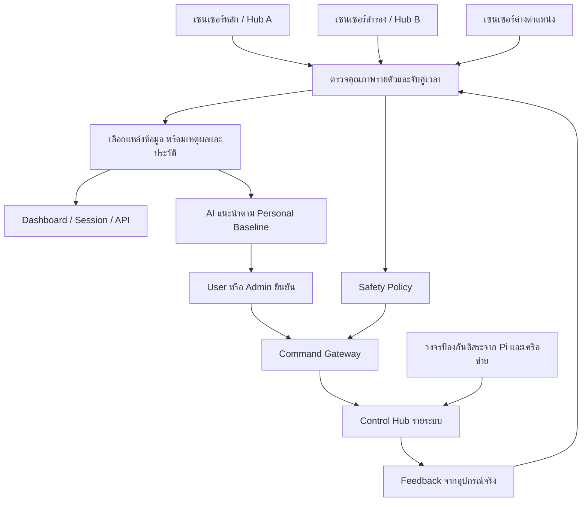

# ZEEP — แผนเซนเซอร์สำรองและการขยายระบบอุปกรณ์

สถานะ: **DESIGN PROPOSAL v1.0 · ยังไม่ใช่ Runtime contract หรือรายการติดตั้งจริง**

วันที่ทบทวน: 19 กันยายน 2026

ฐานที่ตรวจ: `origin/develop` / `c75edcd` และ working tree บน Mac

เจ้าของข้อเสนอ: Pi 5 application team ร่วมกับทีม Embedded, Electrical และ Mechanical

ผู้อนุมัติขอบเขตผลิตภัณฑ์: เจ้าของโครงการ ZEEP; ผู้รับผิดชอบงานวิศวกรรมแต่ละด้านต้องระบุชื่อก่อนเริ่มติดตั้ง

## สรุปสำหรับทีม

แนะนำ **เซนเซอร์หลัก + เซนเซอร์สำรองที่อ่านค่าตลอดเวลา** โดยแยก Hub,
วงจรสื่อสาร และแขนงจ่ายไฟในส่วนที่ต้องทำงานต่อเมื่ออีกชุดเสีย เริ่มที่อุณหภูมิ/
ความชื้นและ CO₂ ก่อน แล้วขยายตามความเสี่ยงและประโยชน์ที่วัดได้

เซนเซอร์สองตัวช่วยตรวจพบความต่าง แต่ไม่ได้บอกเองว่าตัวใดถูก ต้องตรวจสุขภาพ
อุปกรณ์ ตำแหน่งติดตั้ง เวลาเก็บข้อมูล และการสอบเทียบประกอบ ไม่ปรับค่าตัวหนึ่ง
ให้เท่าอีกตัวโดยอัตโนมัติ และไม่เลือกค่าที่ใกล้ Personal Baseline เพียงเพราะดูดีกว่า

อุปกรณ์ใหม่ควรยืนยันได้ทั้ง **สิ่งที่สั่ง** และ **สิ่งที่เกิดขึ้นจริง** เช่น พัดลม
หมุนและมีลมผ่าน วาล์วปิดและไม่มีน้ำไหล ฮีตเตอร์หยุดและกระแสโหลดหยุดจริง
AI เสนอการปรับความสบายได้ แต่ไม่ข้าม Safety Policy หรือคำยืนยันของ User/Admin

Ion Generator เป็นอุปกรณ์เสริมที่ต้องพิสูจน์การปล่อยมลพิษและประโยชน์ก่อนใช้
ส่วน Ozone Generator ไม่รวมใน Nap & Refresh / Overnight ที่มีคนอยู่ในตู้
ขอบเขตว่าจะใช้กับอากาศช่วงบำรุงรักษาหรือวงจรน้ำยังรอทีมยืนยัน

งานรอบนี้เป็นแผนและเอกสารเท่านั้น ไม่เปลี่ยนสูตรคะแนน, Raw data, Firmware,
GPIO, การควบคุมจริง หรือสถานะบริการ

**เชื่อมกับงาน 22 กันยายน:** เอกสารนี้เป็นกรอบสถาปัตยกรรมอุปกรณ์รุ่นถัดไป
ส่วน [Sensor Expansion BOM](zeep-sensor-expansion-bom-v1.md) เป็นรายการคัดเลือก
เฉพาะสถานะประตู อัตราการไหลอากาศ และอุณหภูมิพื้นผิว ยังไม่ใช่คำสั่งซื้อ
[Adaptive Journey](zeep-adaptive-journey-v1.md) ใช้ข้อมูลที่ระบบมีอยู่เพื่อวิเคราะห์
และเสนอคำแนะนำแล้ว แต่ยังไม่ได้เพิ่มระบบเลือกเซนเซอร์สำรองหรือสั่งอุปกรณ์อัตโนมัติ

## 1. จุดเริ่มจากระบบปัจจุบัน

| ส่วนที่มี | หน้าที่ปัจจุบัน | ช่องว่างที่ต้องต่อยอด |
|---|---|---|
| Sensor Hub 1 / USB | SHT3x-DIS, OPT3001, SPH0645LM4H-B | เซนเซอร์หลักต่างชนิดรวมอยู่บน Hub เดียว ยังไม่มีคู่สำรองที่ยืนยันการติดตั้ง |
| Sensor Hub 2 / MQTT | MH-Z19C, PMS7003, SGP40 | มี fallback ในโค้ดบาง field แต่ไม่ใช่หลักฐานว่ามีอุปกรณ์สำรองจริง |
| BCG / USB | LSM-800-T: HR, RR, คลื่นและสถานะเตียง | การมีคนในตู้และการมีคนบนเตียงเป็นคนละเรื่อง; ไม่ใช้ BCG เพียงตัวเดียวรับรองว่าตู้ว่าง |
| Control Hub 1 / IR | สั่งแอร์ | ACK ยืนยันการส่ง IR ไม่ใช่การตอบสนองทางกายภาพของแอร์ |
| Control Hub 2 / Servo | กดรีโมตเตียง | ยังไม่ใช่ feedback ตำแหน่งเตียงจริง |
| Pi GPIO / Audio | ประตู ไฟ กลิ่น ไอน้ำ Red light และเพลง | ต้องออกแบบ feedback และ safe state รายโหลดเมื่อเพิ่มอุปกรณ์ |
| Fleet Health | ตัวตน Hub, Firmware, อายุข้อมูล และสถานะเชื่อมต่อ | ยังไม่ใช่ระบบเลือกเซนเซอร์หลาย instance หรือรับรองความถูกต้องของค่าที่วัด |

หลักฐานใน source:

- [Sensor catalog](../sensors/catalog.py): ข้อมูลและ source ถูกผูกกับชื่อรุ่น เช่น
  `sht3x_dis` ไม่ใช่ serial/instance ของเซนเซอร์แต่ละตัว
- [Environment composer](../sensors/environment.py): เลือก source ที่ live/valid
  ไม่ได้เปรียบเทียบคู่เซนเซอร์เพื่อพิสูจน์ความคลาดเคลื่อน
- [Device contract](../hardware/device_contract.py): มี health ระดับอุปกรณ์ แต่
  transport ยังดีไม่ได้แปลว่า measurement ถูกต้อง
- [Safety faults](../safety/faults.py): ยังมีเงื่อนไขอิงความสดของ ESP32 หลักและ
  model-key ของ CO₂ ต้องปรับอย่างมีการทดสอบเมื่อเพิ่ม backup ไม่ใช่ปิด alarm เดิม
- [Hardware map](onboarding/hardware-hub-map.md) และ
  [Adaptive recommendation](adaptive-control-recommendation-plan-v1.md)
  เป็นรายละเอียดของระบบที่มีอยู่ ไม่ให้ข้อเสนอนี้เขียนทับข้อเท็จจริงปัจจุบัน

## 2. โครงสร้างที่เสนอ

Hub A/B เป็นชื่อเชิงสถาปัตยกรรม ไม่ใช่การเปลี่ยนชื่อ Sensor Hub 1/2 ทันที
เริ่มเพิ่ม **SensorHub-R** สำหรับคู่สำรองของระบบเดิมได้ แล้วจึงพัฒนา Env Hub A/B
ให้มีความสามารถสำคัญเท่ากันในรุ่นถัดไป ไม่ต้องเปลี่ยน Firmware ทั้งตู้พร้อมกัน

สิ่งที่ต้องแยกให้ออกจากกัน:

1. **ความพร้อมข้อมูล** — วัดค่าได้จากแหล่งใดที่ยังใช้ได้
2. **ความพร้อมควบคุม** — สั่งอุปกรณ์และตรวจผลได้หรือไม่
3. **ความปลอดภัย** — ป้องกันอันตรายและออกจากตู้ได้แม้ Pi/เครือข่ายเสีย

มีเซนเซอร์สำรองไม่ได้ทำให้ Pi, แหล่งจ่ายไฟร่วม, พัดลมตัวเดียว หรือรีเลย์ตัวเดียว
มีความทนทานตามไปด้วย ต้องบันทึกจุดเสียร่วมเหล่านี้ใน FMEA ของตู้ด้วย

## 3. เซนเซอร์ซ้ำมีสองหน้าที่ ไม่ควรปะปน

### 3.1 คู่สำรอง: วัดสภาวะเดียวกัน

ติดตั้งในบริเวณที่รับสภาวะใกล้กัน มีหน้าต่างเวลาและการสอบเทียบที่เปรียบเทียบได้
แต่แยก Hub/บัส/แขนงไฟเพื่อไม่เสียพร้อมกัน ตัวสำรองต้องวัดต่อเนื่องและผ่านช่วง
อุ่นเครื่องแล้ว ไม่ใช่เพิ่งเปิดเมื่อหลักเสีย

ข้อมูลสองตัวที่ต่างกันแต่ยังผ่าน self-test ทั้งคู่ให้เป็น **ค่าต่างกัน · รอตรวจสอบ**
ไม่ตัดสินผู้ชนะโดยอัตโนมัติ หากต้องใช้การลงคะแนน 2 ใน 3 ต้องมีสามตัวที่รับสภาวะ
เดียวกันและตรวจสาเหตุเสียร่วมด้วย ไม่ถือว่าเสียงข้างมากถูกเสมอ

### 3.2 วัดหลายตำแหน่ง: เข้าใจความสบายและประสิทธิภาพ

หัวเตียง/ปลายเท้า/ลมเข้า/ลมออกวัดต่างกันได้ตามปกติ ใช้ดูการกระจายอุณหภูมิ
การระบายอากาศ เสียงจากเครื่อง และแสงรั่ว ไม่ใช้ความต่างนี้เป็นหลักฐานว่าเซนเซอร์เสีย
หรือเฉลี่ยจนซ่อนจุดร้อน/จุดอับ การวาง CO₂ ใกล้ลมจ่ายอาจอ่านต่ำกว่าบริเวณคนพัก
จึงต้องทำแผนผังตำแหน่งและทดสอบการผสมอากาศ [CDC ventilation FAQ](https://www.cdc.gov/niosh/ventilation/faq/index.html)

| ประเภท | จำนวนเสนอเริ่มต้นต่อ Pod | การใช้ประโยชน์และข้อจำกัด |
|---|---|---|
| อุณหภูมิ/ความชื้น | 2 ตัวเป็นคู่สำรอง; เพิ่มจุดปลายเท้าได้ภายหลัง | เลือก exact SHT30/31/35 จาก BOM; ไม่วางชิดแหล่งความร้อนหรือโดนลมแอร์ตรง |
| CO₂ | 2 ตัวเป็นคู่สำรองในบริเวณคนพักที่เปรียบเทียบกันได้ | แยกไฟ/Hub, ทดสอบ warm-up และ calibration; ไม่วางรับลมหายใจโดยตรงหรือลมจ่าย |
| แสง | 2 ตัว | เลือกก่อนว่าจะเป็นคู่สำรองหรือหัวเตียง/ประตูสำหรับหาแสงรั่ว; 0 lux ไม่ใช่หลักฐานว่าเสีย |
| เสียง | 2 ตัว | หากต้อง failover ให้สองตัวแทนตำแหน่งการรับเสียงเดียวกันได้; ไมค์ข้างเครื่องเหมาะวิเคราะห์ต้นเสียง แต่ไม่แทนเสียงที่หูผู้พักโดยตรง |
| PM2.5 | 1 ตัวเดิม + 1 ตัวตามงบ/ผลทดสอบ | คู่สำรองต้องรับอากาศเปรียบเทียบกันได้; วัดก่อน/หลังไส้กรองเป็นอีกการทดลองหนึ่ง |
| VOC | 1 ตัวเดิม + 1 ตัวสำหรับเทียบ | เก็บ algorithm state แยกตัว; Index ต่างกันอาจเกิดจากประวัติการเรียนรู้ ไม่ใช่ตัวใดตัวหนึ่งเสีย |
| BCG | ตัวเดิม + sensor ตรวจการมีคนอีกหลักการหนึ่ง | เพิ่ม occupancy/น้ำหนัก/เรดาร์เพื่อช่วยแยกมีคนกับสัญญาณชีพหาย; ไม่แทน HR/RR ด้วยข้อมูล occupancy |

BCG ตัวที่สองควรเป็นงานทดลองเฉพาะ: ตรวจตำแหน่ง แรงกด การรบกวน และความตรงกับ
อุปกรณ์อ้างอิงก่อนเลือกคู่หลัก/สำรอง ห้ามนำ HR ของชุดหนึ่งกับ RR อีกชุดมาประกอบ
เป็นหลักฐานคู่เดียวโดยไม่ระบุวิธีและทดสอบ

SPH0645 เป็นไมค์ดิจิทัล ส่วน `sound_dba` เป็นค่าที่ Firmware คำนวณอยู่แล้ว
แผนนี้ไม่กลับไปใช้ `abs(dBFS)` หรือเพิ่ม bias ใหม่ การเทียบไมค์ต้องใช้ตำแหน่ง
ช่วงเวลา weighting และ time response เดียวกัน รวมทั้ง meter อ้างอิง

VOC Index ของ SGP40 เป็นค่าปรับตามประวัติ ไม่ใช่ความเข้มข้นของสารรายชนิด
และใช้แทน ozone sensor ไม่ได้ การลด Index อย่างเดียวจึงยังไม่พิสูจน์อัตรากำจัด
สาร VOC หรือความปลอดภัยก่อนเข้าตู้ [SGP40 VOC Index for Experts](https://sensirion.com/en/media/documents/A6D12AD4/61644979/Sensirion_Gas_Sensors_Datasheet_GAS_AN_SGP40_VOC_Index_for_Experts_D.pdf)

## 4. วิธีเลือกข้อมูลและเปลี่ยนไปใช้ตัวสำรอง

| เหตุการณ์ | สิ่งที่ระบบควรทำ | ข้อความ Admin |
|---|---|---|
| ทั้งคู่สดและสอดคล้อง | ใช้หลัก เก็บทั้งคู่และผลเปรียบเทียบ | ทำงานปกติ |
| หลักขาดการเชื่อมต่อ/CRC เสีย/รายงาน fault; สำรองพร้อม | ใช้สำรอง พร้อมเหตุผลและเวลาเปลี่ยน; ตรวจ Safety capability ต่อ | ใช้เซนเซอร์สำรอง |
| ทั้งคู่สด แต่ต่างเกิน tolerance | ตรวจเวลา ตำแหน่ง และ health; ถ้าระบุตัวเสียไม่ได้ให้เก็บความไม่แน่นอน ไม่เลือกค่าที่ดูดีกว่า | ค่าต่างกัน · ตรวจสอบตำแหน่งหรือสอบเทียบ |
| สำรองกำลังอุ่นเครื่อง | ไม่ถือเป็น backup พร้อมใช้งาน | เซนเซอร์สำรองกำลังเตรียมพร้อม |
| ไม่มีแหล่งที่ใช้ได้ | เก็บค่าล่าสุดเป็น last-known พร้อมอายุ แต่ไม่ถือเป็น live; ทำ safe action ตามหน้าที่ | ยังไม่มีข้อมูลที่ใช้ยืนยันได้ |
| หลักกลับมา | รอดูเสถียรภาพตามนโยบายรายชนิดก่อนกลับ; ไม่สลับไปมาเมื่อค่าชิดขอบ | กำลังตรวจความพร้อมของตัวหลัก |

การประเมินรายตัวต้องครอบคลุม identity, boot/sequence, data age, CRC,
ช่วงวัดตาม datasheet, warm-up, self-test, calibration, ความเร็วเปลี่ยนที่เป็นไปได้
และความสัมพันธ์กับอุปกรณ์ข้างเคียง **ค่าคงที่อย่างเดียวไม่เท่ากับ stuck**
ต้องมีหลักฐาน packet/เวลาวัดหรือการทดสอบตอบสนองประกอบ

Tolerance และเวลายืนยันให้กำหนดรายชนิดจาก accuracy ของชิ้นส่วนจริง,
ความคลาดเคลื่อนการสอบเทียบ, response time และผลทดสอบตำแหน่ง ไม่ใช้เปอร์เซ็นต์
เดียวกับทุก sensor เหตุการณ์อันตรายไม่รอหน้าจอรอบ 10 วินาทีหรือ Sleep epoch

แยกสองมุมมอง: ค่าตัวแทนสำหรับความสบาย กับข้อมูลสำหรับ Safety ซึ่งต้องเห็น
ค่าเสี่ยงที่ยังน่าเชื่อถือทุกจุด ไม่เอาค่าเฉลี่ยมาหักล้างการเตือนอุณหภูมิสูงหรือ CO₂ สูง
การแจ้งค่าต่างกันไม่จำเป็นต้องจบ Session ทุกครั้ง แต่ถ้าสูญเสียความสามารถที่จำเป็น
ต่อความปลอดภัยต้องเข้าขั้นตอนหยุด/เรียกทีม/ออกจากตู้ตาม risk assessment

## 5. ออกแบบอุปกรณ์ใหม่รายระบบ

### 5.1 Hub Sensor IoT

- แยก acquisition, DSP, transport และ watchdog; DSP ไม่ทันต้องไม่ทำให้
  temperature/CO₂ หรือ heartbeat หยุดตาม
- ใช้ native sampling ตาม datasheet/algorithm แล้วสรุปแสดงผลทุก 10 วินาที;
  SGP40 standard algorithm ต้องมีรอบประมวลผลและ state ของแต่ละตัวตามผู้ผลิต
  ไม่ลดทุกอย่างเหลือหนึ่ง sample ต่อ 10 วินาที
- ใช้ USB/MQTT เดิมผ่าน adapter ก่อน; ประเมิน wired Ethernet หรือ isolated
  CAN/RS-485 หากสายยาว/มี noise ไม่ย้าย transport พร้อมกับเปลี่ยน logic ทั้งระบบ
- แยกโหลดมอเตอร์/ฮีตเตอร์จากแขนงไฟ sensor พร้อม protection และ watchdog;
  การมี USB สองเส้นจากไฟเลี้ยงจุดเดียวไม่ใช่ความสำรองด้านไฟเต็มรูปแบบ
- วางแผน I²C address: SHT3x ใช้ `0x44/0x45`; OPT3001 ใช้ `0x44–0x47`
  จึงชนกันได้ ต้องตรวจ breakout จริงและกำหนด address/แยก bus ก่อนต่อเพิ่ม
  mux ช่วยเรื่อง address แต่ไม่ได้กำจัดจุดเสียร่วมของ bus

อ้างอิง [SHT3x-DIS datasheet](https://admin.sensirion.com/media/documents/213E6A3B/63A5A569/Datasheet_SHT3x_DIS.pdf),
[OPT3001 datasheet](https://www.ti.com/lit/ds/symlink/opt3001.pdf) และ
[Sensirion Gas Index Algorithm](https://sensirion.github.io/gas-index-algorithm/)

### 5.2 Electrical Switching & Power Control

สร้าง Power Control Hub แยกจากงานวัด รองรับโหลดตาม voltage/current/inrush จริง
มี current feedback และ auxiliary contact/feedback ที่เหมาะกับโหลด
วิศวกรไฟฟ้ากำหนด isolation, earthing, leakage protection, fuse และระยะห่างวงจร
ไม่ต่อไฟกำลังเข้ากับ ESP32 โดยตรง

แยก `requested → accepted → applied → verified/failed`;
กระแสไหลไม่ได้ยืนยันประสิทธิภาพงานเสมอ เช่น มอเตอร์กินไฟแต่ไม่มีลม
ต้องทดสอบ relay/SSR ค้างติดและวิธีตัดสำรองที่อิสระ

Emergency stop ต้องตัดโหลดอันตราย แต่ไม่ทำให้การออกจากตู้หรือการระบายอากาศ
ที่จำเป็นหยุดโดยไม่มีทางสำรอง ให้ทีมกำหนด load-shedding และ UPS budget
จากการวัดจริง ไม่ประกาศระยะสำรองไฟจากชื่ออุปกรณ์

### 5.3 Air System

แยก fresh air, exhaust, recirculation/filtration และความเย็นให้ชัด เพิ่ม tachometer,
airflow/pressure, สถานะไส้กรอง และอุณหภูมิทางลมที่จำเป็น
คำสั่ง `fan_on` หรือ RPM อย่างเดียวไม่ยืนยันว่ามีอากาศใหม่เข้าถึงคนพัก

ถ้าต้องการพัดลมสำรอง N+1 ต้องพิสูจน์ว่าเมื่อเสียหนึ่งตัว อีกตัวรักษาปริมาณลมขั้นต่ำ
ผ่านท่อ/ไส้กรองจริงได้ รวมผล backflow และ damper ไม่ใช่เพียงติดพัดลมเพิ่ม
Night mode ลดการเปลี่ยนรอบฉับพลันได้ แต่ไม่ลดการระบายอากาศต่ำกว่าขอบเขตที่อนุมัติ

ใช้การควบคุมต้นกำเนิดมลพิษ การระบายอากาศและไส้กรองเป็นฐาน;
ไส้กรองอนุภาคไม่ใช่ตัวลด CO₂ ส่วนสารดูดซับ VOC ต้องเลือกและทดสอบกับสาร/โหลดจริง
[EPA: Guide to Air Cleaners in the Home](https://www.epa.gov/indoor-air-quality-iaq/guide-air-cleaners-home)

### 5.4 Smart Film Control System

แยก driver ตามชนิดฟิล์มและ datasheet ผู้ผลิต ห้ามสมมติแรงดัน/รูปคลื่นจากคำว่า
Smart Film ตรวจ current/temperature และ isolation จากผู้ใช้
กำหนดสถานะเมื่อไฟดับจากฟิล์มรุ่นจริง ไม่สมมติว่าทุกชนิดจะทึบหรือใสเหมือนกัน

ใช้ User privacy preference + light schedule ได้ แต่แสงภายใน/ภายนอกอย่างเดียว
ยังยืนยัน transmittance ไม่ได้หากไม่มีวิธีทดสอบที่ควบคุมแหล่งแสง
การออกจากตู้และสัญญาณฉุกเฉินต้องไม่พึ่งการทำงานของฟิล์ม

### 5.5 Ion Generator

เป็น optional module ปิดไว้ก่อนระหว่าง qualification ให้ผู้ผลิตระบุชนิด ionization,
emission test, by-products, maintenance และหลักฐานประสิทธิภาพของรุ่นนั้น
EPA ระบุว่าหลักฐานภาคสนามของ bipolar ionization ยังจำกัดกว่า filtration และ
แนะนำตรวจ UL 2998 หากเลือกเทคโนโลยีนี้ การรับรอง emission ไม่ใช่หลักฐานว่า
กำจัดสารได้ทุกชนิดหรือทำให้ตู้ประกอบเสร็จปลอดภัยโดยอัตโนมัติ
[EPA: Bipolar Ionization](https://www.epa.gov/indoor-air-quality-iaq/can-air-cleaning-devices-use-bipolar-ionization-including-portable-air)

ทดลองเปรียบเทียบ ion off/on กับการระบายอากาศและ filtration ที่คงที่ก่อน
เก็บ ozone/by-products ด้วยวิธีที่เหมาะสม ไม่ใช้ VOC Index ตัวเดียวรับรองผล

### 5.6 Ozone Generator

**ข้อเสนอ: แยกเป็น R&D/maintenance module ไม่รวมในโหมดพักที่มีคนอยู่**
Ozone ระคายเคืองระบบหายใจ และความเข้มข้นที่ไม่เกินเกณฑ์สุขภาพมีประสิทธิภาพ
จำกัดต่อมลพิษหลายชนิด ปฏิกิริยาอาจสร้างสารระคายเคืองอื่น จึงไม่ใช้ข้อความ
“เติมโอโซนเพื่อสุขภาพ” หรือให้ AI เปิดตามค่า VOC [EPA: Ozone Generators](https://www.epa.gov/indoor-air-quality-iaq/ozone-generators-are-sold-air-cleaners)

หากทีมยืนยันกรณีใช้งานที่จำเป็น ต้องมีการออกแบบเฉพาะโดยผู้เชี่ยวชาญ:

- ตรวจและยืนยันว่าไม่มีคน พร้อมควบคุมการเข้าพื้นที่ในรอบบำรุงรักษา;
  Session จบ, BCG off-bed หรือ HR/RR หาย **ไม่ใช่** หลักฐานว่าตู้ว่าง
- มี hardware interlock ตัด generator, การตรวจประตู/การเข้าถึง,
  ozone-specific monitor และการตรวจ airflow จริง ซึ่งทำงานได้โดยไม่พึ่ง Pi
- Fault, sensor หาย หรือมีคนเข้าถึง: ปิด generator, แจ้งทีมและดำเนินการระบาย
  ตาม procedure; ทางออกจากด้านในต้องใช้ได้เสมอ ห้ามล็อกคนไว้
- กำหนด re-entry procedure และเกณฑ์โดยผู้เชี่ยวชาญจากระบบจริง;
  ไม่ใช้ timer อย่างเดียว, กลิ่น, VOC Index หรือ occupational limit เป็นใบรับรองให้เข้าพัก
- ประเมินการรั่วไปยังคนภายนอก วัสดุเสื่อม และ by-products;
  ถ้าใช้วงจรน้ำต้องประเมิน off-gassing และการปนเปื้อน/ละอองน้ำด้วย

การมี interlock ไม่ได้ทดแทนการพิสูจน์ความจำเป็นและประสิทธิภาพของกระบวนการ

### 5.7 Foot Warmer

ควบคุมจาก **อุณหภูมิพื้นผิวสัมผัส** ไม่ใช่ SHT ที่วัดอากาศอย่างเดียว
เสนอ sensor สำหรับควบคุม + sensor ตรวจอิสระ พร้อม thermostat/thermal cutoff
ที่ตัดไฟฮีตเตอร์ได้แม้ MCU หรือ relay ค้าง มี current feedback, timeout และ
ต้องตรวจ fault ก่อนเปิดใหม่ ไม่ resume ความร้อนอัตโนมัติหลัง restart

เริ่มจากการอุ่นตามเวลาที่ผู้ใช้เลือก ไม่เปิดต่อเนื่องทั้งคืนเป็น default
กำหนดเพดานอุณหภูมิและเวลาจากชนิดวัสดุ/การสัมผัส/ผู้ใช้เป้าหมายและการทดสอบ
hotspot, ถูกผ้าห่มปิด, sensor หลุด, โหลดติดค้าง ไม่ตั้งเลขจากอุณหภูมิห้องที่คนชอบ
แรงดันต่ำหรือ PTC เพียงอย่างเดียวไม่รับรองว่าปลอดภัยจากการไหม้ผิวหนัง

มาตรฐานที่ต้องให้วิศวกร/ห้องทดสอบตรวจ applicability ได้แก่
[IEC 60335-2-81:2024 — Foot warmers and heating mats](https://webstore.iec.ch/en/publication/101994)
ร่วมกับข้อกำหนดทั่วไป; ถ้าเป็น blanket/pad อาจเข้าขอบเขตอื่น
รอบนี้ตรวจเฉพาะ public scope ไม่ได้อ่านข้อกำหนดฉบับเต็มหรือรับรองผลิตภัณฑ์

### 5.8 Water Tank & Solenoid Valve System

ใช้ sensor ระดับน้ำสำหรับการทำงาน + high-level float switch อิสระ,
low-level/dry-run protection, ถาดตรวจน้ำรั่ว และ flow sensor ตามหน้าที่
วาล์วน้ำเข้าควรเป็น normally closed เมื่อขาดไฟ พร้อม manual isolation;
หากความเสี่ยงน้ำล้นสูงให้มี barrier สำรองที่ไม่พึ่งวาล์วเดียว

กำหนดเวลาหรือปริมาตรเติมสูงสุด ตรวจ “ปิดแล้วแต่ยังมีน้ำไหล” และแยก fault
วาล์วค้างออกจาก tank-full; เมื่อน้ำรั่ว/ระดับขัดแย้งให้หยุดเติมและหยุดอุปกรณ์
ที่เสี่ยงทำงานแห้งโดย local controller ไม่รอเครือข่าย

วางถังและท่อให้ถอดล้าง/ระบาย/ตรวจได้ มี cleaning log และวัสดุเหมาะกับน้ำที่ใช้
น้ำที่ปลอดเชื้อก่อนเติมไม่ได้ทำให้ถังเปิดและทางเดินน้ำปลอดเชื้อตลอดไป
ไม่เชื่อม ozone-water เข้าระบบสร้างละอองสำหรับผู้พักโดยไม่มีการประเมินเฉพาะ

## 6. อุปกรณ์ที่ควรเพิ่มก่อนฟังก์ชันพิเศษ

| รายการ | ช่วยแก้ปัญหาอะไร | ลำดับ |
|---|---|---|
| ตำแหน่งประตูเปิด/ปิด + anti-pinch + manual egress | รู้ว่าประตูเคลื่อนจริงและออกได้แม้ระบบขัดข้อง | P0 |
| Alarm ควันและ CO ที่เหมาะกับพื้นที่ ตอบสนองได้อิสระ | CO₂ ไม่ใช่ CO; Pi ไม่ควรเป็นระบบแจ้งเหตุเพียงชุดเดียว | P0 |
| Airflow/pressure + fan tachometer | แยกสั่งพัดลมกับมีอากาศผ่านจริง | P0 |
| Current/voltage และอุณหภูมิชุดจ่ายไฟ | โหลดติดค้าง ไฟตก โหลดเกิน และวางแผน UPS | P0 |
| น้ำรั่ว + high/low tank level | น้ำล้น ลัดวงจรและอุปกรณ์ทำงานแห้ง | P0 เมื่อมีระบบน้ำ |
| Occupancy อีกหลักการหนึ่ง | แยกคนลุกจากเตียงแต่ยังอยู่ในตู้; ไม่ใช้เป็น clearance ของ ozone เพียงตัวเดียว | P1 |
| Filter differential pressure / service counters | เตือนดูแลก่อน airflow ลด; pressure อย่างเดียวไม่ยืนยันอายุสารดูดซับ VOC | P1 |
| Vibration sensor ที่ compressor/โครง + sound timeline | หาความสัมพันธ์เสียงตัดต่อกับแรงสั่นและจังหวะอุปกรณ์ | P2 |

นี่เป็นรายการเสนอ ไม่ใช่คำสั่งซื้อ; การเลือก alarm และ protection ต้องสอดคล้อง
ประเภทอาคาร/ผลิตภัณฑ์และข้อกำหนดพื้นที่ติดตั้งจริง

## 7. ข้อมูลและ API ที่รองรับหลาย instance

ต่อยอด [Device Contract และ Fleet Health](device-contract-and-fleet-health-v1.md)
โดยแยก **Hub health / Sensor health / Measurement quality / Actuator feedback**
ไม่ใส่ทุกอย่างใน `valid` ตัวเดียว

| ฟิลด์เสนอ | Type | ความหมาย |
|---|---|---|
| `pod_id`, `hub_id`, `sensor_id` | string | ระบุเครื่อง บอร์ด และชิ้นส่วนจริง; ไม่ใช้ชื่อรุ่นเป็น unique ID |
| `model`, `hardware_revision` | string | รุ่นและ revision ที่ตรวจจาก BOM |
| `zone`, `redundancy_group` | string / null | ตำแหน่งและกลุ่มที่อนุญาตให้สลับแทนกัน |
| `metric`, `unit` | string | เช่น `temperature_c`, `degC`; ใช้ registry คุมหน่วย |
| `value` | number / null | ค่าที่วัด; null พร้อมเหตุผลถ้าใช้ไม่ได้ ไม่แทนด้วย 0 |
| `measured_at`, `received_at` | timestamp / null | เวลาเก็บและเวลารับ; null เมื่อ Hub ไม่มีนาฬิกาที่เชื่อถือได้ |
| `boot_id`, `sequence`, `sample_uptime_ms` | string, integer, integer | กัน packet ซ้ำ/ย้อนเวลาและแยก reboot; Pi ผูกเวลา monotonic โดยมี uncertainty |
| `quality` | object | fresh, warm-up, self-test, calibration, errors แยกตาม metric |
| `calibration_id`, `firmware_sha256`, `config_sha256` | string / null | ตามกลับได้; ไม่มีให้เป็น null ไม่แต่งค่า |
| `selected_sensor_id`, `decision_reason` | string / null | แหล่งที่ใช้กับเหตุผลของการเลือก |
| `decision_version`, `source_changed_at` | string, timestamp / null | replay และ audit การเปลี่ยนแหล่ง |

เก็บ observation ของทั้งคู่ก่อนสร้าง canonical snapshot อย่าเขียน backup ทับ
identity ของ primary หากขัดแย้งแล้วยังเลือกไม่ได้ให้ `selected_sensor_id=null`
พร้อมข้อมูลทั้งคู่; consumer ใช้ policy ของตัวเองอย่างชัดเจน ไม่แปลงเป็นค่าปลอดภัย

Endpoint ด้านล่างเป็น **ข้อเสนอ ยังไม่มีการเปิดใช้**:

- `GET /api/v1/admin/sensors/health` — instances, อายุข้อมูลและ health
- `GET /api/v1/admin/sensors/decisions` — source changes / disagreement timeline
- `GET /api/v1/admin/devices/capabilities` — โหลดที่ควบคุมได้และ feedback ที่มีจริง

รักษา environment API เดิมผ่าน adapter แล้วเพิ่ม provenance แบบ additive;
หากโครง nested telemetry เปลี่ยนแบบไม่เข้ากันให้เพิ่ม schema version และ migration
ไม่ส่งหลาย instance เข้า decoder `v1.0` แล้วหวังว่าระบบเก่าจะเข้าใจ

คำสั่งต้องมี RBAC, request/command ID, TTL, expected state, idempotency,
Safety decision, ACK และผล verification มีสิทธิ์แยกตาม Pod และห้าม replay
retained command หลัง reconnect; retained telemetry ต้องตรวจอายุ/boot/sequence
AI ไม่มีช่องส่ง MQTT/GPIO โดยตรง ส่วน local safety action ที่อนุมัติไว้ไม่ต้องรอ
คำยืนยันผู้ใช้ในเหตุฉุกเฉิน

## 8. การแบ่งซอฟต์แวร์โดยไม่ทำให้ซับซ้อนเกินจำเป็น

| ส่วน | หน้าที่ | ไม่ควรทำ |
|---|---|---|
| `hardware/` adapters | อ่าน/เขียน transport และ feedback | ตัดสินคะแนนหรือ Personal Baseline |
| `sensors/` instance registry | ระบุตัว sensor, zone, calibration และหน่วย | ทำสำเนาสูตรตามแต่ละหน้า |
| `sensors/redundancy/` | quality comparison, source selection, hysteresis | สั่ง relay หรือเปลี่ยน raw |
| `safety/` capability policy | ดูว่าหน้าที่สำคัญยังทำงานได้และสั่ง safe response | อิงชื่อ Hub เดียวตลอดไป หรือปิด fault เพื่อให้เริ่มได้ |
| control services | ลำดับคำสั่งและ verification รายอุปกรณ์ | ยกสิทธิ์สั่งจริงให้ AI |
| repositories / API | บันทึก observation/decision/audit และแสดงตามสิทธิ์ | เอา transport health มาอ้างว่า measurement แม่นยำ |

เริ่มจาก pure functions และ contract เล็กที่ทดสอบได้ แยก library เฉพาะสิ่งที่
ใช้ซ้ำจริง เช่น timestamp/sequence validation ไม่สร้าง framework ใหม่หรือย้าย
โฟลเดอร์ทั้งระบบเพื่อรองรับฟีเจอร์นี้

เมื่อ backup ทดแทนได้จริง Safety ควรพิจารณา **capability ที่เหลือ** ไม่บังคับหยุด
เพราะชื่อ Hub หลักหายอย่างเดียว แต่ต้องคง fault ของ actuator/power/life-safety
ที่ยังเสียอยู่ การเปลี่ยนนี้ต้องมี regression เฉพาะ ไม่แก้โดยลบ `_append_esp32_fault`
โดยไม่มี logic ทดแทน

## 9. Dashboard, Monitor และการเรียนรู้ผู้ใช้

- **Dashboard ผู้ใช้:** ค่าที่เลือกแล้วชุดเดียวพร้อมสถานะสั้น; ไม่เพิ่มการ์ด sensor
  ทุกตัวจนรก ถ้าการพักไม่กระทบอาจแสดงเพียง “ระบบใช้เซนเซอร์สำรอง”
- **Monitor Admin:** แสดง A/B, zone, ผลต่าง, อายุข้อมูล, แหล่งที่ใช้,
  firmware/calibration และ timeline สลับแหล่ง/ค่าขัดแย้ง
- **Fleet:** เปรียบเทียบ Pod และดูว่าอะไรเสีย อะไรยังทดแทนได้ ไม่เหมารวมเขียวทั้งตู้
  เพียงเพราะ MQTT ยังเชื่อมต่อ
- **Session/API:** ระบุช่วง backup และความครบของข้อมูล ไม่เพิ่ม coverage เป็นสองเท่า
  เพราะมีสอง sensor และไม่ซ่อนเวลาของผู้ใช้เพียงเพราะข้อมูลสิ่งแวดล้อมบางตัวขาด
- **Baseline/AI:** เรียนรู้ความสบายจากช่วงที่ measurement ใช้ได้ พร้อม mode,
  zone, calibration และ source version; ตัดเฉพาะ evidence ที่ผิด ไม่ทิ้งทั้ง Session
  และไม่ใช้ Baseline มาตัดสินว่าค่าที่ไม่ตรงความชอบเป็น sensor เสีย

Nap & Refresh ยังใช้ **Recovery Score** และ Overnight ยังใช้ **Sleep Score**
แผน redundancy ไม่เปลี่ยนสูตร/สถานะย้อนหลัง การทดลองเปรียบเทียบอุปกรณ์เป็น
ข้อมูลเชิงวิศวกรรมก่อน ไม่ใช่หลักฐานว่าผู้ใช้สุขภาพดีขึ้นจากคะแนนที่เพิ่ม

AI ระยะแรกเสนอคำแนะนำพร้อมเหตุผลและผลที่คาด เช่น “ลมบริเวณศีรษะแรงกว่า
ช่วงที่คุณพักสบาย แนะนำปรับทิศทางลม” จากนั้นให้ผู้ใช้ยืนยัน และบันทึกผลจริง
คำสั่งปรับความสบายต้องอยู่ภายในขอบเขตวิศวกรรม ไม่ให้ผล Sleep State ครั้งเดียว
เริ่มความร้อน, ionization หรือกระบวนการบำรุงรักษา

## 10. ลำดับพัฒนาและเกณฑ์รับงาน

| ระยะ | งาน | ส่งมอบ/หลักฐานผ่าน |
|---|---|---|
| P0 — สำรวจและล็อกแบบ | BOM, ตำแหน่ง, power budget, failure modes, เจ้าของงาน | Wiring/zone map, datasheet รุ่นจริง, safe state รายโหลด และชุดเหตุขัดข้องที่ต้องจำลอง |
| P1 — อ่านคู่แบบไม่ควบคุม | SensorHub-R, instance contract, Monitor เทียบ A/B | ค่าทั้งคู่ตามกลับได้; ทดลองถอดหลักแล้วสำรองสด; disagreement ไม่ถูกปรับทับ |
| P2 — ใช้ข้อมูลสำรองจริง | canonical adapter + capability-based safety | source switch มี audit, ไม่รับ stale/replayed data, API เดิมยังใช้ได้, replay สูตรเดิมไม่เปลี่ยน |
| P3 — ตรวจผลคำสั่งจริง | Power/Air/Film/Water controllers | ทดสอบ feedback, stuck output, network loss, reboot, manual egress และ local cutoff ในตู้ว่าง |
| P4 — Comfort pilot | Foot warmer ที่ผ่านทดสอบและ optional ion ที่พิสูจน์แล้ว | มีข้อจำกัดรุ่นจริง ขั้นตอนทีม และผลทดสอบก่อนมีคน; ozone แยกโครงการตาม use case |
| P5 — Personal recommendation | ข้อมูลหลายจุดเทียบ comfort baseline | คำแนะนำตรวจเหตุผลได้, User/Admin ยืนยัน, มี outcome และไม่สั่งเกินขอบเขต |

Flash เพื่อทดสอบทำได้ตามขอบเขตที่เจ้าของอนุมัติ พร้อม backup/rollback และ
แผนตู้ว่าง ไม่ตั้งเงื่อนไขวนว่า “ต้องทดสอบ Firmware ก่อน แต่ห้าม Flash เพื่อทดสอบ”
การทดสอบที่อาจมีความร้อน สารเคมี หรือไฟกำลังผิดปกติต้องไม่ใช้ผู้พักเป็น test load

ชุดทดสอบสำคัญ ไม่จำเป็นต้องรันทุก test ของทั้งระบบในทุกการแก้เอกสาร:

1. ถอด sensor/Hub/แขนงไฟ, bus ค้าง, CRC เสีย, sequence ย้อน/ซ้ำ, reboot และ
   retained packet เก่า → ระบุแหล่งถูก ไม่มีค่า stale กลายเป็น live
2. หลักผิดชัด/สำรองดี กับทั้งคู่ valid แต่ขัดแย้ง → ผลตัดสินต่างกันและมีเหตุผล
3. 0 lux, อุณหภูมิคงที่, SGP warm-up, คนย้ายตำแหน่ง → ไม่แจ้งเสียจากเหตุปกติ
4. ค่าที่เสี่ยงจากตัวหนึ่ง → ไม่หายไปเพราะเฉลี่ยกับอีกตัวหรือใช้ Baseline กลบ
5. พัดลมหมุนแต่ทางลมตัน, ไส้กรองตัน, relay ค้าง, sensor ฮีตเตอร์หลุด,
   น้ำไหลหลังสั่งปิด → local response ทำงานและตรวจ feedback ได้
6. Pi/เครือข่ายดับ → โหลดความร้อน/น้ำ/สารเคมีเข้าสถานะที่ออกแบบไว้,
   ระบบระบายที่จำเป็นและทางออกยังมีวิธีทำงาน ไม่อ้างว่าคำสั่ง OFF ถูกส่งแล้วพอ
7. กลับมา online → ไม่เปิดฮีตเตอร์/เติมน้ำ/ion/ozone จากคำสั่งเก่าหรือ auto resume;
   แสดง last-known แยกจาก measurement สด
8. replay Session เดิมทั้งสองโหมด → สูตรคะแนนไม่เปลี่ยนเพียงเพราะเพิ่ม provenance
   และไม่มีการแก้ raw หรือเพิ่มเวลาที่วัดได้ด้วยการนับ sensor ซ้ำ

ตัวชี้วัดก่อน/หลัง: availability ของแต่ละ capability, เวลารู้ว่าเสีย,
เวลาสลับแหล่ง, false failover, disagreement duration, packet loss,
ความครบของ audit, ปริมาณลมจริง, เสียงที่ตำแหน่งผู้พักและพลังงานต่อ Session
เกณฑ์ตัวเลขให้ทีมอนุมัติจาก baseline ที่วัดได้ก่อน pilot ไม่ประกาศว่าดีขึ้นโดยไม่มีผลทดสอบ

## 11. ข้อมูลที่ต้องได้จากทีมเพื่อออก BOM และแผนสายจริง

1. ยี่ห้อ/รุ่น/จำนวนและ datasheet ของอุปกรณ์ใหม่ รวม exact part ของ sensor เดิม
2. แบบตู้และตำแหน่งหัวเตียง/ปลายเท้า/ทางลม/ประตู/ถัง/ช่อง service
3. แรงดัน กระแสปกติ/กระชาก กำลังฮีตเตอร์ และโหลดที่ต้องอยู่ต่อเมื่อไฟดับ
4. Ozone ใช้เพื่ออะไร: อากาศตู้ว่าง, น้ำวงจรปิด หรือยังไม่เลือก; มีทางเลือกไม่ใช้ ozone หรือไม่
5. Foot warmer เป็นแผ่นสัมผัส/ช่องลมอุ่น/โครงใต้เตียง และผู้ใช้เป้าหมาย
6. Water tank ใช้เติมไอน้ำ/รองน้ำทิ้ง/วัตถุประสงค์อื่น เส้นทางสัมผัสผู้ใช้และการล้าง
7. งบและพื้นที่ต่อ Pod, เป้าความเงียบ/airflow, การดูแลและเปลี่ยนอะไหล่

ข้อมูลที่ยังไม่มีไม่ขวางการทำ software contract และ shadow comparison
แต่ต้องไม่เดา pinout, power rating, safe temperature หรือ ozone clearance มาใช้จริง

## 12. Verification และแหล่งข้อมูล

ตรวจ source ปัจจุบันและ public primary sources เมื่อ 19 กันยายน 2026 โดย
Codex ในฐานะผู้จัดทำข้อเสนอ; ยังไม่มีผลวัดจากอุปกรณ์ใหม่หรือการตรวจรับโดยวิศวกร
เอกสารนี้ไม่รับรองผลิตภัณฑ์ ไม่ใช่คำแนะนำรักษา และไม่กำหนดเกณฑ์ความปลอดภัยใหม่

ผลตรวจเอกสารรอบนี้: `test_documentation_alignment` ผ่าน 9 tests และ
`git diff --check` ผ่าน เป็นการตรวจ index/link/contract alignment ไม่ใช่ผลทดสอบ
ฮาร์ดแวร์ มีคำเตือน Pydantic V1 validator เดิมในโมเดล API ซึ่งไม่เกี่ยวกับแผนนี้

| แหล่ง | สรุปสิ่งที่นำมาใช้ | ขอบเขต |
|---|---|---|
| [Hardware และ Hub Map](onboarding/hardware-hub-map.md) | อุปกรณ์/transport/ownership ที่มีในระบบ | ตรวจจาก source; สภาพติดตั้งจริงต้องสำรวจซ้ำ |
| [Sensor Interface Contract](zeep-sensor-interface-contract-v1.2.md) | compatibility ของค่าปัจจุบัน | ข้อเสนอนี้ยังไม่เปลี่ยน wire contract |
| [SHT3x-DIS](https://admin.sensirion.com/media/documents/213E6A3B/63A5A569/Datasheet_SHT3x_DIS.pdf) / [OPT3001](https://www.ti.com/lit/ds/symlink/opt3001.pdf) | address, electrical interface และการตรวจรุ่นจริง | datasheet ของ chip ไม่แทน schematic ของ breakout |
| [SGP40 VOC Index](https://sensirion.com/en/media/documents/A6D12AD4/61644979/Sensirion_Gas_Sensors_Datasheet_GAS_AN_SGP40_VOC_Index_for_Experts_D.pdf) / [Algorithm](https://sensirion.github.io/gas-index-algorithm/) | relative index และ state แยก sensor | ไม่ใช่ตัวจำแนกสารหรือ sensor ozone |
| [CDC Ventilation FAQ](https://www.cdc.gov/niosh/ventilation/faq/index.html) | ความสำคัญของตำแหน่ง/จำนวน/การสอบเทียบ CO₂ | ไม่ใช่แบบระบายอากาศเฉพาะ ZEEP |
| [EPA Air Cleaners](https://www.epa.gov/indoor-air-quality-iaq/guide-air-cleaners-home) | แยก filtration, gas removal และ ventilation | ไม่รับรองอุปกรณ์รุ่นที่ทีมจะซื้อ |
| [EPA Bipolar Ionization](https://www.epa.gov/indoor-air-quality-iaq/can-air-cleaning-devices-use-bipolar-ionization-including-portable-air) | หลักฐานจำกัดและข้อควรตรวจ ozone/by-products | ต้องพิสูจน์รุ่นจริงและตู้ประกอบเสร็จ |
| [EPA Ozone Generators](https://www.epa.gov/indoor-air-quality-iaq/ozone-generators-are-sold-air-cleaners) | ความเสี่ยงและข้อจำกัดการใช้ ozone ทำความสะอาดอากาศ | ไม่ใช้ตารางเกณฑ์เก่าในบทความมาตั้ง re-entry ของ Pod |
| [IEC 60335-2-81:2024](https://webstore.iec.ch/en/publication/101994) | ขอบเขต foot warmers/heating mats | อ่าน public scope เท่านั้น; ต้องใช้มาตรฐานฉบับเต็มในการตรวจรับ |

ตารางนี้เป็นบันทึกที่มาของ **ข้อเสนอวิศวกรรม** ไม่ใช่ทะเบียน evidence ชุดใหม่
เมื่อจะนำแหล่งใหม่เป็น approved basis หรือดาวน์โหลดเข้าคลัง ให้ลงทะเบียนผ่าน
[Evidence Library](../research/evidence-library/README.md) และ
[ทะเบียน JSON หลัก](../research/evidence-library/source-register.json) ตาม workflow เดิม
ไม่คัดลอก source ID/checksum ที่ยังไม่ได้ตรวจ
