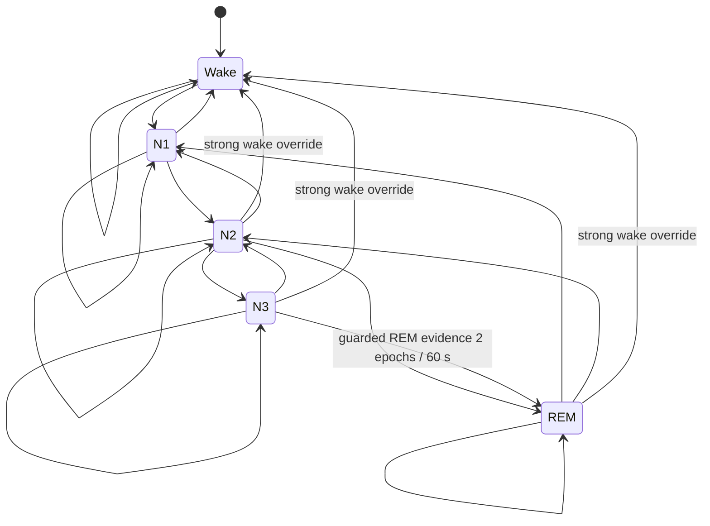

# ZEEP — Sleep-State Baseline v1.8

> **Purpose:** นิยาม input, baseline, transition policy, data quality และแผน PSG validation ของตัวประมาณสถานะการนอนใน Pod  
> **Positioning:** Sleep Wellness · EEG-free exploratory telemetry · ไม่ใช่ผล PSG/การวินิจฉัย/ตัวสั่งอุปกรณ์  
> **Status:** Wellness release candidate · deterministic replay and guarded derived-result promotion required · paired-PSG G2 validation open
> **Version:** `zeep-sleep-state-baseline-v1.8-sep1-cutover` · **Estimator:** `bcg-audio-bed-5state-v1.23-wellness-longitudinal` · **Transition:** `zeep-semimarkov-30s-v1.13-no-bridge-labels` · **Updated:** 2026-09-05
> **Related:** [Current Sleep System](zeep-sleep-system-current.md) · [AI Sleep-State](ai-sleep-state-and-assistant.md) · [Evidence](sleep-wellness-evidence.md) · [Closed Loop](closed-loop-spec.md)

## TL;DR

- ทุก session/cycle เริ่ม `Wake → N1 → N2`; จาก N2 ไป N3 หรือ REM และจาก N3 ไป REM ได้เมื่อหลักฐาน REM ต่อเนื่อง
- N2/N3/REM ที่จะตื่นแบบสัญญาณไม่ชัดต้องย้อนผ่าน N2/N1; bed-exit ไป Wake ได้หลังผ่าน debounce 3 รอบ 10 วินาที ส่วน Raw packet burst เป็นข้อมูล Debug ไม่ใช่ตัว confirm โดยลำพัง
- HR/RR trend, respiratory regularity จาก Raw BCG, Bed Status และ movement เป็นหลัก
- ไม่มี Active Recording Session, ไม่ยืนยันผู้ใช้อยู่บนเตียง หรือรอบปัจจุบันไม่มี HR+RR สด = **ไม่ประเมิน Sleep Stage**; แสดง `WAIT/OFF`, probability ทั้ง 5 เป็นศูนย์ และไม่เขียน stage ลง Timeline
- SPH0645 สนับสนุน Wake ได้เฉพาะเสียงรบกวนที่ time-aligned กับ BCG amplitude shift หรือ bed motion; เสียงดังอย่างเดียวไม่มีผลต่อ state
- Sensor สิ่งแวดล้อม 7 ปัจจัยอธิบาย disturbance และปรับ confidence เท่านั้น ไม่มี direct stage weight
- Sensor frame ทุก 10 วินาที, Evidence epoch ทุก 30 วินาทีจาก rolling 60 วินาที และยืนยัน State 60/120 วินาทีตาม target; แนวโน้ม onset ใช้ context ได้ถึง 270 วินาที
- 5 นาทีแรกสร้าง Session-relative Awake reference; N1 เริ่มได้เมื่อเตียงนิ่ง ไม่มี vital rise และ HR/RR แสดงการลดลงหรือคงอยู่ที่ plateau ที่ต่ำกว่าช่วงตั้งต้นอย่างสอดคล้องกัน เวลาเพียงอย่างเดียวสร้าง N1 ไม่ได้
- พฤติกรรมย้อนหลังใช้เฉพาะ Session ก่อนหน้า ตั้งแต่ 1 ก.ย. 2569 แยกตามบัญชีและโหมด อย่างน้อย 3 Session และเป็น context/คำแนะนำเท่านั้น (`direct_stage_influence=false`); ห้ามข้อมูล Session ปัจจุบันหรืออนาคตย้อนมากำหนด State
- หากหลักฐานสอง State ใกล้กัน ระบบเก็บ Evidence แต่ abstain ไม่เขียน W/N1/N2/N3/REM และ transition ที่ถูก block จะคง State เดิมโดยไม่แต่ง bridge label
- `HR-CV` ในระบบเป็นความแปรปรวนของค่าเฉลี่ยต่อ analysis bucket 10 วินาที ไม่ใช่ RMSSD/SDNN; amplitude shift ของ BCG ไม่ใช่ EEG K-complex/spindle
- G2 primary ontology คือ `W / N1 / N2 / N3 / REM`; 3-class collapse เป็น secondary analysis
- transition guard เป็นกติกาของ ZEEP ไม่ใช่ AASM scoring rule; ต้องเทียบ PSG ก่อนยกระดับ claim
- Beat Detector/True IBI-HRV ถูกพักไว้: UART raw ของ LSM-800-T ที่ติดตั้งจริงเป็น 25 Hz ไม่ผ่าน gate ≥250 Hz

## 1. ขอบเขตและคำที่ใช้

ZEEP แสดงสถานะ `Wake / N1 / N2 / N3 / REM` เพื่อให้ทีมเห็นแนวโน้มแบบ
ต่อเนื่องจากเซ็นเซอร์ใต้เตียงและสภาพแวดล้อมภายใน Pod โดยผลทุก epoch เป็น
**ค่าประมาณแบบ EEG-free** ไม่ใช่ผลตรวจ PSG, ไม่ใช่การวินิจฉัย และยังห้ามใช้
เป็น trigger สั่งแอร์ แสง เสียง กลิ่น เตียง หรืออุปกรณ์อื่นโดยอัตโนมัติก่อนผ่าน G2

มาตรฐาน AASM แบ่ง W, N1, N2, N3 และ R จากหลักฐาน EEG, EOG และ chin EMG
ใน epoch 30 วินาที การกำหนดว่า ZEEP ต้องเริ่ม `Wake → N1` จึงเป็น continuity
guard ของโครงการเพื่อลดการกระโดดจาก noise ของ BCG ไม่ใช่กฎการให้คะแนน AASM

G2 amendment 2026-08-26 freeze ontology แบบ 5-class และ crosswalk one-to-one ดังนี้:

| หน้าจอ ZEEP | PSG reference class |
|---|---|
| Wake | W |
| N1 | N1 |
| N2 | N2 |
| N3 | N3 |
| REM | REM |

ทุก label ยังเป็น exploratory estimate จนกว่าจะผ่าน PSG validation; N3 จาก ZEEP
ห้ามอ้างว่าเป็น deep sleep ที่วัดตาม AASM ก่อน G2 แม้ชื่อจะ crosswalk ตรงกัน

## 2. กติกาการเปลี่ยนสถานะ



กติกาที่ระบบบังคับ:

1. Session/cycle ใหม่ต้อง publish `Wake` ก่อนเสมอ
2. หลัง `Wake` ไปได้เฉพาะ `Wake` หรือ `N1`
3. หลัง N1 ไปได้ Wake/N1/N2 และ REM แบบ rare/guarded; หลัง N2 ไป N1/N2/N3/REM ตามปกติ ส่วน Wake โดยตรงต้องมี strong-Wake proxy
4. `N3 → REM` อนุญาตโดยตรงเมื่อ N3 ผ่าน minimum dwell 60 วินาทีและ candidate REM ชนะต่อเนื่อง 2 evidence epochs (60 วินาที); ไม่บังคับแทรก N2
5. N2/N3/REM ที่จะ Wake แบบสัญญาณไม่ชัดต้องย้อน N1/N2 ก่อน
6. bed-exit เป็น strong-Wake override หลังผ่าน event guard 3 รอบ; movement บนเตียงต้องต่อเนื่องและมี HR/RR rise + BCG shift ใน window เดียวกันจึงใช้ override ได้
7. candidate W/N1/N3/REM ต้องชนะต่อเนื่อง 2 evidence epochs (60 วินาที) ส่วน N2 ต้อง 4 epochs (120 วินาที) และผ่าน minimum engineering dwell ของ state ปัจจุบันก่อน commit
8. เมื่อ commit `Wake` ถือว่าเริ่ม cycle ใหม่และ gate ของ N1 ถูก reset

ข้อ 2–8 เป็น ZEEP engineering policy ไม่ใช่เส้นทางตายตัวทางสรีรวิทยา
สถาปัตยกรรมการนอนจริงมีการย้อนกลับและเปลี่ยนสถานะได้หลายแบบ

### 2.1 เวลาและพฤติกรรมธรรมชาติ

AASM ให้คะแนนจากหลักฐานในแต่ละ epoch ไม่ได้กำหนดว่า “ครบกี่นาทีต้องเปลี่ยน state”
ZEEP จึงไม่ใช้ hard timer ทางการแพทย์ แต่ใช้เวลาเป็น soft prior:

- N1 ต้องมีหลักฐานต่อเนื่อง 60 วินาที; N1 คงขั้นต่ำเชิงวิศวกรรม 30 วินาทีก่อนลง N2
- N2 ต้องมีหลักฐานต่อเนื่อง 120 วินาทีและคงขั้นต่ำ 60 วินาทีก่อน N3/REM
- N3 และ REM ต้องมีหลักฐานต่อเนื่อง 60 วินาที และคง state เดิมขั้นต่ำ 60 วินาที
- REM ก่อน 45 นาทีถูกลด prior; หลังจากนั้นเวลาเพิ่มคะแนนได้เฉพาะเมื่อ respiratory/movement gate ผ่านแล้ว
- เพิ่ม prior N3 แบบอ่อนหลัง 5 นาทีและลดลงในช่วงปลายคืน
- Bed-exit/physiology-corroborated sustained movement ไม่รอ dwell หรือ bridge; brief movement ไม่ใช่ Wake โดยลำพัง

ค่าเหล่านี้เป็น hysteresis เริ่มต้นที่ต้อง tune/freeze ด้วย G2 ไม่ใช่ normal value ทางคลินิก

## 3. Baseline สามชั้น

### 3.1 Population starting prior

ใช้ช่วง HR/RR ที่กว้างและซ้อนกันตามกลุ่มอายุเพื่อให้ระบบเริ่มทำงานได้ตั้งแต่คืนแรก
ตัวเลขเหล่านี้เป็น **product starting ranges ที่ต้อง validate** ไม่ใช่ AASM cutoff:

| อายุ | Wake HR/RR | N1 HR/RR | N2 HR/RR | N3 HR/RR | REM HR/RR |
|---|---|---|---|---|---|
| 18–29 | 65–88 / 13–20 | 61–80 / 12–18 | 56–74 / 11–17 | 50–67 / 10–16 | 59–84 / 12–20 |
| 30–44 | 66–90 / 13–20 | 62–81 / 12–18 | 57–75 / 11–17 | 51–68 / 10–16 | 60–86 / 12–20 |
| 45–59 | 67–92 / 13–21 | 63–83 / 12–19 | 58–77 / 11–18 | 52–70 / 10–17 | 61–88 / 12–21 |
| 60+ | 68–94 / 13–21 | 64–85 / 12–19 | 59–79 / 11–18 | 53–72 / 10–17 | 62–90 / 12–21 |

หน่วยในแต่ละช่องคือ `HR BPM / RR ครั้งต่อนาที` เพศเป็นเพียง prior แบบโปร่งใส
ในเวอร์ชันปัจจุบันและต้องรายงานแยก subgroup; ห้ามตีความเป็นช่วงปกติทางการแพทย์

### 3.2 Personal adaptive baseline

เมื่อมี Overnight ที่ใช้ได้อย่างน้อย 3 Session (สูงสุด 7 Session ล่าสุด) ระบบสรุป
median ของผู้ใช้สำหรับพฤติกรรม เช่น เวลาเริ่มพัก, onset proxy, ระยะเวลา, HR/RR
ที่มักพบ และสภาพแวดล้อมที่สัมพันธ์กับประสบการณ์นั้น เพื่อนำไปอธิบายผลและสร้าง
คำแนะนำครั้งถัดไปเท่านั้น ใน pilot นี้ผลที่โมเดลทำนายเองจะไม่ย้อนกลับไปเลื่อน
ขอบ W/N1/N2/N3/REM (`direct_stage_influence=false`) เพราะจะเกิด feedback loop ได้

Session ที่เข้า baseline ต้องเริ่มตั้งแต่ `2026-09-01 00:00 Asia/Bangkok`, จบสมบูรณ์,
ยาวมากกว่า 25 นาที, เป็น `quality_type=sleep`, ตรวจพบการหลับอย่างน้อย 20 นาที
และมี HR ที่ใช้ได้อย่างน้อย 20 ตัวอย่าง ข้อมูลก่อน cutover ยังคงเป็น Raw/Audit
แต่ไม่ปรากฏในประวัติใหม่ ไม่ใช้ replay/scoring และไม่ใช้เรียนรู้ ผู้ใช้ที่ข้อมูลไม่พอ
จะคง population prior พร้อมสถานะ `learning` แทนการสร้างค่าบุคคลขึ้นมาเอง

### 3.3 Live rolling context

ระบบสร้าง feature bucket ทุก 10 วินาทีและใช้ล่าสุด 6 ชุด รวมเป้าหมาย 60 วินาที
เพื่อสร้างหลักฐานทุก 30 วินาที ก่อนข้อมูลครบยังแสดง `WAIT/provisional` และไม่เขียน
confirmed Sleep State ลง Timeline

หลังคำนวณหลักฐานจาก rolling 60 วินาที ระบบกรอง probability ด้วย EMA
`alpha=0.20` เพื่อไม่ให้ bucket ใหม่เพียงชุดเดียวทำให้เปอร์เซ็นต์ทุก State กระโดด
ผู้ท้าชิงต้องนำสถานะปัจจุบันอย่างน้อย 5 จุดเปอร์เซ็นต์ก่อนเข้าสู่ semi-Markov
confirmation 2 epochs/60 วินาที (N2 ใช้ 4 epochs/120 วินาที) ส่วน Bed Exit ยังใช้
occupancy/safety path แยกต่างหาก เปอร์เซ็นต์ที่
แสดงจึงมาจากหลักฐาน HR/RR + BCG + Baseline ชุดเดียวกับ State ปัจจุบัน

### 3.4 Min–Max proximity

แต่ละ State ใช้ทั้งขอบต่ำ (`Min`) และขอบสูง (`Max`) ของ HR/RR ก่อน แล้วใช้
ระยะจาก midpoint เป็น tie-breaker เมื่อช่วงซ้อนกัน:

```text
outside_distance = distance(value, [Min, Max])       # 0 เมื่ออยู่ในช่วง
midpoint_distance = abs(value - (Min+Max)/2)
normalized = outside_distance/half_span + 0.35×midpoint_distance/half_span
proximity = exp(-1.2×normalized²)
physiology = 0.55×HR_proximity + 0.35×RR_proximity
```

หลัก “State ไหนใกล้ช่วง Min–Max กว่า” จึงใช้ได้เป็น starting evidence แต่ใช้เดี่ยวไม่ได้
เพราะช่วง W/N1/N2/N3/REM ซ้อนกันและ HR/RR ของคนเปลี่ยนตามอายุ ยา ความเครียด
และโรค ระบบจึงยังรวม movement, HR/RR variability, time prior และ transition path

## 4. ตัวแปรที่ใช้และลำดับความสำคัญ

### 4.1 Primary physiological evidence

| กลุ่ม | ตัวแปร | บทบาทใน v1.0 |
|---|---|---|
| BCG/เตียง | อยู่บนเตียง, ลุกจากเตียง, movement ratio, burst count, longest run | Bed exit/Wake support และ data validity; brief movement เป็น sleep-compatible |
| หัวใจ | mean HR, HR trend, HR-summary CV, personal HR baseline | เทียบช่วงและความนิ่ง; HR-summary CV ไม่ใช่ IBI-HRV และมีน้ำหนัก REM ต่ำ |
| การหายใจ | mean RR, RR-CV, Raw-BCG respiratory autocorrelation/spectral entropy | RRV และความสม่ำเสมอเป็นหลักฐานเสริม; mean RR ไม่ใช้เป็นตัวชี้เดี่ยว |
| Raw BCG | respiratory regularity, fast-amplitude CV, amplitude-shift ratio | แยก waveform ที่นิ่ง/ไม่เสถียรและลด false stage; ไม่ตีความเป็น K-complex/spindle |
| เวลา | elapsed time ใน Session | prior ขนาดเล็กเพื่อไม่ให้ REM เด่นตั้งแต่ต้นคืน |
| ลำดับ | transition path | บังคับ Wake/N1 gate และลด state jump จาก noise |
| บุคคล | อายุ/เพศจาก profile และ prior-only personal behaviour | อายุ/เพศเลือก starting prior; personal candidate ใช้รายงาน/คำแนะนำและยังไม่เปลี่ยน Stage ใน pilot |

ระบบใช้ HR/RR/movement เป็นแกนเพราะงานขนาดใหญ่ที่เทียบกับ PSG พบว่าสัญญาณหัวใจ
และการหายใจมีข้อมูลเกี่ยวกับ sleep state แต่ 5-class ยังได้ Cohen's κ ประมาณ
0.585 ขณะที่ยุบเป็น Wake/NREM/REM ดีขึ้นเป็นประมาณ 0.760 จึงไม่สมควรอ้างว่า
BCG 5-class เทียบเท่า PSG

### 4.2 SPH0645 + Bed Status corroboration

SPH0645 และ vendor Bed Status เป็นชั้นหลักฐานเสริมของ BCG โดยมีกฎป้องกัน
false Wake ดังนี้:

- เสียงดังหรือ acoustic step เพียงอย่างเดียวไม่มีผลต่อ W/N1/N2/N3/REM
- เพิ่ม Wake support ได้สูงสุด 0.35 เฉพาะเมื่อ acoustic event เกิดใน rolling
  window เดียวกับ BCG amplitude shift หรือ bed motion
- `Moving` และ `Get out of bed` เป็น direct Wake-compatible evidence
- `Weak breathing` และ `Snoring` เป็น respiratory context/quality flag เท่านั้น
  ไม่ใช่ stage evidence, apnea diagnosis หรือ cortical arousal
- คำนวณเสียงจาก SPH0645 samples ใน bucket 10 วินาทีเดียวกัน ห้ามใช้ค่า held
  จาก bucket เก่าเป็นหลักฐาน

ค่าทั้งหมดต้องบันทึก coverage, event count, corroboration และ bounded support
เพื่อให้ replay/PSG ablation ตรวจย้อนหลังได้

### 4.3 Pod environmental context

ZEEP ใช้เซ็นเซอร์ที่พร้อมจริงทั้ง 7 ปัจจัยเป็น **context และ confidence เท่านั้น**:

| ปัจจัย | ZEEP target band v1.0 | ถ้าออกนอกเป้าหมาย |
|---|---:|---|
| อุณหภูมิ | 18–27°C | เพิ่ม environmental disruption ตามระยะห่าง |
| ความชื้น | 40–60%RH | เพิ่ม environmental disruption ตามระยะห่าง |
| CO₂ | ≤800 ppm | บอก ventilation context; ไม่ใช่ medical cutoff |
| แสง | ≤5 lux | บอก light exposure context |
| เสียง | ≤40 dBA | บอก acoustic disturbance context |
| PM2.5 | ≤15 µg/m³ | บอก particulate context; ไม่ใช่ค่าเฉลี่ย 24 ชั่วโมง |
| SGP40 VOC Index | ≤120 | บอกการแย่ลงจาก adaptive baseline; ไม่ใช่ ppm |

target ทั้งหมดเป็น **ZEEP operational bands** สำหรับทดสอบ ไม่ใช่เกณฑ์วินิจฉัย
และไม่ได้แปลว่าการอยู่ในช่วงนั้นทำให้เกิด N3/REM งานภาคสนามพบความสัมพันธ์ระหว่าง
PM2.5, อุณหภูมิ, CO₂, เสียงกับ sleep efficiency แต่ไม่ได้ให้ coefficient สำหรับ
การจำแนก stage ของ ZEEP โดยตรง ส่วน SGP40 มีค่า 100 เป็นค่าเฉลี่ยก๊าซภายในอาคาร
ย้อนหลังประมาณ 24 ชั่วโมง จึงใช้เป็น relative context เท่านั้น

คำนวณ environmental context:

```text
deviation_i = clamp(distance_outside_target_i / span_i, 0, 1)
disruption  = mean(deviation_i ของ sensor ที่ live)
support     = round(100 × (1 - disruption))
coverage    = live factors / 7 × 100
direct_stage_influence = false
```

น้ำหนักเท่ากันใช้สำหรับ environment support/debug เท่านั้น ไม่มีการแปลง disruption
เป็น Wake/N1/N2/N3/REM score ถ้า environmental coverage ต่ำกว่า 50% ระบบลด
confidence แต่ต้องไม่สร้างค่า sensor ขึ้นมาแทน หาก disruption สูง ระบบ cap
confidence จาก high เป็น medium โดยไม่เปลี่ยน probability winner

สถานะ actuator เช่น แอร์ ไฟ กลิ่น และเสียงไม่ถูกใช้เป็น direct stage evidence
เพื่อป้องกัน data leakage; ผลจริงของอุปกรณ์จะสะท้อนผ่าน sensor และ actuator event
ถูกเก็บแยกไว้เพื่อวิเคราะห์ภายหลัง

## 5. แนวโน้มที่ใช้ตีความแต่ละสถานะ

| สถานะหน้าจอ | ZEEP baseline interpretation |
|---|---|
| Wake | ยืนยันว่ามีผู้ใช้อยู่บนเตียงและมี HR/RR สด โดย movement/physiology ใกล้ awake baseline; acoustic event เพิ่มได้เพียง bounded support เมื่อ BCG/bed corroborate |
| N1 | ช่วงเปลี่ยนจาก Wake: HR/RR trend ยังลดหรือแกว่งและ BCG envelope ยังไม่คงที่; เป็น gate บังคับก่อน N2/N3/REM |
| N2 | HR/RR trend แบนลง, CV ต่ำ, respiratory waveform และ fast-amplitude envelope คงที่ต่อเนื่อง |
| N3 | exploratory label ที่ต้องผ่าน gate ร่วม: movement <5%, HR-summary CV ≤0.020, RR-CV ≤0.035, respiratory regularity ≥0.65 และ HR ไม่ขัด N3 baseline เด่น; ทั้งหมดเป็น engineering threshold ไม่ใช่ AASM cutoff |
| REM | exploratory label ที่ต้องผ่าน gate ร่วม: หลัง 45 นาที, movement <5%, RR-CV ≥0.040, breathing ไม่เหมือน N3 และ waveform ไม่มี amplitude shift รุนแรง; ยังไม่มี RMSSD/SDNN จึงเป็นหลักฐานจำกัด |

ห้ามใช้ค่าหนึ่งค่า เช่น HR ต่ำ, RR ต่ำ หรือห้องมืด เพื่อสรุป state โดยลำพัง

## 6. Data-quality และ fallback

- BCG ไม่มี frame ใหม่เกิน 30 วินาที: หยุดจัดประเภท, แสดง `WAIT`, `data_status=stale`, probability ทั้ง 5 เป็นศูนย์
- HR นอกช่วง sanity 25–220 BPM, RR นอกช่วง 2–60 ครั้ง/นาที, NaN/Inf/
  ค่าที่แปลงเป็นตัวเลขไม่ได้: ตัดออกก่อนเข้า scorer; หากรอบปัจจุบันไม่มีทั้ง HR
  และ RR ที่ใช้ได้ให้หยุดจัดประเภท, `data_status=invalid_or_missing_current_vitals`
- Empty bed แสดง operational status `OFF`, `data_status=empty_bed`; ไม่ตีความเป็น
  Wake และไม่สร้าง state ที่หกใน ontology/รายงาน Sleep Stage
- `last_valid_state` เก็บได้เฉพาะ Admin provenance แต่ห้ามแสดงเป็นผลปัจจุบัน,
  ห้ามให้ 100% และห้าม persist ระหว่าง hard gate ไม่ผ่าน
- BCG valid bucket ต่ำกว่า 75%, environment coverage ต่ำกว่า 50% หรือ waveform
  clip เฉลี่ย ≥20%: confidence ต่ำ
- Raw waveform น้อยกว่า 20 วินาที: ไม่ใช้ spectral regularity; คงผลเป็น provisional/low confidence
- Raw BCG baseline drift ใช้ fitted start-to-end change เทียบ robust waveform span;
  ถ้าเกิน engineering threshold ให้ติด quality flag และลด confidence แต่ไม่ใช้สร้าง stage
- amplitude shift ถูกใช้เป็น signal-stability/artifact proxy เท่านั้น ห้ามแสดงว่าเป็น K-complex หรือ sleep spindle
- Bed Status ระบุลุกจากเตียงต่อเนื่องครบ 3 รอบ: commit `Wake` และ reset cycle
- Historical replay ของ completed Session อนุญาต Raw exit หนึ่งครั้งเฉพาะรอบ
  สุดท้ายที่ติดกับการจบ Session เพื่อรักษาจังหวะลุกก่อนกดจบ
- ผลทุกครั้งเก็บ version, probability, confidence, reason, progression,
  window timestamps, sample count และ environment support/coverage

### 6.1 Mandatory pre-apply replay audit

ก่อนเขียนผลย้อนหลังลง DB เครื่องมือ reclassification ต้องสร้างและผ่าน manifest:

1. chronological transition matrix ต้องมี `Wake→N3=0` และ prohibited transition
   อื่นเป็นศูนย์; `N3→REM` เป็น transition ที่อนุญาตและต้องรายงานจำนวนแยก
2. ทุก `N2/N3→Wake` ต้องมี same-window proxy อย่างน้อยหนึ่งชนิด: BCG amplitude
   shift, physiology-corroborated sustained movement หรือ bed exit; รายงาน amplitude alignment แยกต่างหาก
3. `N2↔REM` และ `N3↔REM` แบบ ping-pong ที่ค้างเพียง 1–2 รอบต้องเป็นศูนย์
4. mean HR/RR ที่ invalid ต้องไม่หลุดเข้า state machine
5. หาก structural gate ข้อใดไม่ผ่าน คำสั่ง `--apply` ต้องหยุดก่อน backup/write

BCG amplitude shift เป็น non-EEG proxy เท่านั้น ไม่ใช่ cortical arousal ตาม AASM;
bed-exit ที่ผ่าน event guard เป็นหลักฐาน Wake ได้โดยตรง ส่วน on-bed movement ต้องต่อเนื่องและมี
HR/RR rise + BCG shift ที่ time-aligned; การพลิกตัวหรือขยับผ้าห่มสั้น ๆ ไม่ใช่
Wake โดยลำพัง การยืนยัน cortical arousal จริงยังต้องใช้ EEG/PSG

## 7. แผน validation ที่ต้องผ่านก่อนยกระดับ claim

1. เก็บ ZEEP พร้อม attended PSG แบบ time-synchronized และใช้ AASM 30-second labels
2. aggregate bucket 10 วินาทีจำนวน 3 bucket เป็น epoch 30 วินาทีโดยกำหนดวิธีล่วงหน้า
3. split train/validation/test ตามผู้ทดสอบ ไม่ให้คืนของคนเดียวกันข้ามชุด
4. รายงาน confusion matrix, Cohen's κ, sensitivity, specificity, precision และ F1
   ราย class พร้อม confidence interval
5. รายงาน 5-class เป็น primary; รายงาน 3-class `Wake/NREM/REM` collapse เป็น secondary robustness analysis
6. ทำ ablation: physiology only, +transition guard, +environment context และ
   เปรียบเทียบกับ no-guard เพื่อพิสูจน์ว่ากฎไม่ได้เพิ่ม bias
7. stratify ตามอายุ เพศ BMI ภาวะหยุดหายใจ ยา และ device/firmware version
8. validate HR/RR/movement accuracy แยกจาก stage accuracy
9. freeze threshold ก่อน test set; การเปลี่ยน target/weight/version ต้อง revalidate
10. ห้าม closed-loop จาก sleep state จนผ่าน acceptance gate G2 และ safety review

## Evidence & Citations

1. American Academy of Sleep Medicine. *The AASM Manual for the Scoring of
   Sleep and Associated Events*. Sleep staging rules and monitored EEG/EOG/EMG
   signals. https://aasm.org/clinical-resources/scoring-manual/
2. Sridhar N, et al. *Sleep staging from electrocardiography and respiration
   with deep learning*. Sleep. 2020;43(7):zsz306.
   https://doi.org/10.1093/sleep/zsz306
3. Tal A, et al. *Validation of Contact-Free Sleep Monitoring Device with
   Comparison to Polysomnography*. J Clin Sleep Med. 2017;13(3):517-522.
   https://doi.org/10.5664/jcsm.6514
4. Gutierrez G, et al. *Respiratory rate variability in sleeping adults without
   obstructive sleep apnea*. Physiol Rep. 2016;4(17):e12949.
   https://doi.org/10.14814/phy2.12949
5. Basner M, et al. *Associations of bedroom PM2.5, CO2, temperature, humidity,
   and noise with sleep: An observational actigraphy study*. Sleep Health. 2023.
   https://doi.org/10.1016/j.sleh.2023.02.010
6. Kang M, et al. *Effects of bedroom ventilation on sleep quality and
   next-day cognitive performance*. Building and Environment. 2024;249:111118.
   https://doi.org/10.1016/j.buildenv.2023.111118
7. Cho JR, et al. *Let there be no light: the effect of bedside light on sleep
   quality and background electroencephalographic rhythms*. Sleep Med. 2013.
   https://doi.org/10.1016/j.sleep.2013.09.007
8. Thiesse L, et al. *Sleep spindle characteristics and arousability from
   nighttime transportation noise exposure*. Sleep. 2018;41(7):zsy077.
   https://doi.org/10.1093/sleep/zsy077
9. Sensirion. *SGP40 Data Sheet*, VOC Index section. Value 100 represents the
   average indoor gas composition over the previous 24 hours.
   https://sensirion.com/media/documents/296373BB/6203C5DF/Sensirion_Gas_Sensors_Datasheet_SGP40.pdf
10. Sadek I, et al. *Ballistocardiogram signal processing: a review*. Health
   Information Science and Systems. 2019;7:10.
   https://pmc.ncbi.nlm.nih.gov/articles/PMC6522616/
11. Gutierrez G, et al. *Respiratory rate variability in sleeping adults
    without obstructive sleep apnea*. Physiological Reports. 2016;4:e12949.
    https://pmc.ncbi.nlm.nih.gov/articles/PMC5027356/
12. Sridhar N, et al. *Sleep staging from electrocardiography and respiration
    with deep learning*. Sleep. 2020;43:zsz306.
    https://pmc.ncbi.nlm.nih.gov/articles/PMC7355395/
13. Jarrin DC, et al. *Reliability of heart rate variability during stable and
    disrupted polysomnographic sleep*. J Appl Physiol. 2022.
    https://pmc.ncbi.nlm.nih.gov/articles/PMC9169847/
14. Bernardi G, et al. *Quantifying sleep architecture dynamics and individual
    differences using big data and Bayesian networks*. PLoS One. 2018. The
    observed SWS→REM transition probability was low but non-zero.
    https://pmc.ncbi.nlm.nih.gov/articles/PMC5894981/

## Verification & Corrections

ใช้กรอบ correction/confidence ร่วมกับ
[verification-notes.md](verification-notes.md) โดย v1.5 แก้จุดสำคัญแล้วดังนี้:

- แยก ZEEP transition policy ออกจาก AASM scoring rule
- เปลี่ยน `N3→REM` จาก hard block เป็น low-frequency transition ที่ต้องผ่าน dwell/hysteresis
- แก้ G2 primary ontology เป็น 5-state one-to-one และคง 3-class เป็น secondary analysis
- ตัด environment-derived Wake prior ออกทั้งหมด; environment เป็น context/confidence เท่านั้น
- เพิ่ม SPH0645 corroboration แบบต้อง time-align กับ BCG/bed และจำกัด Wake support ≤0.35
- เก็บ Weak breathing/Snoring เป็น respiratory context โดยไม่ใช้สร้าง stage
- ระบุว่า HR/RR ตามอายุ, gender adjustment และ environmental targets
  เป็น provisional engineering priors ที่ต้อง validate ไม่ใช่ medical cutoff
- กำหนด PSG validation, ablation และ version freeze ก่อนยกระดับ claim

## Source of Truth ใน Code

- policy/version/transition graph กลาง: `pi5/sleep_system_policy.py`
- estimator runtime: `pi5/app.py`
- scoring และ Session report: `pi5/sleep_session_report.py`
- raw shadow replay หลัก: `pi5/audit_sleep_history_shadow.py`
- legacy event comparison (ปิด apply): `pi5/reclassify_sleep_history.py`
- personal baseline: `pi5/personal.py`
- G2 ontology/claims: `docs/ai-sleep-state-and-assistant.md`
- evidence boundary: `docs/sleep-wellness-evidence.md`
- governance review: `governance/wellness-evidence-review-2026-08-12.md`
