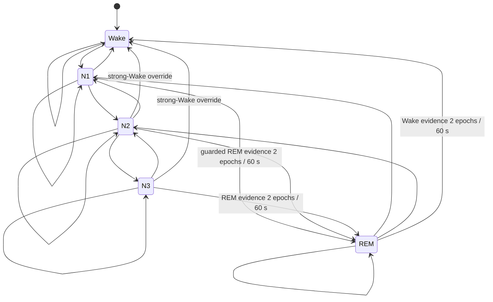

# ZEEP — Sleep System Current Source of Truth

> **Purpose:** เอกสารหลักฉบับเดียวของ Sleep State, Historical Replay, Sleep Score และ Session Report ที่ใช้งานจริงใน ZEEP Pod  
> **Positioning:** Sleep Wellness · EEG-free exploratory telemetry · ไม่ใช่ PSG/การวินิจฉัย/คำสั่งรักษา  
> **Status:** Wellness release candidate · guarded derived-result replay/promotion · G2 paired-PSG validation open
> **Updated:** 2026-09-13
> **Code manifest:** [`pi5/sleep_system_policy.py`](../pi5/sleep_system_policy.py)  
> **Related:** [Sleep-State Baseline v1.8](zeep-sleep-state-baseline-v1.0.md) · [ZEEP Restore Summary v1](zeep-restore-summary-v1.md) · [Respiratory Wellness v1](zeep-respiratory-wellness-v1.md) · [Historical Promotion Policy v2](sleep-history-promotion-policy-v2.md) · [v1.23 Wellness Replay Review](sleep-estimator-v123-wellness-longitudinal-report-2026-09-05.md) · [AI Sleep-State](ai-sleep-state-and-assistant.md)

## TL;DR

- ระบบเก็บ Sensor ทุก 10 วินาที สรุป `sleep_stage_evidence` ทุก 30 วินาที และเปลี่ยน State เมื่อผู้ท้าชิงผ่าน Gate พร้อมยืนยัน 2 epoch/60 วินาที (N2 ใช้ 4 epoch/120 วินาที) เมื่อเริ่ม Recording ระบบยึด `W` เป็น State แรกทันที; ทุกช่วงที่ยังไม่ยืนยัน `OFF BED` ต้องมี W/N1/N2/N3/REM โดยผู้ท้าชิงที่ยังไม่ชัดจะคง State ก่อนหน้าและนับคะแนนให้ State เดิมจนกว่าจะยืนยัน State ใหม่สำเร็จ
- Sleep-onset Guard คง W อย่างน้อย 5 นาทีแรก; หลังจากนั้น N1 ต้องมีเตียงนิ่ง ไม่มี vital rise และ HR/RR แสดงการลดลงหรือ plateau ที่ต่ำกว่าช่วงตั้งต้นอย่างสอดคล้องกัน เวลาเพียงอย่างเดียวสร้าง N1 ไม่ได้
- หลักฐานทั้ง 5 State ถูกปรับให้อยู่บนงบ 0..1 เท่ากัน; หากผู้ชนะ <45% หรือห่างอันดับสอง <8% ระบบจะไม่เปิด State ใหม่ แต่คง State ที่ยืนยันก่อนหน้าอย่างต่อเนื่องจนกว่าผู้ท้าชิงจะผ่าน Gate; N3 ใช้เกณฑ์เดียวกันหลังผ่าน waveform/movement/CV/regularity/relative-drop gate
- พฤติกรรมย้อนหลังเรียนรู้แยกตามบัญชีและ Rest Mode จากอย่างน้อย 3 Session ก่อนหน้า เช่น latency, ช่วงเวลา, ระยะเวลา และสิ่งแวดล้อมที่มักพบ; ใช้เป็น expectation/report/recommendation context เท่านั้น (`direct_stage_influence=false`) และใช้ข้อมูลอดีตแบบ forward-only ตั้งแต่ 1 ก.ย. 2569
- BCG + Bed Status เป็นหลัก; SPH0645 ช่วยยืนยัน disturbance เมื่อตรงเวลากับ BCG/movement; Sensor อากาศอธิบายสิ่งรบกวนและ confidence เท่านั้น
- Login ได้ก่อน แต่จะยังไม่สร้าง Session/Timeline จนกว่าอยู่บนเตียงครบ 20 วินาที และมี HR+RR สดในช่วง sanity ต่อเนื่อง 3 BCG packets ใหม่
- การพลิกตัว ขยับแขนขา หรือขยับผ้าห่มขณะยังอยู่บนเตียงเป็น `sleep-compatible movement` และไม่เปลี่ยนเป็น Wake โดยลำพัง
- เส้นทางหลักเริ่ม `Wake → N1 → N2`; ระบบเปิด `N1 → REM` แบบ SOREMP-like ที่ต้องผ่าน REM physiology gate, เปิด `N3 → REM` และเปิด `REM → Wake` เมื่อหลักฐานของ target ชนะ 2 epoch/60 วินาที
- `Overnight Recovery` ใช้ `Sleep Score`; `Nap & Refresh` ใช้ `Recovery Score` ไม่ว่าจะหลับ พักสายตา หรือทำสมาธิ โดย Recovery Score ใช้ HR/RR ที่จับคู่กันอย่างน้อย 6 จุด ส่วน coverage เป็น QA/confidence แยกและไม่ให้หรือหักคะแนน
- `ZEEP Restore Summary` อธิบายคะแนนหลักด้วยสถานะ ตัวขับคะแนน Personal Baseline และคำแนะนำหนึ่งข้อ โดยไม่สร้างคะแนนที่สามและไม่อ้าง Whole-day Readiness
- `Respiratory Wellness` แสดงค่ากลาง HR/RR จากหน้าต่างหลักฐาน BCG คู่เดียวกัน พร้อมสรุปและคำแนะนำสั้นสำหรับผู้ใช้; รายละเอียดความสม่ำเสมอ, Personal Baseline, ช่วงอายุ และ Coverage อยู่ในมุมมองผู้ดูแล โดยไม่เปลี่ยน State/Score และไม่อ้างว่าเป็นการวัดสมรรถภาพปอด, SpO₂ หรือภาวะหยุดหายใจ
- N3 ต่ำกว่า 3% ไม่ได้คะแนน N3, 3–10% ได้ตามสัดส่วน, ตั้งแต่ 10% ได้เต็มและ **ไม่หักเมื่อเกิน 20%**
- Raw/Timeline เดิมไม่ถูกแก้โดยการคำนวณรายงานใหม่; Historical Replay และ Rescore มี version/audit แยก
- ช่วงจบ Session แยก `Wake` ของมนุษย์ออกจาก `ไม่มีผู้ใช้งานบนเตียง → ออกจาก ZEEP → จบ Session`; สองสถานะหลังเป็น Occupancy และไม่ปนเปอร์เซ็นต์ Sleep Stage
- รายงานต้องปิดบัญชีเวลาทุก epoch: Recording ที่ยังไม่ยืนยัน `OFF BED` ต้องอยู่ใน W/N1/N2/N3/REM และเข้าคะแนนทั้งหมด หลักฐานที่ก้ำกึ่ง ขาด ไม่สด หรือขาดช่วงจาก restart จะคง State ก่อนหน้าแบบ low-confidence โดยไม่แต่ง Evidence probability และไม่ใช้ epoch นั้นเรียนรู้ Personal Baseline; `WAIT` ใช้เฉพาะ `waiting_bed` ก่อน Recording, `NO DATA` เป็น evidence-quality/legacy label ไม่ใช่ State bucket และ confirmed `OFF BED` เป็น operational exception เพียงชนิดเดียวที่ไม่เข้า Stage%, Score หรือ Baseline
- สิ่งแวดล้อมคง key ภายใน 5 ระดับ `critical / poor / fair / good / excellent` แต่หน้าผู้ใช้แสดง `แนะนำให้ปรับตอนนี้ / ควรปรับ / พอใช้ / ดี / ยอดเยี่ยม`; **พอใช้ขึ้นไปผ่านขั้นต่ำ** และแสง/เสียงเปลี่ยนกรอบตาม Rest Mode
- ข้อมูลก่อน `2026-09-01 00:00 Asia/Bangkok` ถูกตัดออกจาก Product history, Baseline, Replay และ Score รุ่นใหม่ แต่ Raw/Audit ยังเก็บไว้โดยไม่แก้ไข; หลัง cutover ระบบประเมินหลักฐานเป็นราย Epoch, ใช้ Tier เป็น Admin QA เท่านั้น และเขียน Derived result ได้เฉพาะรายการที่ไม่มี integrity blocker หลัง Product Owner ตรวจ allowlist โดย replay manifest และ immutable-Raw hash guard ต้องผ่าน

## 1. เวอร์ชันที่ใช้งานปัจจุบัน

| ชั้นระบบ | Version |
|---|---|
| Health pipeline contract | `zeep-sleep-health-pipeline-v1.12-complete-occupied-epochs` |
| Live estimator candidate | `bcg-audio-bed-5state-v1.29-complete-occupied-epochs` |
| Evidence definition | `zeep-sleep-state-evidence-v3.7-complete-occupied-epochs` |
| Baseline | `zeep-sleep-state-baseline-v1.8-sep1-cutover` |
| Semi-Markov transition | `zeep-semimarkov-30s-v1.18-scoreable-continuity` |
| G2 ontology | `g2-aasm-5class-v1.0` |
| Historical replay | `zeep-sleep-history-reclass-v28-complete-occupied-epochs` |
| Sleep / Recovery quality | `zeep-rest-quality-v8.7-recovery-timing-advisory` |
| Sleep Score formula | `zeep-sleep-score-v1.1-20-30-30-15-5-evidence-coverage` |
| Recovery Score formula | `zeep-recovery-score-v2.1-complete-rest-25-35-30-10` |
| Session report | `zeep-session-report-v10.9-recovery-timing-advisory` |
| Restore Summary | `zeep-restore-summary-v1.0` |
| Respiratory Wellness | `zeep-respiratory-wellness-v1.1` |
| Restore action bands | `zeep-restore-action-bands-v1.0` |
| Restore driver policy | `zeep-restore-drivers-v1.0` |
| Restore Personal Baseline | `zeep-restore-personal-baseline-v1.0` |
| Restore recommendation | `zeep-restore-recommendation-v1.0` |
| Environment context | `zeep-environment-context-v2.1-optional-acoustic-input` |
| Environment Session aggregation | `zeep-environment-session-v1.0-sustained-decile` |
| Terminal Wake boundary | `zeep-terminal-wake-boundary-v1.0` |

เวอร์ชันเหล่านี้ไม่ได้มีไว้แสดงอย่างเดียว: ทุก decision/final summary เก็บ version
เพื่อให้รู้ว่าข้อมูลแต่ละคืนสร้างด้วยหลักการใด ข้อมูลเก่าจึงคง version เดิมตาม
provenance จนกว่าจะสั่ง Historical Replay/Rescore แบบมี audit โดยตั้งใจ

Bed Status รหัส `1 / Get out of bed` เป็น Raw Sensor event ที่อาจเกิดชั่วคราว
ระหว่างถ่ายน้ำหนักหรือขยับใกล้ขอบเตียง จึงยืนยัน `OFF BED` ได้ต่อเมื่อพบต่อเนื่อง 3
Sensor buckets (30 วินาที) เท่านั้น Raw packet burst ไม่บังคับสถานะโดยลำพัง
เพราะ Field Session ของ Fay.yy พบ false pulse ตั้งแต่ 1–7 packets ขณะยังอยู่บนเตียง
Raw code ที่ไม่ผ่านยังคงแสดงใน Admin
Packet Inspector แต่ไม่เปลี่ยน Sleep State และไม่ถูกนับเป็นการลุกจากเตียงในรายงาน
สำหรับ completed Session รหัสเดี่ยวที่เป็นรายการสุดท้ายยังนับเป็นการลุก 1 ครั้ง
เพราะผู้ใช้อาจลุกแล้วกดจบทันที ก่อนครบ analysis bucket ถัดไป กฎยกเว้นนี้ไม่ใช้
กับรอบกลาง Session รายงานจะเก็บเหตุการณ์นี้ใน Terminal Occupancy Timeline ไม่สร้าง
Wake จากเตียงว่าง; Wake ต้องมาจากหลักฐานขณะผู้ใช้ยังอยู่หรือ Feedback/Annotation ที่มี audit

## 2. Data flow ที่ใช้จริง

```mermaid
flowchart LR
    L["User Login / Occupancy"] --> V["Start gate: Bed 20 s + fresh HR/RR × 3 packets"]
    B["BCG + Bed Status"] --> V
    V --> A["Start Recording · anchor W"]
    A --> F["Feature bucket 10 s"]
    M["SPH0645"] --> C["Corroboration only"]
    E["Temp · RH · CO₂ · Lux · PM2.5 · VOC · Sound"] --> X["Context / confidence only"]
    F --> H{"Confirmed OFF BED?"}
    H -->|"Yes"| O["OFF BED · occupancy exception · no Stage/Score/Baseline"]
    H -->|"No"| Q{"Current evidence complete and fresh?"}
    Q -->|"No"| LC["Carry prior State · low confidence · score yes · baseline no"]
    Q -->|"Yes"| W["Rolling 6 buckets / 60 s"]
    C --> W
    X --> W
    W --> S["Five-state scorer"]
    S --> SO{"Sleep-onset guard passed?"}
    SO -->|"No"| KW["Keep W · do not manufacture N1"]
    SO -->|"Yes"| G["Semi-Markov guard"]
    KW --> E30
    G --> E30["Persist evidence every 30 s"]
    E30 --> C60["Confirm W/N1/N3/REM after 60 s; N2 after 120 s"]
    C60 --> K{"New State confirmed?"}
    K -->|"No"| P0["Carry prior State · score as prior · challenger gets no time"]
    K -->|"Yes"| D["Persist new confirmed State every 30 s"]
    P0 --> D
    LC --> D
    D --> R["Finalize Session"]
    R --> TW["Terminal W boundary (0 s, excluded from score)"]
    TW --> OX["No user / exited ZEEP / END"]
    R --> Q["Mode-aware quality score"]
    R --> P["Session report"]
```



### 2.1 สิ่งที่มีผลต่อ Sleep State

คำแสดงผลมาตรฐานในทุกหน้าและรายงาน:

| Code | คำแสดงผลภาษาไทย | ความหมายสำหรับ ZEEP Wellness |
|---|---|---|
| W | ตื่น | ระบบประเมินว่ายังตื่นหรือกลับเข้าสู่สถานะตื่น |
| N1 | หลับตื้น / เคลิ้มหลับ | เริ่มเข้าสู่การนอน ร่างกายผ่อนคลาย และปลุกให้ตื่นได้ง่าย |
| N2 | หลับสนิทขึ้น / หลับตื้นต่อเนื่อง | การนอนต่อเนื่องขึ้น โดยหัวใจและการหายใจมักช้าลง |
| N3 | หลับลึก | รูปแบบ BCG/HR/RR ที่สอดคล้องกับ N3; N3 เชื่อมโยงกับการฟื้นฟู แต่ ZEEP ไม่ได้วัดการซ่อมแซมโดยตรง |
| REM | ระยะ REM | รูปแบบ BCG/HR/RR ที่สอดคล้องกับ REM; ไม่ใช่การตรวจพบความฝันหรือการจัดระเบียบความจำโดยตรง |

คำอธิบายนี้เป็นภาษาสื่อสารของ ZEEP; Stage ยังคงเป็นค่าประเมินจาก BCG/Sensor
ไม่ใช่ผล PSG หรือการวินิจฉัยทางการแพทย์

| กลุ่ม | บทบาท |
|---|---|
| BCG HR/RR summary, trend, CV, respiratory regularity, amplitude stability | หลักฐานหลักของ estimator แต่ยังไม่ใช่ EEG/True IBI-HRV |
| Bed Status + movement | Bed exit เป็น Occupancy/Safety result แยกจาก Sleep Stage; การขยับบนเตียงต้องดู burst/run และ HR/RR/BCG ที่สอดคล้องก่อนเป็น strong-Wake |
| SPH0645 | สนับสนุน Wake แบบจำกัดเฉพาะเมื่อเสียงรบกวน time-aligned กับ BCG amplitude shift หรือ movement |
| Temperature, humidity, CO₂, light, PM2.5, VOC | อธิบายว่าอะไรอาจรบกวนการนอนและลด confidence; `direct_stage_influence = false` |

ระบบไม่ใช้ Sensor อากาศสร้าง N1/N2/N3/REM และไม่ใช้ Sleep State เป็น trigger
สั่งอุปกรณ์อัตโนมัติในเวอร์ชันนี้

### 2.2 Sleep-onset Guard — ป้องกัน N1 เร็วเกินจริง

BCG ที่อยู่ใต้เตียงไม่เห็น EEG จึงแยกคนที่นอนนิ่งแต่ยังตื่นออกจาก N1 โดยใช้ HR/RR
คงที่เพียงอย่างเดียวไม่ได้ ระบบจึงใช้กฎเชิงอนุรักษ์ดังนี้:

1. 5 นาทีแรกหลังเริ่ม Recording เป็นช่วง Awake/settling observation และคงผลเป็น W
2. ตัดโบนัส N1 ที่เกิดจากเวลาช่วงต้น Session ออกทั้งหมด
3. หลัง 5 นาที ต้องมี movement ต่ำกว่า 15%, ไม่มี sustained on-bed movement,
   HR/RR ไม่กำลังเพิ่ม และผ่านอย่างน้อยหนึ่งเงื่อนไข:
   downward-transition ≥0.20 หรือ session-relative support ≥0.20 โดย HR และ RR
   ต้องสนับสนุนทิศทางเดียวกันใน candidate นี้
4. Gate เปิดให้เสนอ N1; การเปลี่ยน W→N1 ยังต้องยืนยัน 2 epochs/60 วินาที
5. Sensor acquisition drop ช่วงแรก, quiet wake, สมาธิ หรือการนอนนิ่งอย่างเดียว
   ไม่เพียงพอให้เป็น N1; ผลยังเป็น ZEEP Wellness estimate ไม่ใช่ AASM/PSG onset

ผล Shadow Review วันที่ 2026-09-04 พบว่า mean RR ไม่จำเป็นต้องลดชัดเจนตอน
sleep onset ในทุกคน การบังคับ RR-rate drop จึงอาจทำให้ W ยาวเกินจริง รุ่นถัดไปควร
ใช้ respiration regularity เป็นหลักฐานสนับสนุนและให้ RR-rate drop เป็น soft feature;
ก่อน validate ให้เรียกผลนี้ว่า `sleep-onset proxy` เท่านั้น

หลักอ้างอิงด้านสุขภาพ: AASM ใช้ W/N1/N2/N3/R และต้องอาศัย EEG/EOG/chin EMG
สำหรับการให้คะแนนจริง จึงใช้ชื่อชุดเดียวกันเป็น ontology เพื่อเทียบผลได้ แต่ ZEEP
ไม่เรียกผล BCG ว่า AASM score งานของ Kortelainen และคณะ (2010,
DOI `10.1109/TITB.2010.2044797`) แสดงว่า heart-beat interval + movement จาก
bed sensor สามารถใช้ประมาณ Wake/NREM/REM ได้เมื่อ validate คู่ PSG แต่ผลยังมี
ข้อจำกัด จึงเป็น guideline ของ feature/context ไม่ใช่ใบอนุญาตให้อ้าง clinical
accuracy ดู [AASM Scoring Manual](https://learn.aasm.org/AssetListing/The-AASM-Manual-for-the-Scoring-of-Sleep-and-Associated-Events-4265/The-AASM-Manual-for-the-Scoring-of-Sleep-and-Associated-Events-6697)
และ [งานวิจัย bed sensor](https://pubmed.ncbi.nlm.nih.gov/20403790/)

### 2.3 Cadence และคุณภาพข้อมูล

- สร้าง Sensor frame ทุก 10 วินาทีโดยไม่ขึ้นกับ Login/Session: Environment ทั้ง 6 ตัว, HR, RR และ Bed Status เปลี่ยนพร้อมกันทุกหน้าเมื่อ `sensor_frame.sequence` เปลี่ยนเท่านั้น
- WebSocket/Control ตอบสนองได้ถี่กว่า 10 วินาที แต่ห้ามนำ Raw packet ระหว่าง frame มาแทนค่าที่แสดง; Raw ใช้เฉพาะ Admin Packet Inspector และ Safety supervisor ยังคงอ่านสดโดยไม่รอ UI
- เฉพาะ Sleep State ใช้ 3 Sensor frames สร้าง Evidence epoch ทุก 30 วินาที
- เป้าหมาย confidence ใช้ rolling 6 feature buckets = 60 วินาที
- หลักฐาน (`candidate` + probability ทั้ง 5) แยกจากสถานะที่ยืนยันแล้ว (`confirmed_state`); W/N1/N3/REM ต้องชนะต่อเนื่อง 2 epoch = 60 วินาที ส่วน N2 ต้อง 4 epoch = 120 วินาที
- Probability ทั้ง 5 ใช้ EMA `alpha=0.20` ต่อจาก rolling 60 วินาทีเป็น continuity หลักของ
  W/N1/N2/REM; เฉพาะ N3 ที่ชนะจากหลักฐานปัจจุบันอย่างน้อย 5 จุดเปอร์เซ็นต์และผ่าน
  N3 physiology gate เท่านั้นที่เสนอ candidate ก่อน EMA ได้ จากนั้น State Machine ยังต้องยืนยัน
  N3 เดิม 2 epoch/60 วินาที การยกเว้นเฉพาะจุดนี้ป้องกัน EMA + confirmation กดช่วง N3 ที่มีหลักฐานครบ
  จนหายไป โดยไม่ทำให้ State อื่นสลับไวขึ้น; strong Wake ยังต้องผ่าน 2 evidence epochs;
  Bed Exit และ Safety ตอบสนองใน pipeline แยกและไม่รอ Sleep State
- เปอร์เซ็นต์สูงสุดบน Dashboard คือ **หลักฐานล่าสุด** จึงอาจต่างจาก `confirmed_state` ระหว่างช่วงรอยืนยัน โดย UI ต้องติดป้ายสองค่านี้แยกกัน
- ก่อนผู้ท้าชิงครบ confirmation UI แสดง State ก่อนหน้าและนับเวลา/คะแนนให้ State
  เดิม ป้าย `provisional` หากยังส่งเพื่อ compatibility เป็น diagnostic metadata
  เท่านั้นและไม่มีผลต่อ `score_eligible`; ผู้ท้าชิงไม่ถูกนับเป็น State ใหม่ก่อนยืนยัน
- Timeline ของ Session บันทึก Sensor ทุก 10 วินาที, `sleep_stage_evidence` ทุก
  30 วินาที และ State attribution ทุก 30 วินาทีตั้งแต่เริ่ม Recording โดยเริ่มจาก W;
  Gate มีหน้าที่อนุญาต **การเข้า State ใหม่** ไม่ได้ลบ State เดิม เมื่อหลักฐาน
  acquisition ขาดหรือไม่สดขณะยังไม่ยืนยัน OFF BED ระบบคง State ก่อนหน้าแบบ
  low-confidence ซึ่งเข้าคะแนนแต่ไม่เข้า Personal Baseline ส่วน confirmed OFF BED
  เป็น occupancy exception ที่ไม่ใช่ Sleep Stage และไม่ถูกนับใน Score/Baseline
- การเปิดใช้ 10 วินาทีเต็มรูปแบบระหว่าง Active Session ไม่แก้ Raw เดิม: checkpoint เก็บ `sample_cadence_segments` ว่าช่วงใดเป็น legacy 5 วินาที/ช่วงใดเป็น 10 วินาที และรายงานถ่วงน้ำหนักตามเวลาจริง จึงไม่ทำให้ TST, WASO, Stage ratio หรือค่าเฉลี่ย Sensor เพิ่ม/ลดเท่าตัวหลัง restart
- Timestamp ของ Timeline ใช้เวลาที่เก็บ Session sample จริง ไม่ใช้ Sensor-frame timestamp ซ้ำ; ข้อมูล Sensor frame สำหรับ Sleep State ยังมี provenance ของรอบ 10 วินาทีแยกต่างหาก
- ค่า HR/RR ที่ invalid ถูกคัดออกก่อนสร้าง Evidence และไม่ถูกแต่งเป็นค่าปกติ;
  เมื่อยังไม่ยืนยัน OFF BED การขาดหลักฐานจะคงเฉพาะ **State attribution** ก่อนหน้า
  แบบ low-confidence โดย probability ของ Evidence ยังคง missing/zero ตามจริง
  และ epoch นั้นถูกกันออกจาก Personal Baseline

#### สัญญา State continuity และลำดับอำนาจของ Gate

| สถานการณ์ใน epoch 30 วินาที | ผลที่แสดง/บันทึก | นับ Stage/Score |
|---|---|---|
| เริ่ม Recording และยังไม่มี State จากหลักฐาน | กำหนด `W` เป็น initial awake anchor | นับ W; ไม่ใช้ช่วงที่หลักฐานไม่ครบเรียนรู้ Personal Baseline |
| มี State เดิม; ผู้ท้าชิงกำลังยืนยัน | แสดง State เดิมพร้อม pending/provisional metadata | นับให้ State เดิม; ไม่ให้ผู้ท้าชิง |
| มี State เดิม; หลักฐานก้ำกึ่งหรือ transition ถูก Gate ปิด | คง State เดิมต่อเนื่องจนมีผู้ท้าชิงที่ผ่านครบ | นับให้ State เดิม |
| HR/RR/BCG ขาด ไม่สด หรือขาดช่วงจาก restart ขณะยังไม่ยืนยัน OFF BED | คง State เดิมแบบ low-confidence พร้อม data-quality provenance | นับให้ State เดิม; ไม่เข้า Personal Baseline |
| ยืนยันไม่มีผู้ใช้งานบนเตียง | `OFF BED` | ไม่ |
| ผู้ท้าชิงผ่าน physiology, transition, dwell และ confirmation | เปลี่ยนเป็น State ใหม่ | เริ่มนับ State ใหม่ ณ epoch ที่ยืนยัน |

ดังนั้นระบบไม่มีค่าผลลัพธ์ `Unclassified`: ทุก epoch หลังเริ่ม Recording อยู่ใน
`W/N1/N2/N3/REM` หรือ confirmed `OFF BED` เท่านั้น `WAIT` อยู่ได้เฉพาะ phase
`waiting_bed` ก่อนสร้าง Recording ส่วน `NO DATA` เป็น evidence-quality หรือ
legacy label ไม่ใช่ State bucket ของรุ่นปัจจุบัน
ฟิลด์ `held_previous_state`, `continuity_hold_epochs`, `provisional`,
`pending_state`, `score_attribution_state` และ
`challenger_counted_as_new_state=false` ทำให้ Admin ตรวจสอบที่มาของเวลาได้
`score_attribution_state` ต้องไม่เป็น null สำหรับทุก non-OFF-BED epoch และเวลา
carry รวมทั้ง epoch ที่ติด `provisional` ต้องรวมใน `score_eligible_s`; หาก
หลักฐานขาด ฟิลด์ confidence/data quality ต้องระบุ low/missing และ
`excluded_from_personal_baseline=true` โดย continuity carry-forward ไม่สร้าง Evidence
probability ปลอมให้ State เดิม

### 2.4 Session start gate

1. Browser Login และ Pod occupancy เริ่มได้ตามปกติ แต่ phase ยังเป็น
   `waiting_bed` และยังไม่มี row ใน `sessions.db`
2. Bed Status ต้องเป็น `On bed / Moving / Weak breathing / Snoring`
   ต่อเนื่องครบ `BED_START_SECONDS=20`
3. หลัง Login หรือ service restart ขณะที่ยังอยู่ phase `waiting_bed` ต้องได้ BCG packet ใหม่ที่มีทั้ง
   `HR 25–220 bpm` และ `RR 2–60 /min` ต่อเนื่อง
   `SESSION_VITAL_START_PACKETS=3`
4. ค่า HR/RR ที่ UI hold ไว้ชั่วคราวจาก packet เก่าไม่นับผ่าน gate
5. เมื่อทั้งสองเงื่อนไขผ่านจึงตั้ง `started_at_utc`, เปิด BCG storage,
   สร้าง DB Session และเริ่ม Timeline 10 วินาที
6. ถ้าผู้ใช้จบ/ออกก่อน gate ผ่าน ระบบปิดเฉพาะ Login/lease และไม่สร้าง
   zero-duration Session, Timeline, Report หรือ Personal Baseline
7. หลังเริ่มบันทึกแล้ว หาก HR/RR/BCG ขาดชั่วคราวจะไม่จบ Session อัตโนมัติ;
   Timeline เก็บ Sensor/coverage ตามจริงและคง State attribution ก่อนหน้าแบบ
   low-confidence ตราบที่ยังไม่ยืนยัน OFF BED หน้าจอแสดง State เดิมพร้อมป้าย
   “หลักฐาน Sensor ไม่ครบ” แทนการสร้าง `null` หรือ `NO DATA` State เมื่อสัญญาณ
   กลับมาระบบประเมินต่อจาก confirmed State, Sleep onset, ลำดับวงจร และ Awake
   reference เดิม โดยล้างเฉพาะ candidate/EMA ที่ยืนยันไม่ครบ
8. เมื่อ HR/RR/BCG สดและยืนยัน on-bed แต่ Evidence winner ยังไม่ผ่านเกณฑ์,
   Transition ถูกปิด หรือผู้ท้าชิงกำลังสะสม confirmation ระบบคง State ก่อนหน้า
   แทนการสร้าง `null`/ช่องว่าง; ป้าย `provisional` เป็น diagnostic metadata
   เท่านั้น เวลาและคะแนนยังเป็นของ State เดิมจน State ใหม่ผ่านครบ
9. ข้อยกเว้นเฉพาะ **Session เดิมที่ระบบกู้หลัง service/code restart**: ถ้า State
   ใน frame ก่อนปิดตรงกับ `sleep_stage` ล่าสุดที่บันทึกถาวร ระบบแสดง State เดิม
   และ carry ต่อแบบ low-confidence จน Evidence สดกลับมา โดยช่วง restart ที่ยังไม่
   ยืนยัน OFF BED ถูกนับเป็น State เดิมใน Stage%/Score แต่ไม่เข้า Personal Baseline
   หากยังไม่เคยมี State ที่บันทึกให้ใช้ W เป็น initial awake anchor และ confirmed
   Bed Exit มีสิทธิ์แสดง `OFF`/ล้าง hold ทันที รายงานย้อนหลังใช้ event
   `service_pause`/`service_resume` ระบุ provenance ของช่วง restart โดยไม่แต่ง
   Evidence probability
   รายงานย้อนหลังใช้ continuity projector เดียวกับ Live เพื่อเติมทุกช่วงที่ผู้ใช้
   ยังอยู่บนเตียงด้วย State ก่อนหน้าแบบ low-confidence โดยไม่แก้ Raw หรือ decision
   เดิม; การเปลี่ยน Derived report/คะแนนย้อนหลังต้องผ่าน replay/rescore audit ตามปกติ
10. เมื่อยืนยันว่าไม่มีผู้ใช้งานบนเตียง หน้าจอแสดง `OFF` ซึ่งเป็นสถานะการครอบครอง
   ไม่ใช่ `Wake`; ระบบล้าง rolling physiology เมื่อจบ/เปลี่ยนเจ้าของ Session
11. เมื่อ completed Session มี Bed Exit ที่ผ่าน debounce และไม่มี HR+RR ที่ valid
    กลับมา รายงานจะคง State ก่อนหน้าจนถึงขอบเขต OFF BED แล้วปิดลำดับเป็น
    `Sleep State สุดท้าย → W · ตื่น (0 วินาที) → ไม่มีผู้ใช้งานบนเตียง → ออกจาก ZEEP → จบ Session`;
    Missing HR/RR เพียงอย่างเดียวไม่สร้าง Wake หรือ OFF BED เพราะอาจเป็น Sensor fault
12. ถ้า confirmed Sleep State สุดท้ายยังเป็น N1/N2/N3/REM การกดจบโดย User/Admin
    หรือ Terminal Bed Exit จะสร้าง `terminal_wake_boundary` 1 จุดที่เวลา 0 วินาที
    เพื่อแสดงว่าลำดับการนอนจบที่ Wake ก่อน Exit/END จุดนี้เป็น Operational marker,
    ไม่ใช่ AASM/PSG epoch และไม่เพิ่ม Wake duration, WASO, สัดส่วน Stage, คะแนน
    หรือ Personal Baseline; หาก State สุดท้ายเป็น Wake อยู่แล้วจะไม่สร้างซ้ำ
13. confirmed `OFF BED · ไม่มีผู้ใช้งานบนเตียง` เป็น operational interval เพียง
    ชนิดเดียวระหว่าง Recording ที่ไม่ใช่ Sleep Stage และไม่เข้าคะแนน ส่วนหลักฐาน
    HR/RR/BCG ที่ขาด ไม่สด หรือขาดช่วงเป็น data-quality metadata ของ low-confidence
    carry ไม่ใช่ช่องว่าง State; `WAIT · กำลังยืนยันสถานะ` ใช้ได้เฉพาะก่อน Recording

### 2.5 Baseline สามชั้นที่ต้องไม่ปนกัน

| ชั้น Baseline | ใช้อะไร | ใช้ทำอะไร | ห้ามใช้ทำอะไร |
|---|---|---|---|
| Physiology / Sleep State | BCG, Bed Status, HR/RR สด, movement, อายุ/เพศ และ personal baseline ที่ผ่าน eligibility | ให้น้ำหนักหลักฐาน W/N1/N2/N3/REM และ confidence | Sensor อากาศห้ามสร้างหรือเปลี่ยน Stage |
| Environment Context | Temp, RH, Lux, Sound, CO₂, PM2.5, VOC ตาม policy version และ Rest Mode | อธิบายสิ่งที่อาจรบกวน, สิ่งที่ต้องแก้ และสิ่งที่ควรรักษา | ไม่ใช่การวินิจฉัยและไม่แทน life-safety alarm |
| Mode / Quality | วัตถุประสงค์ Session, เวลาจริง, continuity, architecture/proxy และ coverage | เลือก duration target และสูตร Sleep Score/Recovery Score ให้เหมาะกับรูปแบบการพัก | ไม่ย้อนแก้ Raw BCG หรือ Stage decision เพื่อทำคะแนนให้ดีขึ้น |

`HR/RR Fit` ในหน้า Admin หมายถึงความใกล้ของค่า HR/RR เฉลี่ยกับช่วงอ้างอิง
ของแต่ละ State เท่านั้น ช่วงเหล่านี้ทับซ้อนกันได้และไม่ใช่ความน่าจะเป็นจาก PSG
รุ่น v1.27 นำ evidence distribution มาผสานกับ HR/RR Fit distribution โดย Fit มี
น้ำหนัก 20% หรือ 35% เมื่อ Fit สูงสุดจริงตรงกับ State ที่ยืนยันก่อนหน้าและ State
นั้นยังผ่าน physiology gate แล้วจึงผ่าน EMA, transition, dwell และการยืนยัน
60/120 วินาที การผสานจะตัด probability ของ State ที่ physiology gate ปิดเป็นศูนย์
จึงทำให้ Fit มีผลจริงโดยไม่ข้าม safety invariant

เพื่อไม่ให้ EMA ที่ยังจำ N1 ปิดกั้นการหลับที่ลึกขึ้น รุ่น v1.27 อนุญาตเฉพาะ
`N1 → N2` ให้ใช้ผู้ชนะจากหลักฐานสด 30 วินาทีเมื่อ N2 gate ผ่านและคะแนนชนะเกิน
switch margin จากนั้นยังต้องชนะต่อเนื่อง 4 epochs/120 วินาทีก่อนยืนยัน N2;
กฎนี้ไม่เปิดทางข้าม gate และไม่อนุญาตให้ N2 เกิดจาก HR/RR Fit เพียงอย่างเดียว

State ที่ Fit สูงสุดยังอาจต่างจาก State ที่ยืนยันเมื่อ BCG waveform, movement,
ความแปรปรวน, respiratory regularity, gate, ลำดับ State หรือเวลายืนยันยังไม่ผ่าน
โดยเฉพาะ `HR/RR Fit N3` ห้ามสร้าง N3 โดยลำพัง หน้า Admin ต้องแสดง State ที่
HR/RR ใกล้ที่สุด, State evidence, State ที่ยืนยัน และเหตุผลที่ต่างกันแยกจากกัน
หาก N3 gate ผ่านจริง ระบบยังต้องใช้หลักฐาน N2 ตามลำดับก่อนเข้า N3 และไม่ข้าม
จาก N1 ไป N3 ด้วยค่า Fit อย่างเดียว

Personal Physiology Baseline เริ่มจาก age/gender default แล้วจึงเรียนรู้เฉพาะ completed
Session ต้องเริ่มตั้งแต่ 1 ก.ย. 2569, เป็น `quality_type=sleep`, ยาวมากกว่า 25 นาที,
ตรวจพบการหลับอย่างน้อย 20 นาที, มี HR ที่ใช้ได้เพียงพอ และสะสมอย่างน้อย 3 Session
(rolling สูงสุด 7 Session) การงีบ สมาธิ และพักเฉย ๆ ไม่ถูกปนเข้า physiology
baseline ภายใน Session ที่ผ่านเกณฑ์ ระบบเรียนรู้เฉพาะ epoch ที่มีหลักฐานเพียงพอ
และ `excluded_from_personal_baseline=false`; low-confidence carry จากหลักฐานขาด/ไม่สด/
restart ไม่ถูกใช้สอน Baseline แม้ epoch นั้นยังเข้าคะแนน และการขาด Sensor บางช่วง
ไม่ทำให้ต้องทิ้ง Session ทั้งรายการ

### 2.6 Environment Context — ระดับที่ต้องแก้ไขและระดับที่คาดหวัง

หลักตัดสินใช้ค่าที่ต่ำที่สุดของเกณฑ์ที่มีข้อมูล เพื่อไม่ให้ค่าที่ดีบดบังค่าที่ควรดูแล
โดยอุณหภูมิ ความชื้น แสง CO₂ PM2.5 และ VOC เป็นเกณฑ์หลัก ส่วนเสียงเป็น
เกณฑ์เสริมที่รับจาก `sound_dba` ของ ESP32 โดยตรง:

- ถ้า SPH0645 ไม่มีข้อมูลหรือ `INVALID` ภาพรวมยังคำนวณจาก 6 เกณฑ์หลักและระบุ
  `degraded_optional`; ห้ามสมมติว่าเสียงเงียบและห้ามนำค่าเก่ามาใช้
- ถ้าเกณฑ์หลักขาด ภาพรวมเชิงบวกยังเป็น `รอข้อมูล`; ค่า Poor/Critical ที่ตรวจพบ
  แล้วยังคงแสดงทันที และ Safety CO₂/อุณหภูมิไม่ถูกผ่อน

| ระดับ | การตัดสิน | สิ่งที่ระบบแสดง |
|---|---|---|
| แนะนำให้ปรับตอนนี้ (`critical`) | แนะนำสิ่งที่ปรับได้ | ไม่เปิดเสียงฉุกเฉินจาก Wellness band เพียงอย่างเดียว |
| ควรปรับ (`poor`) | ปรับเพื่อความสบาย | แสดงค่าปัจจุบันและข้อเสนอที่ทำต่อได้ |
| พอใช้ | **ผ่านขั้นต่ำ** | ใช้งานได้ ไม่ขึ้นเป็นความผิดพลาด แต่แสดงคำแนะนำเพื่อยกระดับ |
| ดี | ผ่าน | รักษาการตั้งค่าปัจจุบัน |
| ยอดเยี่ยม | เป้าหมายสูงสุด | รักษาค่าและ freshness; ไม่ใช่เงื่อนไขบังคับให้เริ่ม Session |

กรอบร่วมทุก Mode:

| Sensor | ยอดเยี่ยม | ดี | พอใช้ (ขั้นต่ำที่คาดหวัง) | ควรปรับ | แนะนำให้ปรับตอนนี้ |
|---|---:|---:|---:|---:|---:|
| อุณหภูมิ | 18–27°C | 17–28°C | 16–29°C | 13–32°C | นอกช่วง |
| ความชื้น | 40–60%RH | 35–65%RH | 30–70%RH | 20–80%RH | นอกช่วง |
| CO₂ | ≤800 ppm | ≤1,000 | ≤1,150 | <1,300 | ≥1,300 |
| PM2.5 | ≤15 µg/m³ | ≤25 | ≤37.5 | ≤50 | >50 |
| VOC Index | ≤120 | ≤150 | ≤200 | ≤300 | >300 |

แสงและเสียงเป็นประสบการณ์ตาม Mode จึงห้ามใช้กรอบ “ห้องนอนมืดและเงียบ” กับช่วง
เตรียมพร้อมที่ตั้งใจใช้แสงสว่างหรือเสียง cue:

| Mode | Lux: ยอดเยี่ยม / ดี / พอใช้ / ควรปรับ | Sound dBA: ยอดเยี่ยม / ดี / พอใช้ / ควรปรับ |
|---|---|---|
| Overnight Recovery | ≤5 / ≤10 / ≤30 / ≤100 | <40 / ≤45 / ≤50 / ≤60 |
| Nap & Refresh | ≤10 / ≤30 / ≤100 / ≤300 | <40 / ≤45 / ≤50 / ≤60 |

Live Dashboard ประเมินจาก Sensor ที่ `live` ทุก 10 วินาที รายงานจบ Session ใช้
ระดับของ sample ที่ lower decile 10% (`sustained_lower_decile_of_sample_levels`)
เพื่อไม่ให้ transient packet เดียวลดทั้ง Session ค่า peak/max และจำนวน sample ที่
Critical ยังคงอยู่เป็นบริบทตรวจสอบ หากเกิด Critical เพียงชั่วคราว รายงานจะระบุ
transient โดยไม่เรียกทั้ง Session ว่า Critical ข้อมูลขาดคือ `รอข้อมูล/ตรวจ Sensor`
ไม่ใช่ค่าปกติ กฎ aggregation นี้ไม่เปลี่ยน Safety Basis: CO₂ critical,
temperature hard range, smoke/CO alarm และ Local Safety Supervisor ยังทำงานตาม
threshold ที่อนุมัติแยกต่างหาก

คำว่า `critical` ในย่อหน้านี้เป็น stable key สำหรับ Logic/API ส่วนหน้าผู้ใช้แสดง
`แนะนำให้ปรับตอนนี้` ตาม
[Product Language Guideline](zeep-product-language-guideline-v1.md) และเสียงเตือน
ฉุกเฉินผูกกับเหตุ Critical ของ Local Safety Supervisor เท่านั้น

## 3. Transition policy ล่าสุด



| Target state | หลักฐานต่อเนื่องก่อน commit | Minimum dwell ของ state เดิม |
|---|---:|---:|
| Wake | 2 evidence epochs / 60 s | Wake 10 s |
| N1 | 2 evidence epochs / 60 s | N1 30 s |
| N2 | 4 evidence epochs / 120 s | N2 60 s |
| N3 | 2 evidence epochs / 60 s | N3 60 s |
| REM | 2 evidence epochs / 60 s | REM 60 s |

หลักการสำคัญ:

1. ทุก Session/cycle publish Wake ก่อน และต้องพบ N1 ก่อนให้ N2/N3/REM ผ่าน
2. N1 ไป REM ได้แบบ rare/SOREMP-like เมื่อ **REM physiology gate เดิมผ่าน** และ candidate REM ชนะ 2 epoch/60 วินาที; N1 ไป N3 ยังต้อง bridge ผ่าน N2
3. N3 ไป REM ได้เมื่อผ่าน normal dwell/hysteresis จึงไม่บังคับ N2 ที่รอยต่อนี้
4. REM ไป Wake, N1 หรือ N2 ได้ตามหลักฐานที่ยืนยันแล้ว; REM ไป N3 โดยตรงยัง bridge ผ่าน N2
5. Wake ที่ไม่ชัดจาก N2/N3 ยังย้อนผ่าน N1/N2; strong-Wake เปิด transition path แต่ยังยืนยัน 2 epoch ส่วน bed-exit ที่ผ่าน event guard จะแสดง `OFF` ใน occupancy pipeline ทันทีโดยไม่สร้าง Wake จากเตียงว่าง
6. Replay กำหนด W เป็น State แรกของ Recording และคง State ก่อนหน้าแบบ
   low-confidence สำหรับ epoch ที่ HR/RR/BCG ขาด ไม่สด หรือ transition ยังไม่ผ่าน;
   epoch เหล่านี้เข้าคะแนนแต่ไม่เข้า Personal Baseline ส่วน confirmed Bed Exit เป็น
   `OFF BED` และเป็นข้อยกเว้นเดียวที่ไม่เข้า Stage/Score Tier และคำเตือนเชิงสัดส่วนเป็น
   Admin QA ไม่ใช่ allowlist ส่วนการเขียนย้อนหลังผ่าน
   `promote_sleep_history.py` ต้องไม่มี per-Session integrity blocker, อยู่ใน
   reviewed allowlist และยืนยัน hash ว่า Timeline/Raw BCG ไม่เปลี่ยน

### 3.1 การพลิกตัวและกายวิภาคที่ระบบตีความได้

- ระบบวัด `movement ratio`, จำนวน burst และช่วง Moving ที่ต่อเนื่องยาวที่สุดใน rolling 60 วินาที
- Moving สั้นไม่เกิน 2 buckets (ประมาณ 10–20 วินาทีในรุ่นนี้) และไม่เกิน 25% ของ window ถูกจัดเป็น `position_change_or_blanket_adjustment_candidate` ซึ่งยังเข้ากับการนอน
- Moving ต่อเนื่องตั้งแต่ 3 buckets หรืออย่างน้อย 35% ของ window ลดความมั่นใจของ N3/REM แต่ยังไม่ยืนยัน Wake
- strong-Wake จากการขยับต้องเป็นการขยับต่อเนื่อง พร้อม HR เพิ่มอย่างน้อย 2 bpm/min หรือ RR เพิ่มอย่างน้อย 1.2/min และมี BCG amplitude shift ใน window เดียวกัน; bed-exit ที่ผ่าน event guard เป็นข้อยกเว้นด้านความปลอดภัย
- BCG ใต้เตียงเพียงตัวเดียวระบุไม่ได้ว่าเป็นศีรษะ ลำตัว แขน ขา หรือผ้าห่ม จึงเก็บเป็น candidate ไม่แสดงเป็นข้อเท็จจริงทางกายวิภาค
- Personal baseline ไม่นำ Moving row ทุกแถวมารวมเป็น awake-HR อีกต่อไป เพราะจะทำให้การพลิกตัวขณะหลับปนกับ Wake baseline

หลักนี้สอดคล้องกับหลักฐานว่าการเคลื่อนไหวและการเปลี่ยนท่าพบได้ระหว่างการนอน
และ movement intensity เพียงอย่างเดียวแยก sleep/wake ไม่ได้แม่นยำ โดย PSG ยังคง
เป็นตัวอ้างอิงสำหรับ Sleep Stage จริง

`REM → Wake` เป็น transition ที่พบได้ตามธรรมชาติ ส่วน `N1 → REM` พบได้น้อยกว่า
และใช้เป็นลักษณะของ sleep-onset REM period (SOREMP) ในการตรวจ MSLT จึงเปิดเป็น
เส้นทางพิเศษที่ต้องผ่าน REM gate ไม่ใช่ default path งาน transition network จาก PSG
ขนาดใหญ่ก็พบทั้ง Stage 1 → REM และ REM → Wake/WASO
([Yetton et al., 2018](https://pmc.ncbi.nlm.nih.gov/articles/PMC5894981/),
[AASM MSLT guidance](https://aasm.org/wp-content/uploads/2018/01/MSLT-Guideline-at-a-Glance.pdf)).
อย่างไรก็ตาม “ฝันกลางวัน/จินตนาการขณะยังตื่น” ไม่ใช่ REM sleep และไม่เปิด
`Wake → REM`; ZEEP ต้องมี Active Session, occupancy และ HR/RR สด พร้อม REM
physiology evidence ก่อนเสมอ การอนุญาต graph นี้ไม่ได้หมายความว่า BCG เทียบเท่า PSG
ซึ่งยังต้องใช้ EEG/EOG/chin EMG จริง

## 4. Sleep / Recovery Quality v8.7

### 4.1 สมการภาพรวม

`Sleep Score = Opportunity 20 + Stability 30 + Restorative 30 + Cycle 15 + Coverage 5`

สัญญาน้ำหนักเชิงตัวเลขของสูตรคือ `20 + 30 + 30 + 15 + 5 = 100` คะแนน

ระบบแยกคะแนนตามเป้าหมายที่ผู้ใช้เลือกโดยไม่แก้ Raw หรือบิด Sleep Stage:
`Overnight Recovery` ใช้ Sleep Score เท่านั้น ส่วน `Nap & Refresh` ใช้ Recovery Score
เท่านั้น ไม่ว่าจะพบการหลับหรือยังตื่นพักอยู่ การไม่มีข้อมูล Sensor เพียงพอจะไม่เผยแพร่
คะแนนจาก duration เพียงอย่างเดียว

สำหรับ Recovery Score เมื่อมีหลักฐาน HR/RR ที่จับคู่กันอย่างน้อย 6 จุดและมีเวลา
พักที่นับได้อย่างน้อย 10 นาที ระบบจะแสดงคะแนนพร้อมระดับความมั่นใจ
`high / medium / low` โดย
Coverage/Tier เป็น Admin QA เท่านั้น มีน้ำหนัก 0 คะแนนและไม่หักคะแนนสุขภาพ
การขาด paired HR/RR ยังปิดคะแนนได้เพราะไม่มีหลักฐานสรีรวิทยาขั้นต่ำ ไม่ใช่เพราะ
Coverage ทั้ง Session ต่ำกว่า Tier ใด Tier หนึ่ง

| Component | เต็ม | วิธีปัจจุบัน |
|---|---:|---|
| หลับไวและเวลาพัก | 20 | Duration 15 + latency 5 |
| หลับดีและต่อเนื่อง | 30 | Efficiency 20 + Wake continuity 10 − BCG disturbance proxy สูงสุด 5 |
| โครงสร้าง N2/N3/REM | 30 | แสดงเฉพาะ Overnight: N2 10 + N3 12 + REM 8; เป็น Signal estimate ไม่ใช่การวัดการฟื้นฟูโดยตรง |
| รอบการนอนที่ตรวจพบ | 15 | Overnight ใช้ NREM→REM proxy เทียบจำนวนรอบที่คาด |
| ความครบของข้อมูล | 5 | เวลาที่มี HR/RR คู่จริงและ BCG valid / wall-clock duration; continuity carry ไม่เพิ่มหลักฐาน |

Nap & Refresh ใช้ Recovery Score v2.1: **เวลาพักตามเป้าหมาย 25 + การตอบสนอง
HR/RR 35 + ความต่อเนื่อง/ความนิ่ง 30 + สภาพแวดล้อมสนับสนุน 10** รวม 100
คะแนน ไม่บังคับให้หลับและไม่บังคับ N1/N2/N3/REM; Coverage/Tier แสดงแยกเป็น
QA/confidence และมีน้ำหนัก 0 คะแนน ส่วนความสดชื่นจริงต้องใช้แบบประเมินหลัง
Session ประกอบ ห้ามอนุมานจาก Sensor เพียงอย่างเดียว

คะแนนเวลา Nap ใช้ **เวลาที่มี State attribution และยังไม่ยืนยัน OFF BED เทียบ
เป้าหมาย 30 หรือ 90 นาทีที่บันทึกตั้งแต่เริ่ม Session**:
`Duration points = 25 × min(1, eligible rest seconds / selected target seconds)`
ช่วง Continuity carry นับเป็นเวลาพักแบบ low-confidence แต่ไม่ถูกนับเป็นหลักฐาน
HR/RR, Movement หรือ Environment ใหม่; Raw `Get out of bed` ชั่วคราวไม่หักเวลา
มีเพียง confirmed OFF BED เท่านั้นที่ไม่นับ หากข้อมูลเก่าไม่มี State attribution
จะใช้ On bed/Moving/Weak
breathing/Snoring หรือ HR/RR คู่ที่ผ่าน sanity range เป็น fallback เมื่อครบเป้าหมาย
ได้เต็ม 25 และไม่หักคะแนนเพียงเพราะพักนานกว่าเป้าหมาย หากยังไม่เกิน lifecycle
guard 120 นาที ความต่างจากเป้าหมาย 30/90 นาทีจะเป็น Admin QA flag แต่ไม่ปิด
Recovery Score; หากข้อมูลเดิมไม่มีเป้าหมาย ระบบจะไม่เดาเป้าหมายและไม่นับ
องค์ประกอบเวลา โดยคำนวณจากองค์ประกอบที่มีหลักฐานแทน

คำอธิบายสองรูปแบบ แผนที่หลักฐาน และข้อห้ามในการเปรียบเทียบคะแนนอยู่ที่
[`TWO_MODE_SCORE_EVIDENCE.md`](../research/evidence-library/TWO_MODE_SCORE_EVIDENCE.md)

### 4.2 Rest Mode และ Duration target

| Mode | Target ที่ใช้ใน Duration component |
|---|---:|
| Nap & Refresh · 30 นาที | 1,800 s ของ State-attributed rest ที่ไม่ใช่ confirmed OFF BED; ช่วงแนะนำ 25–35 นาที; extended ถึง 45 นาที |
| Nap & Refresh · 90 นาที | 5,400 s ของ State-attributed rest ที่ไม่ใช่ confirmed OFF BED; ช่วงแนะนำ 75–105 นาที; extended ถึง 120 นาที |
| Overnight/main sleep | 25200 s / 7 h |

Session ใหม่ต้อง persist ทั้ง Rest Mode และเป้าหมาย Nap 30/90 นาทีตั้งแต่เริ่ม
บันทึก ระบบ **ห้าม resolve `auto` จากเวลาที่ผ่านไปหรือ Sleep State ย้อนหลัง**
เพราะจะเปลี่ยนเจตนาของผู้ใช้โดยไม่มีหลักฐาน การเลือก `sleep` คงเป็นการนอนหลัก
แม้ Session ถูกยุติก่อน 5 ชั่วโมง และรายงานจะแสดง `protocol_status=too_short`
แทนการแอบเปลี่ยนวัตถุประสงค์

Nap ที่มี **eligible rest ต่ำกว่า 10 นาที** ไม่เผยแพร่ Recovery Score แม้เวลา
wall-clock ของ Session จะถึง 10 นาทีแล้ว; จึงไม่สามารถใช้ช่วง confirmed OFF BED
เติมขั้นต่ำเพื่อออกคะแนนได้ เป้าหมาย 30 นาทีแบ่งเป็น
`partial=10–<25`, `recommended=25–35`, `extended=>35–45` และ
`out_of_protocol=>45` ซึ่งต้อง review และไม่เขียนคะแนนใหม่อัตโนมัติ เป้าหมาย
90 นาทีใช้ `recommended=75–105` และ `extended` ถึง 120 นาที; Session เกิน
120 นาทีเป็น `implausible_outlier` และไม่เผยแพร่คะแนน

ข้อมูลเดิมที่ไม่มี target ไม่ถูกเดา: 10–45 นาทีแสดง `TARGET_UNKNOWN`, 45–120
นาทีแสดง `TARGET_UNKNOWN/extended` และรักษาคะแนนเดิมไว้จนกว่าจะ review;
มากกว่า 120 นาทีถือเป็น outlier ที่ปิดคะแนนได้

คำว่า 7 ชั่วโมงในระบบหมายถึง AASM/SRS adult overnight recommendation threshold
ไม่ใช่ “ZEEP target 7.5 ชั่วโมง” และไม่ใช้ลงโทษการงีบหรือการพักจากเข้าเวร

### 4.3 รูปแบบการทดสอบ Pilot

หน้าเริ่ม Session แสดง **2 รูปแบบเท่านั้น** ส่วนชื่อเก่าและ `auto` คงอยู่เฉพาะ
compatibility สำหรับอ่านประวัติและ replay โดยไม่แก้ Raw record เดิม

| เป้าหมายผู้ใช้ | ช่วงเวลา | ลักษณะการประเมิน |
|---|---|---|
| Nap & Refresh | เลือกเป้าหมาย 30 หรือ 90 นาที; ช่วงแนะนำ 25–35 หรือ 75–105 นาทีตามเป้าหมาย | อนุญาตทั้งหลับ พักสายตา และสมาธิ; ใช้ Recovery Score จากเวลา HR/RR ความนิ่ง และสภาพแวดล้อม; coverage แสดงเป็น QA/confidence แยก |
| Overnight Recovery | ขั้นต่ำโหมด 5 ชม.; duration score เต็มที่ 7 ชม. | Sleep Score จาก W/N1/N2/N3/REM, continuity, architecture, cycle proxy และ coverage |

ค่าเก่า `relax_meditation`, `recovery_readiness`, `performance_prep` และ
`physical_comfort` map เป็น `nap_recovery` ตอนอ่าน/สร้างรายงานโดยไม่แก้ Raw
record เดิม ทุกผลมี
`protocol_status` เพื่อแยกเวลาที่แนะนำ, สั้นเกิน และเกินขอบเขตออกจากคะแนน
สรีรวิทยา

Recovery Score รวม `เวลา 25 + HR/RR 35 + ความต่อเนื่อง/ความนิ่ง 30 +
สภาพแวดล้อม 10`; Coverage/Tier มีน้ำหนัก 0 และแสดงเป็น QA/confidence แยก
ค่าอากาศใช้สนับสนุนประสบการณ์และอธิบายคะแนนเท่านั้น ไม่ใช้กำหนด
W/N1/N2/N3/REM ทั้งสองสายแสดง `score_title`, `quality_type`, เป้าหมาย และ version
เพื่อให้ UI และประวัติไม่เรียกทุก Session ว่า “คุณภาพการนอน” อย่างไม่ถูกต้อง

### 4.4 Overnight architecture

- N2 45–75% ของ TST ได้เต็ม 10; นอกกรอบลดแบบเส้นตรง
- N3 `<3%` ได้ 0; `3–<10%` ได้ตามสัดส่วน; `≥10%` ได้เต็ม 12
- N3 เกิน 20% **ไม่ถูกหักคะแนน**; ความเสี่ยง over-score จัดการที่ physiology/confidence gate ไม่ใช่หัก reward
- REM 15–25% ของ TST ได้เต็ม 8; นอกกรอบลดแบบเส้นตรง
- กรอบนี้เป็น ZEEP conservative wellness formula ไม่ใช่ AASM normative score

### 4.4 Continuity และ Cycle proxy

- Sleep efficiency = sleep rounds / (sleep + Wake rounds)
- Wake ≤10% ได้ continuity base เต็ม 10; เกินจากนั้นลด 1 คะแนนต่อ 1 percentage point
- BCG disturbance proxy รวม amplitude shift/movement/bed exit เป็น episode แบบ debounce; หัก `min(5, 0.25 × index/hour)`
- Cycle นับเมื่อมี accumulated NREM ≥45 นาทีก่อนเข้า REM และไม่เพิ่มหลายรอบจาก REM flicker
- Arousal proxy ไม่ใช่ EEG cortical arousal และ Cycle proxy ไม่ใช่ AASM cycle count

## 5. Session Report v10.7

เมื่อจบ Session ระบบสร้างและ persist รายงานจากข้อมูลชุดเดียวกับ Timeline:

- W/N1/N2/N3/REM: จำนวนรอบ, เวลา, % ของ scored time และ % ของ TST
- Classification accounting ปิดเวลา Recording ด้วยสมการ
  `direct_confirmed_s + continuity_carried_forward_s + off_bed_s = recording_s`;
  ทุก non-OFF-BED second อยู่ใน `score_eligible_s` ขณะที่ provisional เป็นเพียง
  diagnostic subset และ low-confidence carry ไม่เข้า Personal Baseline
- `state_attribution_coverage` แสดงว่าเวลาถูกใส่ State ครบเพียงใด ส่วน
  `physiological_evidence_coverage` นับเฉพาะ HR/RR คู่จริงกับ BCG valid;
  ห้ามนำ State ที่ carry ไปอ้างว่า Sensor evidence ครบ
- หาก Service ขาดช่วงกลาง Session รายงานจะสร้าง report-only time grid
  ให้ครบ wall clock และ carry State เท่านั้น โดยไม่คัดลอก HR/RR,
  สิ่งแวดล้อม หรือ Raw BCG เข้าช่วงที่หาย
- TST estimate, Wake, WASO proxy, sleep onset proxy, awakenings
- คะแนนรวม, component points, Rest Mode, target และ version
- ระดับความมั่นใจของคะแนน พร้อม coverage ของ Session และ HR/RR; coverage
  เป็นบริบท QA ไม่ใช่ตัวซ่อนคะแนนเมื่อหลักฐานขั้นต่ำผ่านแล้ว
- ค่าเฉลี่ย/ต่ำสุด/สูงสุดของอุณหภูมิ ความชื้น แสง เสียง CO₂ PM2.5 และ VOC พร้อม coverage
- Findings แยกเป็น `ต้องแก้ไข`, `ผ่านขั้นต่ำ/ปรับเพิ่มได้` และ `ดี/ยอดเยี่ยม/รักษาค่า` โดยไม่เรียกค่าพอใช้หรือดีว่าเป็นข้อผิดพลาด
- อุณหภูมิเฉลี่ยและ CO₂ อยู่ในบริบทของลำดับสถานะ ไม่ใช้เปลี่ยน stage
- Bed movement/exit และ acoustic corroboration เป็น findings ที่ตรวจสอบย้อนกลับได้
- ข้อมูลขาดแสดง “ไม่มีข้อมูล” ไม่สรุปเป็น “ดี”

History API ใช้ persisted report เมื่อ version ปัจจุบันตรงกัน หาก Session เก่าขาด report
หรือเป็น version ก่อนหน้า จะคำนวณ read-only display ด้วย policy ปัจจุบัน พร้อมฟิลด์
`display_recomputed_from_version` และ `persisted_record_unchanged=true` โดยไม่เขียนทับ
health record เดิม การแก้ derived record จริงยังต้องใช้ Rescore ที่มี audit

## 6. Historical Replay และ Rescore

| เครื่องมือ | เปลี่ยนอะไร | ไม่เปลี่ยนอะไร |
|---|---|---|
| `audit_sleep_history_shadow.py` | อ่าน Raw/Timeline แบบ read-only เพื่อทดสอบ deterministic replay, quality tier, transition และคะแนน; แยก Model State ออกจาก Annotation overlay ที่ใช้กับ Report | Raw BCG, Timeline, Report และ DB ทุกชนิด |
| `reclassify_sleep_history.py` | Legacy event comparison; ใช้ scorer/policy เดียวกันและมี dry-run/guard | Raw BCG และ Timeline |
| `promote_sleep_history.py` | Promote valid derived Epoch ของ reviewed Session หลังตรวจ per-Session blocker และ replay/code/input hash บน staging copy; ใช้ช่วงวันที่และ minimum duration ที่ตรึงมากับ reviewed artifact โดยไม่บังคับ cutoff 25 นาทีซ้ำ | Raw BCG, Timeline และ confirmed OFF BED; WAIT/NO DATA รุ่นเก่าคง provenance เดิมและถูกแปลเป็น initial W/low-confidence carry เฉพาะใน Derived result รุ่นใหม่ |
| `compare_sleep_history_replay.py` | เปรียบเทียบ replay manifest สองรุ่นเป็น owner-only JSON/Markdown | DB, Raw, Event และ Report ทุกชนิด |
| `rescore_session_reports.py` | Derived `final_summary`, quality และ report | Raw BCG, Timeline, event ต้นฉบับ |
| `trim_session.py` | ตัดข้อมูลตามคำสั่งผู้ดูแลพร้อม audit | ข้อมูลนอกช่วงที่สั่ง |

ทุกเครื่องมือ default เป็น dry-run หรือมี gate ก่อน apply และสร้าง audit/version เพื่อ
ให้แยกได้ว่าค่าใดเป็นค่าดั้งเดิมกับค่าคำนวณย้อนหลัง

## 7. Sensor calibration ที่เกี่ยวกับรายงาน

- Humidity ใช้ raw pass-through (`0.0 percentage-point bias`) ใน canonical environment snapshot; raw Hub diagnostics ไม่ถูกแก้
- Sound รับ `sound_dba` จาก ESP32 โดยตรงตาม Sensor Contract v1.2 โดย Pi ไม่ทำ
  abs, bias, recalibration หรือ LAeq/CEM/profile gate; raw dBFS เก็บภายในเพื่อ
  วิศวกรรม และ packet แบบ dBFS-only เป็น INVALID
- ค่าเสียง valid แสดงเฉพาะ 30–130 dBA; ค่าติดลบและ
  ค่าหลุดช่วงเป็น invalid, ไม่ clamp, ไม่คงค่าก่อนหน้าเป็นค่าปัจจุบัน และ
  ไม่บันทึกลง Session
- Monitor comfort target ใช้ ≤35 dBA; Dashboard overall “ยอดเยี่ยม” ใช้ `<40 dBA` จึงเป็นคนละวัตถุประสงค์ ไม่ใช่ calibration คนละชุด
- ผลสอบเทียบเดิมเป็น QA history สำหรับ Admin ไม่ใช่ Runtime gate

## 8. Implementation map และสถานะการนำไปใช้

| Requirement | Runtime implementation | Verification |
|---|---|---|
| Policy/version กลาง | `pi5/sleep_system_policy.py` | `test_sleep_system_consistency.py` |
| Movement/Bed exit/Arousal/HR-RR/waveform proxies | `pi5/sleep_signal_features.py` | `test_sleep_signal_features.py` |
| Wake/N1/N2/N3/REM evidence | `pi5/sleep_stage_scoring.py` | Live/Replay consistency + baseline tests |
| Live state + 10 s cadence | `pi5/app.py` | `test_sleep_baseline_policy.py` |
| Shared scorer | `pi5/sleep_stage_scoring.py` | baseline/signal tests |
| Adaptive baseline รายบุคคล | `pi5/personal.py` | หลัง cutover, Session >25 นาที, completed `quality_type=sleep`, detected sleep ≥20 นาที; เรียนเฉพาะ epoch ที่ `excluded_from_personal_baseline=false` และกัน low-confidence carry ออก; ใช้ context-only; `test_personal_baseline_policy.py` |
| Historical shadow replay | `pi5/audit_sleep_history_shadow.py` | `test_audit_sleep_history_shadow.py` |
| Mode-aware score/report | `pi5/sleep_session_report.py` | `test_sleep_session_report.py` |
| Derived report rescore | `pi5/rescore_session_reports.py` | dry-run + DB audit event |
| Confirmed ground-truth annotation | `pi5/sleep_stage_annotations.py`, `pi5/annotate_sleep_stage.py` | original decision/Raw BCG immutable + annotation regression |
| User/Admin rendering | `pi5/static/index.html` | consistency text check + browser smoke test |
| Admin deployed-policy inspection | `GET /api/admin/sleep/policy` | Admin auth + snapshot equality test |
| Detailed baseline rationale | `docs/zeep-sleep-state-baseline-v1.0.md` (legacy filename, content v1.8) | docs index + consistency test |

### 8.1 ความสอดคล้องของชั้นวิเคราะห์สุขภาพ

- `sleep_signal_features.py` สร้างเฉพาะ engineering proxies และประกาศชัดว่า
  HR-CV ไม่ใช่ RMSSD/SDNN, amplitude shift ไม่ใช่ K-complex/spindle และ movement
  ไม่บอกอวัยวะหรือพิสูจน์การตื่น
- `sleep_stage_scoring.py` เป็น scorer ร่วมของ Live และ Historical Replay;
  Sensor อากาศไม่มี direct stage influence และ SPH0645 สนับสนุน Wake ได้เฉพาะ
  เมื่อมีหลักฐาน BCG/Bed ที่ตรงเวลา
- `sleep_system_policy.py` เป็น manifest เดียวของ version, hard gate, transition,
  Rest Mode, scoring และ eligibility ของ Personal Baseline
- `personal.py` เรียนรู้เฉพาะรายงานที่ยืนยันว่า `quality_type=sleep`,
  เริ่มหลัง cutover, ยาว >25 นาที, `sleep_detected=true` และมีเวลาหลับที่ตรวจพบ
  อย่างน้อย 20 นาที จึงไม่ปน Session สมาธิ/พักเฉย ๆ เข้ากับ physiology baseline;
  ภายใน Session ใช้เฉพาะ epoch ที่ baseline-eligible และไม่ใช้ low-confidence carry
- `sleep_session_report.py` แยก Overnight Sleep Score ออกจาก Nap Recovery Score และไม่ใช้
  สภาพแวดล้อมย้อนหลังเพื่อเปลี่ยน Sleep State
- `reclassify_sleep_history.py` เปลี่ยน derived stage เมื่อมีหลักฐานครบ;
  `rescore_session_reports.py` เปลี่ยนเฉพาะรายงาน ทั้งคู่ไม่แต่ง Raw BCG

กราฟ transition และ Probability EMA เป็น hysteresis ทางวิศวกรรมเพื่อป้องกัน
Evidence probability และ confirmed state ถูกแยกเพื่อลดชื่อสถานะสั่นตาม Sensor frame ไม่ใช่กฎ AASM; State ทั้งห้ายังคงเป็น
ค่าประเมิน wellness จนกว่าจะผ่าน paired-PSG G2

## 9. Release/closure checklist

รันจาก `/home/pod1/pi5` บน Pi:

```bash
.venv/bin/python -m unittest discover -p 'test_*.py'
.venv/bin/python -m py_compile app.py sleep_system_policy.py \
  sleep_session_report.py reclassify_sleep_history.py rescore_session_reports.py
sqlite3 data/sessions.db 'PRAGMA integrity_check;'
systemctl is-active zeep-pod.service
```

ตรวจเพิ่มเติมหลัง deploy:

1. Admin เรียก `GET /api/admin/sleep/policy` แล้ว version ตรงตารางข้อ 1
2. `/dashboard` และ `/sessions` ตอบ HTTP 200
3. Session เขียน Sensor ทุก 10 วินาที, Evidence ทุก 30 วินาที และ State attribution
   ทุก 30 วินาทีตั้งแต่ initial W; ทุก non-OFF-BED epoch ต้องมี
   `score_attribution_state` และ `score_eligible=true` โดย low-confidence carry มี
   `excluded_from_personal_baseline=true` และ provisional ไม่ลด score seconds ผู้ท้าชิง
   เปลี่ยน State หลังหลักฐานต่อเนื่องครบ 60 วินาทีสำหรับ W/N1/N3/REM หรือ 120
   วินาทีสำหรับ N2; `final_summary` ต้องมี cadence/estimator/quality/report version
   และ Active Session ที่ข้ามรุ่นต้องมี cadence segment 5→10 วินาทีโดยเวลารวมไม่เปลี่ยนจากการ migrate
4. Historical Replay dry-run ต้องผ่าน transition, arousal proxy, smoothness และ sanity gates ก่อน apply
5. ห้ามแก้คะแนนย้อนหลังโดยไม่มี audit และห้ามเปลี่ยน raw เพื่อให้ผลดูดีขึ้น

### Confirmed Sleep State annotation

เมื่อผู้ใช้งานหรือผู้สังเกตการณ์ยืนยันสถานะช่วงหนึ่งภายหลัง ให้บันทึกเป็น event
`sleep_stage_annotation` แยกจาก decision เดิม แล้ว rebuild เฉพาะ derived report:

- ใช้กึ่งกลางตาม `sample_interval_s` ของแต่ละรอบในการเทียบกับช่วงเวลาที่ผู้ใช้แจ้ง
- เก็บ `original_state`, probability และ confidence เดิมไว้ใน API สำหรับ Audit
- ไม่แก้ Raw BCG, Timeline หรือ event `sleep_stage` เดิม
- ระบุ `aasm_psg_equivalent=false`; เป็น Project ground truth ไม่ใช่การ score PSG ย้อนหลัง
- UI ทั่วไปแสดงเฉพาะ State และเหตุผลจากหลักฐานช่วงเวลา ไม่แสดงข้อความว่า
  “ยืนยันย้อนหลังจากผู้ใช้งาน”; source/original decision แสดงเฉพาะ Admin/Audit

คำสั่งต้องเริ่มด้วย dry-run และใช้ `--apply` หลังตรวจจำนวนรอบที่ได้รับผลเท่านั้น

### 9.1 บันทึกการตรวจรับรุ่นก่อนหน้า — เก็บเพื่อ Audit เท่านั้น

รายการรุ่นเก่าในตารางนี้บันทึกข้อเท็จจริง ณ เวลาที่ตรวจรับและ **ไม่ใช่ policy
ปัจจุบัน** โดยเฉพาะกฎ v1.14 และ v1.28 ที่ใช้ WAIT/NO DATA หรือหัก provisional
ถูกแทนที่ด้วย complete occupied-epoch policy v1.29 แล้ว

| รายการตรวจ | ผลตรวจจริง |
|---|---|
| Regression บนเครื่อง Pi | ผ่าน Sleep suite `81/81` tests |
| Python/source consistency | Live, Replay, Score, Report, UI และเอกสารอ้าง policy manifest เดียวกัน |
| หน้าใช้งาน | `/dashboard`, `/control`, `/monitor`, `/sessions` ตอบ HTTP 200 |
| Service | `zeep-pod.service = active` |
| Database | `PRAGMA integrity_check = ok` |
| Historical Replay | Session `s-20260825T202352Z-42938e` ผ่าน apply gate; เปลี่ยน 73 จาก 3,301 decisions |
| ผลหลัง Replay | Wake 183 · N1 208 · N2 2,302 · N3 92 · REM 516 |
| Report หลัง Rescore ครั้งก่อน | Score 80 · Quality v4.1 · Report v7.1 (คง provenance เดิมจนกว่าจะสั่ง Rescore) |
| Provenance | Decision เดิมคง estimator version ของเวลาที่สร้าง; v1.11 ใช้กับ Live/Replay หลัง deploy โดยไม่แต่ง Raw BCG |
| Backup ก่อน Apply | `/home/pod1/pi5/backup/sessions-pre-sleep-reclass-20260826-180708.db` |
| Goal-aware regression | Sleep/Rest + policy consistency ผ่าน `21/21` tests |
| Runtime activation | Service reload สำเร็จ; Session `s-20260826T215053Z-849f26` และ owner Login ถูก restore |
| Responsive UI | ตรวจขนาด 1280×800 ไม่มี horizontal overflow และผลแยก Sleep Score / Recovery Score |
| Sleep-compatible movement release | Estimator v1.11 + Evidence v1.6; targeted regression บน Pi ผ่าน `32/32` |
| One-time data cleanup | ลบ completed Session ที่ `<7,200 s` จำนวน 10 รายการ พร้อม Timeline 952, Event 924, BCG 82 epochs / 4,756 packets; active Session ถูก exclude |
| Cleanup integrity/idempotency | `sessions.db=ok`, `bcg.db=ok`, orphan=0, rerun ตอบ `already_applied` |
| Cleanup backup/marker | `/home/pod1/pi5/backup/cleanup-short-sessions-under-2h-v1-20260826T232610Z` · `data/cleanup-short-sessions-under-2h-v1.done.json` |
| Movement-aware Historical Replay | Session ที่เหลือ 3,301 decisions ผ่าน audit; Wake 183→19, N1 208→164, N2 2,302→2,463, N3 92, REM 516→563; Raw BCG ไม่ถูกแก้ |
| Rebuilt derived report | Quality score 80→82 และ personal baseline ถูกคำนวณใหม่จากข้อมูลที่เหลือ |
| Confirmed final Wake correction | `akkewach` 09:06:28–09:06:58: 6 rounds N1→Wake จาก user report + Raw BCG พบ bed exit/HR-RR loss; Score 82→81 |
| Annotation integrity | Raw BCG, Timeline และ `sleep_stage` เดิมไม่เปลี่ยน; annotation v1.0 + SQLite backup + DB integrity `ok` |
| Fay.yy Bed Status field correction | Session `s-20260827T060114Z-3382e4`: Raw exit 12 samples → canonical confirmed 1 + transient 11; Raw Timeline ไม่เปลี่ยน |
| Vital/occupancy hard gate | Estimator v1.14: ไม่มี Active Recording Session, ไม่มีผู้ใช้งานบนเตียง หรือไม่มี HR+RR สด = ไม่จัดประเภท, probability 0, ไม่ persist stage และไม่ hold ผลเดิม |
| Bed-exit field rule | Estimator v1.14: Live ต้องต่อเนื่อง 3 sensor buckets/30 s; Raw packet burst เป็น Admin diagnostic; terminal Session exit อยู่ใน Occupancy timeline แยกจาก Sleep Stage |
| Fay.yy derived report | Rest score 38→54 · Report v8.2 · Quality v5.2 · Sleep Stage เดิม Wake 48/48 เพราะไม่มี HR/RR และไม่ฝืนสร้าง Stage |
| Fay.yy pre-apply backup | `backup/sessions-pre-fay-bed-exit-fix-20260827T062953Z.db` · integrity `ok` |
| Mac data snapshots | `private-data/pi5-snapshots/` มี during, pre-fix และ post-fix snapshot; SHA-256 ผ่านทุกไฟล์ และ SQLite 4 ฐาน `ok` |
| Bed-exit targeted regression | Local/Pi ผ่าน `56/56` tests; `/dashboard`, `/control`, `/monitor` ตอบ HTTP 200; service active |
| Vital/occupancy hard-gate release | Estimator v1.14 deploy แล้ว; ไม่มี Session/ผู้ใช้/HR/RR สด = `WAIT/OFF`, probability 0 และไม่ persist stage; Sleep suite `81/81` |
| Terminal occupancy separation | Session `s-20260828T115851Z-3748bf`: Feedback 20:17:42–20:18:42 เป็น Wake 12 รอบ; จากนั้นแสดงไม่มีผู้ใช้งานบนเตียง 55 s → ออกจาก ZEEP 270.8 s → จบ Session; Raw BCG/decision เดิมไม่ถูกแก้ |
| Active Session continuity หลัง v1.14 reload | Session `s-20260827T133335Z-23c23c` คง checkpoint เดิม, phase `recording`; public occupancy `true`, service `active` |
| v1.14 rollback backup | `/home/pod1/pi5/backup/pre-vital-occupancy-gate-20260827T234113` |
| Stable 30-second epoch release | Estimator v1.17: Sensor 10 s → Evidence 30 s → Confirmed State 60 s; rolling features 60 s (6 buckets) + EMA 20% + candidate margin 5%; Evidence probability ไม่ถูกบิดให้ตรงกับ State ที่กำลัง hold |
| Guarded REM/Wake transition release | Estimator v1.18 / Transition v1.10: เปิด N1→REM แบบ REM-gated และ REM→Wake แบบปกติ โดยทุก transition ยังยืนยัน 2 evidence epochs/60 s; ไม่เปิด Wake→REM จากความง่วงหรือ daydream |
| Balanced N3 evidence release | Estimator v1.19 / Transition v1.11: เฉพาะ N3 ที่ชนะ current 30 s evidence และผ่าน physiology gate เสนอ candidate ก่อน EMA แล้วจึงยืนยัน 2 epochs/60 s; State อื่นยังใช้ EMA และข้อห้ามเมื่อไม่มี HR/RR/on-bed ยังคงเดิม |
| Sleep-onset guard release | Estimator v1.20 / Transition v1.12: 5 นาทีแรกคง W, ตัด time-only N1 bonus และต้องมี quiet downward HR/RR evidence ต่อเนื่องก่อน W→N1; แก้เคส 2026-09-04 ที่ acquisition drop ทำให้ N1 81.4% และยืนยันในไม่ถึง 2 นาที |
| Gated N2 progression release | Estimator v1.27 / Transition v1.16: เมื่ออยู่ N1 และ N2 gate ผ่าน ผู้ชนะจากหลักฐานสด 30 วินาทีสามารถเข้าตัวรับรองก่อน EMA ที่ยังค้าง N1; ยังต้องชนะ 4 epochs/120 วินาทีและห้าม HR/RR Fit ข้าม gate |
| Continuity carry-forward release | Estimator v1.28 / Transition v1.17: WAIT ใช้ก่อน State แรกเท่านั้น; valid on-bed epoch ที่ challenger ยังไม่ผ่านคง State ก่อนหน้า, ติด provisional 1–2 epoch โดยยังไม่เข้าคะแนน, ไม่ให้เวลา State ใหม่แก่ challenger และคง NO DATA/OFF BED เป็น hard operational precedence |
| Terminal Wake sequence | รายงานปิดลำดับเป็น `Sleep State สุดท้าย → W · ตื่น → Occupancy/END`; marker 0 s แยกจาก physiology และไม่เปลี่ยน Stage statistics/Score/Baseline |
| Complete occupied-epoch release | Estimator v1.29 / Evidence v3.7 / Transition v1.18: Recording เริ่มด้วย W; ทุก non-OFF-BED epoch คง W/N1/N2/N3/REM และเข้าคะแนน, provisional ไม่หักคะแนน, missing/stale/restart evidence เป็น low-confidence carry ที่ไม่เข้า Personal Baseline และ OFF BED เป็น operational exception เพียงชนิดเดียว |

รายการที่อยู่ก่อน cutover เป็นหลักฐานทางวิศวกรรมเท่านั้นและไม่ถูกใช้ใน Product
history, Baseline, Replay หรือ Score รุ่นปัจจุบัน ส่วนรายการหลัง cutover เก็บเป็น
ลำดับ release/provenance โดยแถวที่ใหม่กว่ามีอำนาจเหนือกฎที่ถูก supersede รายงานที่
ผู้ใช้เห็นต้องเป็น `Sleep Score` หรือ `Recovery Score` ตามสัญญาสองโหมดเท่านั้น

### 9.2 One-time cleanup contract

`pi5/cleanup_short_sessions.py` ใช้ dry-run เป็นค่าเริ่มต้น และ `--apply` ทำงานตาม
สัญญาต่อไปนี้: ลบเฉพาะ Session ที่ `end_time` มีค่าและ duration จริงต่ำกว่า 7,200
วินาทีแบบ strict, กัน Session ใน active checkpoint, สำรอง SQLite/Profiles/Baselines,
cascade ข้อมูลลูก, rebuild profile counters/personal baselines, ตรวจ integrity/orphan
แล้วจึงเขียน marker ถาวร เมื่อ marker มีอยู่จะไม่ลบข้อมูลซ้ำ

### 9.3 Wake lock-in shadow audit

ปัญหา legacy ที่ signal gap ทำให้ `sleep_onset_established` และ awake reference
หลุดกลางคืนถูกปิดด้วย continuity policy ปัจจุบัน และขึ้นทะเบียนเป็น coded
regression fixtures สามชุดใน
`docs/zeep-wake-lock-regression-register.md` ระบบตรวจซ้ำแบบ read-only ทุกเช้า
ด้วย `audit_wake_lock_in.py`; ผลเป็น Admin QA flag เท่านั้น ไม่แก้ Sleep State,
WASO, Score หรือ Raw data อัตโนมัติ

### 9.4 Session count source of truth

จำนวนข้างชื่อผู้ใช้และรายการ User History ต้องมาจาก SQLite query ชุดเดียวกัน:
Session ต้องจบแล้ว อยู่หลัง product cutover และมี Timeline อย่างน้อยหนึ่งแถว
จึงถือว่าเปิดดูได้ ค่าใน `profiles.json` เป็น lifetime cache เพื่อ compatibility
และห้ามใช้เพิ่มตัวเลขด้วย `+1` หลังจบ Session เพราะอาจ drift หลัง cleanup,
migration หรือ retry ผู้ดูแลยังเห็นยอดสะสม/รายการ archive ผ่าน metadata แยกได้
โดยไม่ทำให้หน้า User แสดงจำนวนที่กดแล้วไม่พบข้อมูล

## 10. Claim boundary

- AASM stage จริงต้องใช้ PSG signals/criteria; ZEEP ไม่มี EEG/EOG/chin EMG
- HR-CV ปัจจุบันคือ CV ของ HR summary ต่อ analysis bucket 10 วินาที ไม่ใช่ RMSSD/SDNN และ Beat Detector ถูกพักไว้
- K-complex/Sleep spindle ไม่สามารถอนุมานอย่างเป็นทางการจาก BCG amplitude shift
- ผล W/N1/N2/N3/REM, Arousal และ Cycle ของ ZEEP เป็น directional wellness estimate
- ต้องทำ paired-PSG G2, confusion matrix, sensitivity/specificity, agreement และ subgroup review ก่อนยกระดับ claim

## Evidence & citations

1. AASM/SRS. *Recommended Amount of Sleep for a Healthy Adult: A Joint Consensus Statement*. J Clin Sleep Med. 2015;11(6):591–592 — ผู้ใหญ่ควรนอน 7 ชั่วโมงขึ้นไปเป็นประจำ.  
   https://aasm.org/resources/pdf/pressroom/adult-sleep-duration-consensus.pdf
2. AASM. *Summary of Updates in Scoring Manual v2.1* — epoch หลัง N3 เป็น N2 เมื่อไม่เข้า N3, ไม่มี arousal และไม่เข้า W หรือ R; จึงไม่ควรสร้าง hard block ที่ห้าม R ทุกกรณี.  
   https://aasm.org/wp-content/uploads/2017/11/Summary-of-Updates-in-v2.1-FINAL.pdf
3. Bernardi G, et al. *Quantifying sleep architecture dynamics and individual differences using big data and Bayesian networks*. PLoS One. 2018 — transition จาก slow-wave sleep ไป REM พบต่ำแต่ไม่เป็นศูนย์ในข้อมูลขนาดใหญ่.  
   https://pmc.ncbi.nlm.nih.gov/articles/PMC5894981/
4. Sadek I, et al. *Ballistocardiogram signal processing: a review*. Health Inf Sci Syst. 2019;7:10 — ขอบเขตและข้อจำกัดของ BCG signal processing.  
   https://pmc.ncbi.nlm.nih.gov/articles/PMC6522616/
5. Stefani A, et al. *Physiological movements during sleep in healthy adults across all ages*. Sleep. 2024 — การขยับและเปลี่ยนท่าพบได้ในผู้ที่ยังหลับ และ movement จำนวนมากไม่เข้ากลุ่มพฤติกรรมผิดปกติ.  
   https://pmc.ncbi.nlm.nih.gov/articles/PMC11381566/
6. Shin M, et al. *Validity of an algorithm for determining sleep/wake states using a new actigraph*. J Physiol Anthropol. 2014 — movement intensity เพียงอย่างเดียวอาจตี restless sleeper เป็น Wake ผิด.  
   https://pmc.ncbi.nlm.nih.gov/articles/PMC4203879/
7. Smith MT, et al. *Use of Actigraphy for the Evaluation of Sleep Disorders and Circadian Rhythm Sleep-Wake Disorders: AASM Clinical Practice Guideline*. J Clin Sleep Med. 2018 — actigraphy ใช้ประมาณ sleep/wake; PSG ยังคงเป็นมาตรฐานอ้างอิงเมื่อจำเป็นต้องวินิจฉัย.  
   https://pmc.ncbi.nlm.nih.gov/articles/PMC6040807/

## Verification & corrections

- เลิกใช้สูตร legacy 40/40/20 และลบ dead architecture function ออกจาก runtime file
- เปลี่ยน duration overnight จาก 7.5 เป็น 7 ชั่วโมง และระบุ Rest Mode แยก
- เปลี่ยน N3 >20% จากการลดคะแนนเป็น full-credit แบบไม่กำหนด upper penalty
- เปลี่ยน N3→REM จาก hard block เป็น rare guarded transition
- ทำ Live และ Replay ให้ตรงกัน: N2/N3→Wake โดยตรงต้องมี same-window proxy; ถ้าไม่ชัดให้ bridge ผ่าน N1/N2
- เปลี่ยน generic Moving→Wake เป็น sleep-compatible movement guard; พลิกตัว/ขยับผ้าห่มสั้น ๆ ไม่ยืนยัน Wake และไม่อ้างตำแหน่งอวัยวะจาก BCG ตัวเดียว
- แก้คำ “หลับตื่น” เป็น “หลับตื้น” และใช้ Wake สำหรับช่วงตื่น
- แยก environment ออกจากตัวกำหนด Stage และเก็บเป็น context/report
- เพิ่ม canonical policy manifest + Admin policy API + cross-layer consistency regression
