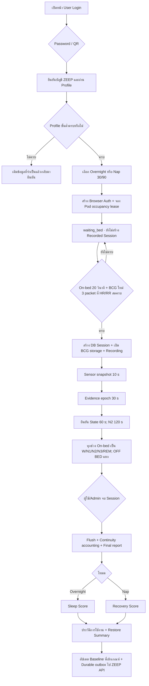

# ZEEP Pi 5 v1 System Handover and Code-Freeze Readiness

> **สถานะ:** Freeze candidate — ยังไม่ใช่ Final Code Freeze
>
> **ขอบเขต:** ZEEP Wellness & Longevity · Pi 5 runtime · สองรูปแบบการพัก
>
> **วันที่ตรวจ:** 16 กันยายน 2569 (Asia/Bangkok)
>
> **ผู้อนุมัติ Freeze:** Product Owner ต้องตรวจผล Regression, Production smoke,
> ประเด็นคงค้าง และระบุ Git SHA/Tag ใน Closure record ก่อนประกาศ v1

## 1. บทสรุปสำหรับส่งมอบ

ZEEP v1 เป็นระบบประเมินการพักและการนอนเชิง Wellness แบบไม่ต้องสวมอุปกรณ์
โดยใช้ BCG, Bed Status, HR/RR และ Movement เป็นหลักฐานด้านการพัก/การนอน
ส่วนอุณหภูมิ ความชื้น แสง เสียง CO₂, PM2.5 และ VOC ใช้อธิบายสภาพแวดล้อม
และปรับความเชื่อมั่น ไม่ใช้สร้าง Sleep State โดยตรง

ระบบเปิดให้ผู้ใช้เลือกเพียงสองรูปแบบ:

| รูปแบบ | จุดประสงค์ | เงื่อนไขคะแนน | ผลหลัก |
|---|---|---|---|
| **Overnight Recovery** | พักค้างคืนและประเมินภาพรวมการนอน | บันทึกอย่างน้อย 5 ชั่วโมง; เวลาเต็มสำหรับผู้ใหญ่ 7 ชั่วโมง | **Sleep Score 0–100** |
| **Nap & Refresh** | พักกลางวัน 30 หรือ 90 นาที; จะหลับ พักสายตา หรือทำสมาธิก็ได้ | บันทึกอย่างน้อย 10 นาที; เป้าหมาย 30/90 นาทีถูกตรึงเมื่อเริ่ม | **Recovery Score 0–100** |

คะแนนทั้งสองไม่ควรเปรียบเทียบตรงกัน เพราะตอบคนละคำถาม Sleep Score สรุป
การนอนค้างคืน ส่วน Recovery Score สรุปคุณค่าของช่วงพักระยะสั้นและไม่บังคับให้หลับ
Restore Summary เป็นคำอธิบายคะแนนหลัก ไม่ใช่คะแนนที่สาม และ v1 ไม่อ้างว่าเป็น
ความพร้อมทำกิจกรรมทั้งวัน

## 2. Lifecycle ตั้งแต่ Login ถึงจบ Session



### 2.1 การยืนยันตัวตนและ Profile

1. ผู้ใช้ Login ด้วยบัญชี ZEEP ผ่าน Password หรือ QR; สองเส้นทางบัญชีจริงลงที่
   `_complete_occupant_login` เดียวกัน จึงใช้ Profile gate และ Session policy ชุดเดียว
2. Email ที่ normalize เป็นตัวพิมพ์เล็กเป็น Account Key หลัก, `publicId` เป็น
   authorization subject; Display name เปลี่ยนได้โดยไม่สร้างผู้ใช้ใหม่
3. Verified ZEEP Profile ขั้นต่ำต้องมีเพศ วันเกิด/ช่วงอายุ ส่วนสูง และน้ำหนัก;
   กรุ๊ปเลือดเป็นข้อมูลเสริมเชิงสำรวจและไม่มีผลต่อคะแนนหรือ Sleep State ส่วน Local
   fallback รองรับเพศ/ช่วงอายุโดยไม่สร้างส่วนสูงหรือน้ำหนักที่ไม่มี และต้องแสดง
   health-reference coverage ตามจริง
4. Admin Login แยกจาก User Login และไม่ทำให้ Admin กลายเป็นผู้ครอบครองตู้
5. เมื่อ ZEEP API ใช้งานไม่ได้ ระบบ Local fallback ต้องได้รับ one-time offline ticket
   อายุ 5 นาที; ห้ามเรียก local login โดยข้ามการยืนยันความขัดข้อง

### 2.2 การเลือก Mode และการจองตู้

1. Mode ถูกเลือกและตรึงก่อนเริ่ม Session; ค่า legacy `auto` ห้ามเดาว่าเป็น Nap
2. Nap ต้องระบุเป้าหมาย 30 หรือ 90 นาที และบันทึกไว้กับ Session
3. Occupancy coordinator ป้องกันบัญชีเดียวใช้สองตู้ และป้องกันหนึ่งตู้มีสองคน
4. หาก coordinator ใช้งานไม่ได้ ระบบไม่รับผู้ใช้ใหม่ แต่ไม่เตะผู้ใช้ที่กำลังพัก

### 2.3 จุดเริ่ม Recording

หลัง Login ระบบอยู่ `waiting_bed` และเก็บ checkpoint แต่ยังไม่สร้าง Session สำหรับ
การคิดคะแนน Recording เริ่มเมื่อครบสองเงื่อนไขพร้อมกัน:

- Bed Status ยืนยัน on-bed ต่อเนื่อง 20 วินาที
- มี BCG packet ใหม่หลัง Login อย่างน้อย 3 packet โดย HR และ RR อยู่ใน packet เดียวกัน,
  สด, ไม่ใช่ค่าที่ UI hold และผ่าน physical sanity range

ถ้าผู้ใช้ออกก่อนผ่าน gate ระบบปิดเพียง Browser/occupancy lifecycle และไม่สร้าง
Session ศูนย์นาที รายงาน หรือ Baseline ปลอม

### 2.4 การเก็บข้อมูลและยืนยัน Sleep State

| ชั้นข้อมูล | Cadence | หน้าที่ |
|---|---:|---|
| Canonical Sensor snapshot | 10 วินาที | Dashboard, Timeline, Safety และรายงานอ่านค่าชุดเดียวกัน |
| Sleep evidence | 30 วินาที | รวม BCG waveform, HR/RR, Bed และ Movement เป็นหลักฐาน |
| State confirmation | 60 วินาที | ยืนยัน W, N1, N3 และ REM หลังผู้ท้าชิงผ่าน gate ต่อเนื่อง |
| N2 confirmation | 120 วินาที | เพิ่ม hysteresis ให้ N2 ไม่สั่นตามค่าระยะสั้น |

หลักสำคัญของ continuity:

- ทุกช่วง Recording ที่ยืนยันว่าผู้ใช้ยังอยู่บนเตียงต้องมี State เป็น
  `W/N1/N2/N3/REM` เสมอ
- `WAIT` ใช้เฉพาะก่อน Recording; ไม่ใช่ Sleep State
- ถ้าหลักฐานใหม่ยังไม่ชัดหรือ Sensor ขาดชั่วคราว ให้ State ก่อนหน้าเป็นเจ้าของเวลา
  แบบ low confidence และยังนับคะแนน แต่ไม่นำช่วงนั้นไปสอน Personal Baseline
- ถ้ายังไม่เคยมี State ให้เริ่มด้วย W เป็น initial awake anchor
- `OFF BED` เป็น Occupancy exception ไม่ใช่ Wake และไม่เข้า Sleep Stage ratio;
  เวลานี้ยังใช้ประกอบ continuity/presence และการออกจากเตียงในคะแนน
- Environment Sensor ไม่สร้างหรือเปลี่ยน Sleep State
- Terminal W ที่เวลา 0 วินาทีใช้ปิดลำดับก่อนออกจากตู้/จบ Session เท่านั้น ไม่เพิ่ม
  Wake, WASO หรือหักคะแนน

### 2.5 Restart และ Code update ระหว่างพัก

- Restart ไม่ใช่ Logout และไม่จบ Session
- Browser auth อยู่ใน `auth.db`; physical Session อยู่ใน atomic checkpoint
- ระบบคืน Session ID, ผู้ใช้, Mode, target, State ที่ยืนยัน, sleep onset และ awake
  reference เดิม
- ช่วงกลับมาเชื่อม Evidence ใช้ State ก่อนหน้าแบบ low confidence แทน `WAIT`
- ช่วง continuity นี้นับในคะแนน แต่ไม่เข้า Personal Baseline
- confirmed OFF BED เท่านั้นที่ยุติการนับ State ระหว่าง Recording

### 2.6 การจบและเผยแพร่ผล

1. User หรือ Admin ที่มีสิทธิ์สั่งจบ
2. ระบบ flush DB writer แล้ว project Sleep decision ลง Timeline ตามขอบเขตเวลา
   ไม่เลื่อนไปข้างหน้าหนึ่งหรือสอง Sensor rows
3. ตรวจ Continuity Accounting: ทุก on-bed interval ต้องมี attribution และ
   OFF BED ต้องแยกออก
4. สรุป Sensor, HR/RR, Sleep/Rest metrics และสร้าง score ตาม Mode
5. commit finalization ลง DB แบบ atomic ก่อนลบ restart checkpoint
6. อัปเดตประวัติ/Baseline ด้วยข้อมูลก่อนหน้าและ Session ที่เข้าเกณฑ์ โดยไม่ให้
   current result รั่วกลับไปเปลี่ยนการตัดสินของตัวเอง
7. สร้าง allowlisted payload ลง durable outbox; การส่ง API ล้มเหลวไม่ทำให้
   local finalization ล้ม และ sweeper จะ retry

## 3. วิธีคิดผลลัพธ์สองรูปแบบ

### 3.1 Overnight Recovery — Sleep Score

| องค์ประกอบ | น้ำหนัก | ความหมาย |
|---|---:|---|
| Duration/onset | 25 | ระยะเวลาการนอนโดยประมาณเทียบเป้าหมายผู้ใหญ่ 7 ชั่วโมง และการเข้าสู่การนอน |
| Stability/continuity | 35 | ความต่อเนื่อง, Wake/WASO, movement/arousal proxy และการออกจากเตียง |
| Bounded stage pattern | 20 | รูปแบบ W/N1/N2/N3/REM แบบ conservative; N3/REM สูงไม่ถูกหักเพราะสูง |
| HR/RR support | 10 | ความนิ่งและความสมเหตุสมผลของชีพจร/การหายใจจาก BCG |
| Environment support | 10 | สภาพแวดล้อมที่สนับสนุนการพัก; ไม่สร้าง Stage |

Sleep Stage เป็นค่าประเมิน ZEEP Wellness จาก Sensor ไม่ใช่ผล PSG และไม่ใช้
วินิจฉัยโรค คะแนนเผยแพร่เมื่อ Overnight ที่ระบุชัดจบแล้วและบันทึกอย่างน้อย 5 ชั่วโมง
ข้อมูลเสริมที่ขาดใช้ค่า neutral พร้อมลด confidence แทนการซ่อนคะแนนทั้ง Session

### 3.2 Nap & Refresh — Recovery Score

| องค์ประกอบ | น้ำหนัก | ความหมาย |
|---|---:|---|
| Goal duration | 25 | เวลาพักเทียบเป้าหมายที่ผู้ใช้เลือก 30 หรือ 90 นาที |
| Physiological response | 35 | แนวโน้ม HR/RR ที่ค่อย ๆ settle และความพร้อมของหลักฐาน |
| Rest continuity/stillness | 30 | ความนิ่ง, movement และการออกจากเตียง; การหลับไม่ใช่เงื่อนไข |
| Environment support | 10 | สภาพแวดล้อมสนับสนุนการพัก |

Nap ที่ไม่หลับยังมีคุณค่าและได้ Recovery Score ได้เมื่อบันทึกอย่างน้อย 10 นาที
Sleep Stage ภายในเป็นข้อมูลสำหรับ Admin/การศึกษาหลักฐาน ไม่ใช่ตัวตัดสินว่าการพัก
สำเร็จหรือล้มเหลว หน้า User ควรใช้กลุ่ม `พักขณะตื่น`, `เคลิ้ม` และ
`ช่วงหลับที่ประเมินได้` เมื่อมีหลักฐานเพียงพอ

### 3.3 หลักการ Release คะแนน

- ทุก completed Session ที่ Mode ชัดและถึง minimum ต้องมีคะแนน แม้ยาวกว่า target
- ระยะสั้นกว่าขั้นต่ำไม่มีคะแนน แต่ยังมีผลสรุปเชิง Wellness จากค่าที่วัดได้อย่างตรงไปตรงมา
- Coverage/Tier/Review flag เป็น QA สำหรับ Admin ไม่ใช่ veto เพียงลำพัง
- ปิดกั้นผลเมื่อ Session ยังไม่จบ, Mode/สูตรขัดกัน หรือ invariant ของผลถูกละเมิด
- การ finalize Session ปัจจุบันยังเผยคะแนนแบบ low confidence โดยใช้ neutral factor
  เมื่อข้อมูลเสริม/Timeline ไม่มีพอ แต่ไม่แต่ง Sensor; ส่วนการเขียนผลย้อนหลังด้วย
  replay/promotion ต้องมี Raw และฐานข้อมูลที่ตรวจสอบได้ มิฉะนั้นห้าม rewrite
- ข้อมูลเสริมที่ขาดใช้ neutral factor ที่ประกาศและลด confidence; ห้ามแต่ง Sensor
  หรือสร้าง positive driver ที่ไม่มีหลักฐาน

## 4. Baseline และการเรียนรู้จากผู้ใช้

ระบบแยก Baseline เพื่อป้องกัน feedback loop:

| ชั้น | เริ่มใช้ | บทบาทใน v1 |
|---|---|---|
| Population prior | ครั้งแรก | จุดเริ่มกว้างตามผู้ใหญ่/ช่วงอายุ; เพศเป็น engineering prior แบบอ่อน |
| Within-session evidence | ระหว่าง Session | เทียบ HR/RR/Movement กับช่วงต้นและ rolling evidence ของ Session |
| Personal physiology | Overnight ที่เข้าเกณฑ์อย่างน้อย 3 ครั้ง; rolling สูงสุด 7 | รายงานและ confidence context เท่านั้น; ยังไม่เปลี่ยน State โดยตรง |
| Personal score comparison | Session เทียบเคียงอย่างน้อย 7; stable ที่ 14 | แนวโน้มและ comparison แยก Mode/target/formula |
| Best observed rest window | แสดงได้ตั้งแต่ visit 2 เมื่อมี prior comparable Session | observation จากครั้งก่อน ไม่ใช่ preference หรือเวลาที่ดีที่สุดเชิงเหตุผล |

กฎข้อมูล:

- เรียนรู้เฉพาะข้อมูลตั้งแต่ 1 กันยายน 2569 ตาม policy cutover
- เปรียบเทียบเฉพาะบัญชีเดียวกัน, Mode เดียวกัน, Nap target เดียวกัน และสูตรเดียวกัน
- การ rebuild อ่าน Session metadata หนึ่งครั้ง แล้วจำกัดการอ่าน report/timeline ละเอียด
  ไว้ไม่เกิน 120 candidate ต่อ `Overnight`, `Nap 30`, `Nap 90` และ Nap ที่ target
  ยังยืนยันไม่ได้ โดยผลที่เผยแพร่ยังใช้ย้อนหลังสูงสุด 30 Session ต่อ cohort
- Low-confidence carry ยังเข้าคะแนนแต่ห้ามเข้า physiology baseline
- อายุ/เพศช่วย cold start อย่างจำกัด; เชื้อชาติ กรุ๊ปเลือด และข้อมูลสำรวจอื่นไม่ใช้
  เพิ่ม/ลดคะแนนใน v1
- Personal baseline direct influence ต่อ Sleep State ปิดไว้จนผ่าน frozen-model
  validation กับ label อิสระ เพื่อไม่ให้โมเดลเรียนจากคำตอบของตัวเอง
- ข้อมูลกิจกรรม อาหาร คาเฟอีน ความเครียด หรือแบบสอบถามใช้เป็น context/advice
  เมื่อมี consent ไม่ย้อนแก้ Raw หรือ State เพื่อให้คะแนนดีขึ้น

## 5. กรอบข้อความ Wellness & Longevity

ข้อความผู้ใช้ต้องสั้น เป็นมิตร และอธิบายสิ่งที่พบโดยไม่สร้างคำรับรองทางการแพทย์:

- ใช้ “ค่าประเมิน”, “แนวโน้ม”, “พบว่า” และ “ลองปรับครั้งถัดไป”
- ไม่ใช้ “วินิจฉัย”, “ปอดแข็งแรง”, “ร่างกายฟื้นตัวแล้ว” หรือ “พร้อมทั้งวัน” จาก
  BCG/HR/RR เพียง Session เดียว
- HR/RR สรุปจังหวะการพักและความสม่ำเสมอได้ แต่ไม่แทน ECG, SpO₂, ความดัน,
  สมรรถภาพปอด หรือผลตรวจการนอน
- คะแนนต่ำไม่ใช้คำตัดสินรุนแรง; แสดงจุดแข็งสูงสุดสองข้อ จุดที่ลองปรับได้สองข้อ
  และคำแนะนำที่ทำได้จริงหนึ่งข้อ
- ข้อความ Safety สำหรับเหตุที่ v1 ตรวจได้จริง เช่น ประตู, CO₂/อุณหภูมิ Critical,
  ระบบหาย หรือเหตุฉุกเฉินต้องตรง ชัด และไม่ถูกทำให้นุ่มจนเสี่ยง
- สูตร, raw BCG, coverage, gate, provenance และ review flags อยู่ใน Admin/Monitor

งานวิจัยทำหน้าที่กำหนดตัวแปร ขอบเขต และสมมติฐาน ไม่ได้ทำให้ ZEEP อ้างเป็น
เครื่องมือแพทย์โดยอัตโนมัติ การเปลี่ยน threshold/weight ต้องมี engineering rationale,
policy version, regression และผล replay ที่ Product Owner ตรวจได้

แผนที่หลักฐานที่ใช้กับ v1:

| Evidence ID | ใช้รองรับ | ไม่ได้ใช้รับรอง |
|---|---|---|
| SLP-001 | อย่างน้อย 7 ชั่วโมงเป็นกรอบ adult Overnight | เป้าหมาย Nap หรือคะแนนสากลสำหรับทุกคน |
| SLP-002 | HR/respiration มีข้อมูลสัมพันธ์กับ Stage และต้องดู temporal context | ความแม่นยำของ BCG รุ่น ZEEP |
| SLP-003, SLP-004 | ความเสี่ยง BCG ประเมิน TST/WASO/Stage ผิดและความจำเป็นของ QA | การเทียบเท่า PSG |
| SLP-005, SLP-006 | ขอบเขต Consumer Sleep Technology และ ontology W/N1/N2/N3/REM | การวินิจฉัยหรือการคัดลอกเกณฑ์ PSG มาใช้ตรง ๆ |
| SLP-007–SLP-011 | Nap, sleep inertia, wakeful rest และความสำคัญของผลก่อน–หลัง | น้ำหนัก Recovery Score หรือเป้า 30/90 แบบตายตัว |
| WHO-001–WHO-005 | สุขภาพที่อยู่อาศัย อากาศ และแนวทาง ventilation/measurement | Safety threshold แบบ real-time ของ ZEEP โดยตรง |
| VEN-001, VEN-002 | ขอบเขตและ adaptive behavior ของ SGP40/VOC Index | การระบุชนิดสารหรือผู้ก่อเหตุ |

ทะเบียนฉบับตรวจสอบได้อยู่ที่
[Research Evidence Source Register](../research/evidence-library/SOURCE_REGISTER.md)

บทความหรือ citation ที่ยังไม่อยู่ใน Source Register ถือเป็น **background reading**
เท่านั้น ห้ามใช้เป็นหลักฐานเพียงรายการเดียวเพื่อเปลี่ยน runtime threshold, สูตรคะแนน
หรือข้อความอ้างผลเชิงสุขภาพ จนกว่าจะมี Evidence ID, provenance, limitation และการตรวจ
ลิงก์ตาม governance ครบ

## 6. API สำหรับทีม Pi, Backend และ App

| หน้าที่ | Contract หลัก |
|---|---|
| User login | `POST /api/auth/login`, QR session/poll และ profile completion |
| Admin login | `POST /api/admin/auth/login` |
| เริ่ม/จบ lifecycle | Login สร้าง waiting phase; `POST /api/session/logout` จบผล |
| รายการใช้งาน | `GET /api/v1/usage-sessions` |
| ผลย่อ | `GET /api/v1/usage-sessions/{id}/summary` |
| ผลสำหรับหน้า User | `GET /api/v1/usage-sessions/{id}/presentation` |
| ผลรายละเอียด raw-free | `GET /api/v1/usage-sessions/{id}` |
| QA สำหรับ Admin | `GET /api/v1/usage-sessions/{id}/development` |
| Longitudinal profile | `GET /api/v1/usage-sessions/longitudinal` |
| Advisory AI context | `GET /api/v1/usage-sessions/longitudinal/ai-context` |
| Raw/research export | `/api/session/{id}/...` และ `/api/sessions` — Admin เท่านั้น |
| Account backend ingest | `POST https://api.zeep.world/api/v1/sleep-sessions/ingest` ผ่าน durable outbox |

หน้าประวัติบน Tablet ยังใช้ legacy read endpoint เพื่อคง confirmed Timeline ใน
รายงาน Pi แต่ list/result policy ใช้ service และ persisted result ชุดเดียวกัน
ก่อนลบ legacy endpoint ต้องย้าย client, เทียบ response parity และประกาศ migration
version; ห้ามลบเพียงเพื่อลดจำนวนโค้ด

## 7. Regression audit: 964 Tests จำเป็นหรือไม่

คำตอบคือ **จำเป็นต้องรักษา coverage แต่ไม่จำเป็นต้องรันทั้งชุดในทุกการแก้หนึ่งบรรทัด**

- Baseline เดิม 964 tests รันประมาณ 11–14 วินาที จึงไม่ได้เป็นต้นเหตุของเวลาตรวจนาน
- Audit ไม่พบ test body ที่ซ้ำตรงกันและยังไม่มีชุดใดปลอดภัยพอให้ลบ
- ชุดนี้ครอบคลุม Auth/Privacy, Hardware/Control, Sleep/Baseline/Replay,
  Score/Report, Session/API, Storage และ UI/Evidence
- UI composer, Ruff และ Evidence check เป็นคนละ gate และไม่รวมอยู่ในเลข 964
- Replacement Firmware ใต้ `firmware/sensorhub1-esp32s3/` ถูกยกเลิกและระบุ
  `ARCHIVED / DO NOT FLASH`; ไม่ใช่ v1 runtime หรือ Product Gate
- หลังเพิ่ม regression สำหรับช่องโหว่ที่พบ จำนวนจริงจะมากกว่า 964; จำนวนไม่ใช่ KPI
  เป้าหมายคือพฤติกรรมสำคัญมีหลักฐานและ suite ยังเร็วพอ

ภาพรวม 964 tests ณ baseline ที่ audit:

| กลุ่มพฤติกรรม | จำนวน |
|---|---:|
| Identity, Access และ Privacy | 132 |
| Hardware, Sensor, Control และ Audio | 96 |
| Sleep State, Baseline และ Replay | 276 |
| Score, Report และ Wellness language | 188 |
| Session, History, API และ User learning | 195 |
| Storage, Maintenance และ Architecture | 32 |
| UI และ Evidence governance | 45 |

หลัง patch รอบนี้ Application suite มี **983 tests, skip 0**; Closure record
ด้านล่างบันทึกผล rerun ล่าสุดหลัง patch ทุกชิ้น จำนวนที่เพิ่มคือ
regression ของพฤติกรรมใหม่/ช่องโหว่ที่พบ ไม่ใช่การคัดลอก test เดิม

วิธีลดเวลาและความซับซ้อนที่ถูกต้อง:

1. ระหว่างพัฒนาให้รัน focused suite ตาม domain ที่แก้
2. ก่อน push/deploy รัน Application release gate เต็ม
3. ก่อน Code Freeze รัน Full Product Gate ของ Pi application รวม evidence/UI และ
   Production smoke; replacement Firmware ที่ยกเลิกแล้วไม่อยู่ใน gate นี้
4. รวม fixture/helper ได้ แต่ลบ test ได้เมื่อ feature/route/data format ถูก retire และ
   มี regression ที่ครอบ behavior ทดแทนแล้ว
5. แยก test inventory ตาม ownership แทนการลด assertion
6. กำจัด skip โดยติดตั้ง dev dependency ครบ; เป้าหมาย v1 คือ `skipped=0`

สิ่งที่ลดได้หลัง Freeze โดยทำเป็น migration แยก คือ legacy Tablet history route
หลัง App ใช้ Usage API ครบ, `recalibrate_sound_history.py` หลังยืนยันว่าไม่มีข้อมูล
รุ่นเก่าที่ต้อง audit และ compatibility facade ที่ไม่มี caller แล้ว ส่วนไฟล์
`docs/archive/sound-processing-history-2026-09-10.json` เป็น audit provenance ขนาดเล็ก
ไม่ใช่ runtime จึงยังไม่ควรลบเพื่อประหยัดเวลาหรือพื้นที่

รายละเอียดคำสั่งและขอบเขตอยู่ใน [TESTING.md](../TESTING.md)

## 8. Invariants สำหรับ v1 Freeze

1. Raw Sensor/BCG immutable; calibration/replay เขียนเฉพาะ derived result พร้อม audit
2. ไม่มี HR/RR และไม่มีผู้ใช้อยู่บนเตียง ห้ามสร้าง N1/N2/N3/REM
3. ทุก on-bed Recording interval มี W/N1/N2/N3/REM; OFF BED แยกออก
4. Live, Replay และ Report ใช้ scorer/policy/version ชุดเดียวกัน
5. Overnight มี Sleep Score เท่านั้น; Nap มี Recovery Score เท่านั้น
6. Mode และ target ถูกตรึงก่อน Recording; elapsed time ห้ามเปลี่ยนประเภท Session
7. Tier/coverage/review flag ไม่ปิดทั้ง Session โดยลำพัง
8. Restart ไม่ logout/ไม่จบ Session/ไม่แสดง WAIT แทน State เดิม
9. Environment ไม่สร้าง Stage; Sleep State ไม่สั่งอุปกรณ์อัตโนมัติ
10. User เห็นเฉพาะข้อมูลตนเอง; Admin/raw routes ตรวจ RBAC/CSRF ที่ Backend
11. Public result ต้อง `clinical_validated=false` เสมอใน v1
12. Adaptive control เป็น recommendation/shadow; `automatic_actuation=false`
13. ข้อความผู้ใช้เป็น Wellness; Safety message คงความตรงและเข้มเมื่อจำเป็น
14. Finalization ต้อง atomic และ continuity accounting ต้องครบก่อนเผยแพร่

## 9. สิ่งที่แก้ระหว่าง Audit รอบนี้

- รักษา provisional continuity ที่เป็น score owner ไว้ใน Account ingest โดยใช้
  `sleep_score_eligible`/exclusion เป็นอำนาจแทนการทิ้งเพราะป้าย provisional
- บังคับ Public contract ไม่ให้เผย `clinical_validated=true` จากข้อมูลเก่า
- กำหนดผู้ใช้อายุต่ำกว่า 18 ปีเป็น unsupported/unspecified สำหรับ adult prior แทน
  การจัดเข้ากลุ่ม 18–29 อัตโนมัติ
- เพิ่มตัวเลือก Nap 30/90 ใน Login และส่ง target เดียวกันผ่าน Password, QR,
  Profile completion และ Local fallback
- เพิ่ม `jsonschema` ใน dev dependency เพื่อให้ Evidence regression ไม่ skip
- ปิด test temp-resource leak และ console noise ที่เกิดจาก rollback test โดยตั้งใจ
- ปรับถ้อยคำ Restore/Environment ให้ไม่อ้างเหตุและผลเกินหลักฐาน
- แยก cohort ก่อนจำกัดจำนวนย้อนหลัง, normalize legacy mode จากจุดเดียว, กรอง
  non-finite value และคำนวณเวลาเริ่มพักข้ามเที่ยงคืนแบบ circular
- แยก `classification_source` ออกจาก `baseline_candidate_source` ใน Replay
  และเปิดเผยเวอร์ชัน/ขีดจำกัด Personal Baseline ผ่าน Admin Policy snapshot
- ปฏิเสธ Rest-window cache คนละเวอร์ชันทุก read path เพื่อให้ rebuild ก่อนแสดงผล
- ตัด replacement Firmware ที่ถูกประกาศ `ARCHIVED / DO NOT FLASH` ออกจาก v1
  Product Gate; Pi-side Sensor contract ยังอยู่ใน Application regression
- เพิ่ม regression สำหรับประเด็นข้างต้น โดยไม่ลด coverage เดิม

## 10. ประเด็นที่ต้องตัดสินก่อนประกาศ Final Freeze

### P0 — ต้องปิดหรือมี Owner sign-off

- Application suite, UI composer, Ruff และ Evidence check ต้องผ่านพร้อมกันโดยไม่มี skip
- ตรวจ Production smoke เมื่อไม่มีผู้ใช้งาน: service, public status, Hub 1/2, BCG,
  Safety faults, checkpoint resume และหน้า Dashboard/Sessions
- ยืนยันนโยบาย Session-start Safety: v1 ปัจจุบันแยก Bed+Vitals start gate ออกจาก
  readiness/preflight; Pi-local Safety Supervisor ยังมีอำนาจเตือน/เข้าสู่ safe mode
  ต้องให้ Safety owner ระบุชัดว่าความผิดปกติชนิดใดบล็อก Recording ใหม่ และชนิดใด
  เป็นเพียง Wellness warning
- ยืนยัน continuity trade-off: ตามคำสั่ง Product Owner ทุกช่วง on-bed ต้องมี State
  ระบบจึงคง State เดิมแบบ low confidence ได้แม้สัญญาณขาดนาน ช่วง carry เข้าคะแนน
  แต่ไม่เข้า Personal Baseline และ coverage ต้องเปิดเผย; ก่อน Freeze ต้องยอมรับ
  ความเสี่ยงว่าคะแนนอาจ optimistic เมื่อ BCG/HR/RR ขาดนาน หรือกำหนด cap เพิ่ม
- ยืนยันว่า v1 Pi runtime ยังไม่มี smoke/CO input หรือ alarm output; อุปกรณ์
  standalone (ถ้ามี) ต้องมี Owner และ functional test แยกก่อนอ้างในคู่มือผู้ใช้
- ตรวจ legacy Tablet history เทียบ canonical Usage API ก่อนประกาศเส้นทาง migration

### P1 — บันทึกเป็นหนี้เทคนิคได้หากไม่เปลี่ยน behavior

- `app.py` ยังใหญ่และควรทยอยแยก Session lifecycle, BCG reader และ route wiring
  ด้วย characterization tests; ห้ามรวม refactor กับการเปลี่ยนสูตร
- Personal Baseline จำกัด expensive detail reads ต่อ cohort แล้ว แต่ metadata query
  ยังอ่านทุก Session ในครั้งเดียว ควรย้ายเป็น indexed/window query เมื่อปริมาณข้อมูลจริง
  โตจนมีหลักฐานว่า query นี้เป็นคอขวด
- Session เก่าที่ไม่มี Mode ใน metadata จะเข้ากลุ่ม `unresolved` แบบมีเพดานก่อนอ่าน
  Final Summary; ปัจจุบันข้อมูล pilot ยังต่ำกว่าเพดาน แต่ก่อน import ประวัติเกิน 120
  รายการต่อผู้ใช้ควรทำ metadata migration หรือเพิ่ม resolved-mode query โดยตรง
- Legacy Tablet history ยังใส่ account key/email ใน URL path ซึ่งอาจอยู่ใน browser
  history หรือ access log; canonical Usage API ใช้ authenticated principal/header แล้ว
  จึงควรย้าย client และประกาศ deprecation ก่อนลบ legacy route
- Account-backend ingest ส่ง Stage ที่เป็น continuity carry ได้ แต่ contract ปัจจุบันยัง
  ไม่ส่ง confidence/provisional/exclusion provenance ครบ ต้องเพิ่ม contract version ร่วมกับ
  Backend/App ก่อนให้ปลายทางตีความความมั่นใจราย Epoch
- fallback JavaScript สำหรับข้อมูลจาก Pi รุ่นเก่าใช้ Sleep environment bands กับ Nap;
  Live Pi ปัจจุบันส่ง mode-aware evaluation ถูกต้องแล้ว แต่ควรถอด fallback นี้หลังยืนยัน
  fleet compatibility
- อัปเดต Pydantic v1 validators และ Starlette/httpx compatibility ในรุ่นหลัง Freeze
- ทำ clock/cadence observability ให้ Sensor frame และ Session sample อธิบาย skew ได้
- เก็บ external refresh token แบบปลอดภัยหากต้องให้ revoke/share ต่อเนื่องข้าม restart

### Defer ไป v2

- Personal Baseline เปลี่ยน Sleep State โดยตรง
- Closed-loop automatic control จาก Sleep State
- Whole-day readiness, training load และ wearable integration
- True HRV (RMSSD/SDNN), SpO₂, ความดัน, pulmonary fitness, OSA screening
- เชื้อชาติ/กรุ๊ปเลือดเป็นตัวเพิ่มลดคะแนน
- ข้อกล่าวเชิงเหตุผลว่าสภาพแวดล้อมทำให้ Stage/สุขภาพดีขึ้น

## 11. Full Product Gate และ Closure Record

```bash
# Mac / CI
pi5/.venv/bin/python -m unittest discover -q
pi5/.venv/bin/python ui_composer.py check
pi5/.venv/bin/ruff check zeep_pod
pi5/.venv/bin/ruff format --check zeep_pod
pi5/.venv/bin/python -m py_compile app.py *.py
pi5/.venv/bin/python research/evidence-library/update_research_library.py check
git diff --check
```

บันทึกเมื่อพร้อม Freeze:

| รายการ | ค่า |
|---|---|
| Candidate Git SHA | รอกรอกหลัง merge/push |
| Policy/version snapshot | ตรวจจาก `GET /api/admin/sleep/policy` |
| Application tests | 1,027 passed, failure=0, error=0, skip=0 · 12.449 วินาที |
| Archived replacement Firmware | ไม่อยู่ใน v1 gate · ห้าม Flash |
| Evidence/UI/style | Registry 30 records + protocol ผ่าน; UI, Ruff, compile และ diff ผ่าน |
| Production smoke | รอช่วงไม่มีผู้ใช้งาน |
| Replay/reference Sessions | ตรวจเฉพาะ reviewed manifest; ห้ามแก้ Raw |
| Product Owner approval | รออนุมัติ Final Code Freeze |
| Safety owner approval | รอยืนยัน start/safe-mode policy |
| Git tag | ยังไม่สร้าง |

## 12. เอกสารและ Source of Truth

- [Pi 5 Software Architecture](pi5-software-architecture.md)
- [Sleep System Current](zeep-sleep-system-current.md)
- [Sleep-State Baseline v1.8](zeep-sleep-state-baseline-v1.0.md)
- [Session Result Presentation v1](zeep-session-result-presentation-v1.md)
- [Product Language Guideline v1](zeep-product-language-guideline-v1.md)
- [User Learning Profile v1](zeep-user-learning-profile-v1.md)
- [Adaptive Recommendation Plan v1](adaptive-control-recommendation-plan-v1.md)
- [ZEEP API v1](zeep-api-v1.md)
- [Testing and Release Gates](../TESTING.md)
- [Research Evidence Library](../research/evidence-library/README.md)

หากข้อความในเอกสารรองขัดกับ `sleep_system_policy.py`, versioned API contract หรือ
approved replay manifest ให้หยุดการเผยแพร่และแก้ความขัดแย้งก่อน Freeze ห้ามเลือก
ข้อความที่ดูเหมาะกว่าโดยไม่มี version/audit trail
